# DuDe Hawaiian — System Architecture Document
## Multi-Agent AI Site/Factory Manager v2.0

**เวอร์ชัน:** 2.0 | **วันที่:** เมษายน 2026 | **สถานะ:** Production Blueprint

---

## 1. ภาพรวมสถาปัตยกรรม (System Overview)

ระบบ DuDe Hawaiian ทำหน้าที่เป็น **Digital Site/Factory Manager** แบบอัตโนมัติ โดยใช้สถาปัตยกรรม Multi-Agent Microservices ที่ประกอบด้วย 6 เอเจนต์เฉพาะทาง ทำงานประสานกันผ่าน **Mem0** (Long-Term Memory Engine) และ **Blinko** (Human-in-the-Loop Dashboard + Automated Log Store)

### หลักการออกแบบ
- **Event-Driven First** — ทุกอย่างเริ่มจาก Event ไม่ว่าจะเป็น Webhook จากกล้อง, LINE Message, หรือ Scheduled Job
- **Local-First, Cloud-Optional** — ประมวลผลบนเครื่องก่อนเสมอ ลด Latency และปกป้องข้อมูล
- **Memory-Centric** — Mem0 เป็นแหล่งความจำกลาง แทนที่ RAG แบบ Static Document ด้วย Dynamic Entity Memory
- **Blinko as Single Source of Truth** — ทุก Log, Alert, และ State เขียนลง Blinko เพื่อให้ทีมงานตรวจสอบและ Override ได้เสมอ
- **Hardware-Agnostic** — ออกแบบให้รันบน Dell 3060 ได้วันนี้ และ Scale ไป GPU Server ได้โดยไม่แก้ Code

---

## 2. Mermaid.js Architecture Diagram
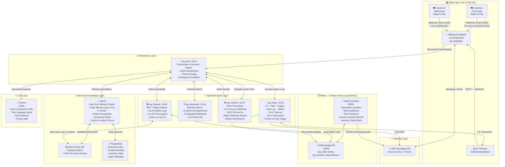

---

## 3. Data Flow — Scenario A: ไฟไหม้ / โจรกรรม (Emergency Response)

### 3.1 ลำดับเหตุการณ์ (Event Sequence)
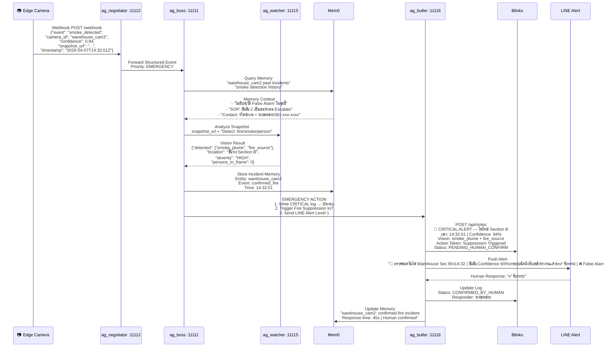

### 3.2 สรุปข้อมูลที่ไหลในแต่ละขั้นตอน

| ขั้นตอน | ข้อมูลที่ส่ง | ข้อมูลที่ได้รับ |
|---------|------------|--------------|
| Edge → Negotiator | Raw Webhook JSON (event type, confidence, snapshot URL) | Structured Event Object |
| Boss → Mem0 | Query: camera_id + event_type | Past incidents, SOP reference, Contact info |
| Boss → Watcher | Snapshot URL + Detection Task | Vision Result JSON (objects, location, severity) |
| Boss → Butler | Emergency Action List | Execution Confirmation |
| Butler → Blinko | Critical Log Entry (Markdown) | Log ID for tracking |
| Butler → LINE | Thai Alert Message + Action Buttons | Human Confirmation |

---

## 4. Data Flow — Scenario B: การตรวจสอบของเสียและสต็อกรายวัน (Daily Waste & Inventory Logging)

### 4.1 ลำดับเหตุการณ์
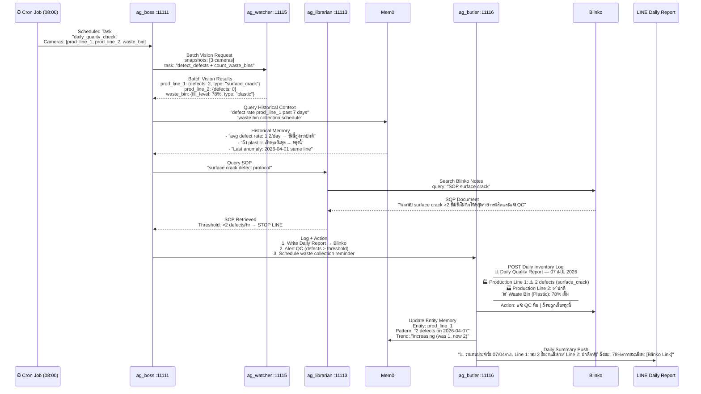

---

## 5. Memory Architecture — Mem0 Integration

### 5.1 ทำไมต้องใช้ Mem0 แทน RAG แบบเดิม?

| มิติ | RAG แบบเดิม (Qdrant Only) | Mem0 (Entity Memory) |
|-----|--------------------------|---------------------|
| **ประเภทข้อมูล** | Static Documents (PDF, MD) | Dynamic Entities (บุคคล, เครื่องจักร, สถานที่) |
| **การอัปเดต** | Re-ingest ทั้งหมด | Update Entity ได้แบบ Incremental |
| **Context** | Document Similarity เท่านั้น | Relational + Temporal Context |
| **การเรียนรู้** | ไม่เรียนรู้จาก Event | เรียนรู้ Pattern จากทุก Incident |
| **ความเร็ว** | ช้า (Vector Search ทุกครั้ง) | เร็ว (Entity Cache + Vector) |
| **Use Case เหมาะสม** | SOP Lookup, Manual Search | Incident Memory, Equipment History, Person Recognition |

### 5.2 โครงสร้าง Entity Memory ใน Mem0
```yaml
# ตัวอย่าง Entities ที่ Mem0 จัดเก็บ

Entity: camera/warehouse_cam2
  memories:
    - "ตรวจพบควันไฟ 2026-04-07 14:32 (Confirmed)"
    - "False alarm rate: 0% (ไม่มีประวัติ False Alarm)"
    - "Peak alert hours: 13:00-15:00"
    - "Maintenance last done: 2026-03-15"
  relations:
    - covers: warehouse_section_B
    - escalates_to: line_manager_somchai

Entity: equipment/prod_line_1
  memories:
    - "Defect rate trending up: 1→2 ชิ้น/วัน (สัปดาห์นี้)"
    - "Last maintenance: 2026-03-28"
    - "Common defect type: surface_crack"
    - "SOP trigger: หยุดสายหาก >2 defects/hr"
  relations:
    - monitored_by: prod_line_1_cam
    - responsible_qc: team_B

Entity: person/somchai_line_manager
  memories:
    - "Response time avg: 3.2 minutes"
    - "Available: Mon-Sat 07:00-19:00"
    - "Preferred contact: LINE > Call"
    - "Confirmed 3 incidents in April 2026"
```

### 5.3 Memory Flow ใน ag_boss
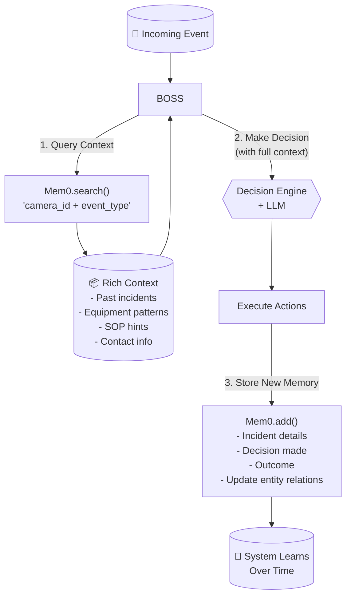

---

## 6. Blinko — Human-in-the-Loop Interface

### 6.1 บทบาทของ Blinko ในระบบ
Blinko ทำหน้าที่ 4 อย่างพร้อมกัน:

1 📝 Automated Log Store
└── ag_butler เขียนทุก Event, Alert, และ Action ลงที่นี่
└── Format: Structured Markdown พร้อม Tag และ Status
2 🔍 Searchable Knowledge Base
└── ag_librarian อ่านและ Index Blinko Notes เข้า Qdrant
└── ทำให้ Boss ค้นหาประวัติย้อนหลังได้
3 👁️ Human Dashboard
└── ทีมงานเข้าดูผ่าน Web UI ที่ health.thegodseller.com
└── เห็น Real-time Alerts และ Daily Reports
4 ✍️ Human Override Channel
└── ทีมงานเพิ่ม Note / แก้ Status ใน Blinko
└── ag_librarian ตรวจจับการเปลี่ยนแปลงและแจ้ง Boss

### 6.2 Log Entry Format (ที่ ag_butler เขียน)
```markdown
## 🚨 CRITICAL — ไฟไหม้ Warehouse Section B
**เวลา:** 2026-04-07 14:32:01 ICT
**กล้อง:** warehouse_cam2
**Confidence:** 94%
**Vision Detection:** smoke_plume, fire_source
**Location:** ชั้นวาง Section B (ไม่มีบุคคลในเฟรม)

**Action Taken:**
- [x] ระบบฉีดน้ำดับเพลิงทำงาน (14:32:15)
- [x] แจ้งหัวหน้าเวร (LINE) — รับทราบ 14:32:58
- [x] บันทึกเข้า Incident Log

**Status:** ✅ RESOLVED
**Confirmed By:** นายสมชาย (Line Manager)
**Tags:** #fire #warehouse #critical #resolved
```

### 6.3 ag_librarian ↔ Blinko Integration
```python
# Flow ที่ ag_librarian ทำเป็น Scheduled Job (ทุก 15 นาที)

import asyncio
import httpx
from datetime import datetime
from qdrant_client import QdrantClient
from qdrant_client.models import PointStruct
import os
import hashlib

async def sync_blinko_to_memory():
    # 1. ดึง Notes ใหม่จาก Blinko ที่ยังไม่ได้ Index
    new_notes = await blinko_api.get_notes(since=last_sync_time, tags=["#critical", "#alert", "#report"])

    for note in new_notes:
        # 2. Extract Entities จาก Note
        entities = extract_entities(note.content)
        # → ["warehouse_cam2", "นายสมชาย", "fire_incident"]

        # 3. Update Mem0 Entity Memory
        for entity in entities:
            await mem0.add(
                messages=[{"role": "system", "content": note.content}],
                user_id=entity,
                metadata={"source": "blinko", "note_id": note.id, "timestamp": note.created_at}
            )

        # 4. Upsert Vector ลง Qdrant สำหรับ RAG Search
        await qdrant.upsert(
            collection="blinko_logs",
            vectors=[embed(note.content)],
            payload={"note_id": note.id, "tags": note.tags, "status": note.status}
        )
```

---

## 7. Hardware Migration Plan

### 7.1 Phase 1 — Dell OptiPlex 3060 (ปัจจุบัน)

**Specifications:**
- CPU: Intel Core i5-8500T (6 Cores)
- RAM: 16GB DDR4
- Storage: 512GB SSD
- GPU: Intel UHD 630 (iGPU เท่านั้น)

**Architecture Adjustments สำหรับ Hardware นี้:**
```yaml
# docker-compose.yml adjustments สำหรับ 3060

ag_watcher:
  # ใช้ Webhook-based เท่านั้น — ไม่ดึง RTSP Stream โดยตรง
  # กล้องทำ Edge AI และส่งแค่ Result + Low-res Snapshot
  environment:
    VISION_MODE: "webhook_only"        # ไม่รัน RTSP Processing
    OCR_ENGINE: "paddle_cpu"           # PaddleOCR CPU Mode
    MAX_IMAGE_SIZE: "640x480"          # จำกัดขนาดภาพ
    CONCURRENT_ANALYSIS: "2"           # จำกัด Concurrent

ollama:
  environment:
    OLLAMA_NUM_PARALLEL: "1"           # คิว Request ทีละ 1
    OLLAMA_MAX_LOADED_MODELS: "1"      # โหลด Model เดียวกัน
  deploy:
    resources:
      limits:
        memory: 6G                     # จำกัด RAM

mem0:
  # ใช้ Lightweight Mode
  environment:
    MEM0_EMBEDDING_MODEL: "bge-small-en-v1.5"  # Model เล็กลง
    MEM0_CACHE_SIZE: "500"                        # จำกัด Cache
```

**Performance Expectations บน 3060:**

| Operation | Latency (3060) | หมายเหตุ |
|-----------|---------------|---------|
| Webhook รับ-ส่ง | < 100ms | รวดเร็ว |
| LLM Inference (3B model) | 5-15 วินาที | ยอมรับได้สำหรับ Non-urgent |
| Vision Analysis (via Webhook result) | < 500ms | กล้องทำหนักแล้ว |
| Mem0 Query | < 200ms | Qdrant Fast |
| Emergency Alert E2E | < 30 วินาที | ยอมรับได้ |

---

### 7.2 Phase 2 — Dedicated GPU Server (อนาคต)

**Target Specifications:**
- CPU: Intel Xeon หรือ AMD EPYC (16+ Cores)
- RAM: 64GB ECC
- Storage: 2TB NVMe SSD
- GPU: NVIDIA RTX 4090 / A10G (24GB VRAM)

**Architecture Upgrades เมื่อย้าย:**
```yaml
# สิ่งที่เปลี่ยนได้ทันทีโดยแก้แค่ .env / docker-compose

ag_watcher:
  environment:
    VISION_MODE: "full_rtsp"           # เปิด RTSP Processing
    OCR_ENGINE: "paddle_gpu"           # GPU-accelerated OCR
    MAX_IMAGE_SIZE: "1920x1080"        # Full HD
    CONCURRENT_ANALYSIS: "8"           # Parallel Analysis
    YOLO_MODEL: "yolov8l"              # Large Model (ถูกต้องกว่า)
    FRIGATE_ENABLED: "true"            # เปิด Frigate NVR

ollama:
  environment:
    OLLAMA_NUM_PARALLEL: "4"           # Parallel Requests
    OLLAMA_NUM_GPU: "1"                # Use GPU
    OLLAMA_GPU_LAYERS: "99"            # All layers on GPU
  deploy:
    resources:
      reservations:
        devices:
          - driver: nvidia
            capabilities: [gpu]

mem0:
  environment:
    MEM0_EMBEDDING_MODEL: "bge-m3"    # Large multilingual model
    MEM0_CACHE_SIZE: "5000"           # ขยาย Cache

# เพิ่ม Services ใหม่ที่ต้อง GPU
reranker_svc:
  # Reranker สำหรับ RAG Quality ที่ดีขึ้น
  image: reranker:latest
  environment:
    MODEL: "BAAI/bge-reranker-v2-m3"
    DEVICE: "cuda"
```

**Performance Expectations บน GPU Server:**

| Operation | Latency (GPU Server) | Improvement |
|-----------|---------------------|-------------|
| LLM Inference (7B model) | < 2 วินาที | 5-7x เร็วขึ้น |
| Vision Analysis (RTSP) | Real-time 30fps | จาก Webhook-only |
| Multi-camera Concurrent | 16 กล้องพร้อมกัน | จาก 0 |
| Emergency Alert E2E | < 5 วินาที | 6x เร็วขึ้น |

---

### 7.3 Migration Checklist (ไม่ต้องแก้ Code)
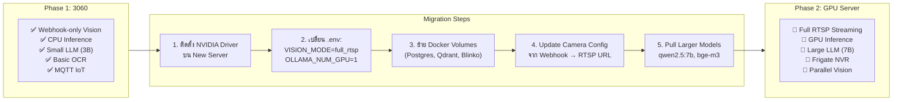

---

## 8. API Contract สำคัญระหว่าง Agents

### 8.1 ag_watcher — Vision Analysis Request
```python
# Request จาก ag_boss → ag_watcher
POST http://ag_watcher:8080/api/analyze
{
    "snapshot_url": "https://cam2.local/snapshot.jpg",  # หรือ base64
    "task": "detect",
    "detect_classes": ["fire", "smoke", "person", "defect", "waste"],
    "camera_id": "warehouse_cam2",
    "incident_id": "INC-20260407-001"
}

# Response จาก ag_watcher → ag_boss
{
    "status": "ok",
    "camera_id": "warehouse_cam2",
    "detections": [
        {"class": "smoke_plume", "confidence": 0.94, "bbox": [120, 80, 400, 300]},
        {"class": "fire_source", "confidence": 0.87, "bbox": [150, 200, 280, 350]}
    ],
    "summary": "ตรวจพบควันและแหล่งไฟที่บริเวณ Section B ไม่มีบุคคลในเฟรม",
    "severity": "HIGH",
    "processing_time_ms": 342
}
```

### 8.2 ag_butler — Blinko Log Writer
```python
# Request จาก ag_boss → ag_butler
POST http://ag_butler:8080/api/log
{
    "type": "CRITICAL_ALERT",
    "title": "🚨 ไฟไหม้ Warehouse Section B",
    "content": "...",  # Markdown content
    "tags": ["#fire", "#warehouse", "#critical"],
    "incident_id": "INC-20260407-001",
    "actions_required": [
        {"type": "iot", "device": "fire_suppression_zone_B", "command": "activate"},
        {"type": "line_alert", "level": 1, "message": "..."}
    ]
}
```

### 8.3 Mem0 Integration ใน ag_boss
```python
from mem0 import Memory

mem0 = Memory.from_config({
    "vector_store": {
        "provider": "qdrant",
        "config": {"url": "http://db_qdrant:6333", "collection_name": "dude_mem0"}
    },
    "llm": {
        "provider": "ollama",
        "config": {"model": "qwen2.5:3b", "base_url": "http://db_ollama:11434"}
    },
    "embedder": {
        "provider": "ollama",
        "config": {"model": "bge-m3", "base_url": "http://db_ollama:11434"}
    }
})

# ใน ag_boss orchestration flow
async def orchestrate(event: dict) -> dict:
    entity_id = event["camera_id"]

    # 1. ดึง Context จาก Memory
    memories = mem0.search(
        query=f"{event['event_type']} at {entity_id}",
        user_id=entity_id,
        limit=10
    )

    # 2. ประมวลผลด้วย Context
    decision = await make_decision(event, memories)

    # 3. บันทึก Memory ใหม่
    mem0.add(
        messages=[{
            "role": "system",
            "content": f"Incident: {event['event_type']} | Decision: {decision['action']} | Outcome: pending"
        }],
        user_id=entity_id,
        metadata={"incident_id": decision["incident_id"], "timestamp": event["timestamp"]}
    )

    return decision
```

---

## 9. Port & Service Registry (Production)
┌─────────────────────────────────────────────────────────────┐
│                    AGENT PORTS                              │
├───────────────────┬──────────┬────────────────────────────  │
│ ag_boss           │ :11111   │ Main Orchestrator            │
│ ag_negotiator     │ :11112   │ LINE + Webhook Gateway       │
│ ag_librarian      │ :11113   │ RAG + Blinko Indexer         │
│ ag_adventure      │ :11114   │ External Search              │
│ ag_watcher        │ :11115   │ Vision Processing            │
│ ag_butler         │ :11116   │ IoT + Logger                 │
├───────────────────┼──────────┼────────────────────────────  │
│                    DATABASE PORTS                           │
├───────────────────┼──────────┼────────────────────────────  │
│ db_postgres       │ :12221   │ Structured Data              │
│ db_qdrant         │ :12222   │ Vector Store (Mem0 + RAG)    │
│ db_redis          │ :13331   │ Cache + Rate Limiting        │
│ db_ollama         │ :11434   │ LLM Inference                │
├───────────────────┼──────────┼────────────────────────────  │
│                    APP PORTS                                │
├───────────────────┼──────────┼────────────────────────────  │
│ blinko            │ :15555   │ Human Dashboard              │
│ blinko_bridge     │ :15556   │ Blinko API                   │
│ mem0_svc          │ :13332   │ Memory Service API           │
│ dude_web_control  │ :11118   │ System Control Panel         │
└───────────────────┴──────────┴────────────────────────────  ┘

---

## 10. สรุปและ Next Steps

### สิ่งที่ต้องทำถัดไป (Priority Order)

| ลำดับ | Task | Agent ที่เกี่ยวข้อง | Phase |
|-------|------|-------------------|-------|
| 1 | ติดตั้ง Mem0 และ Configure Entity Schema | ag_boss | ทันที |
| 2 | เชื่อม ag_butler → Blinko Bridge API | ag_butler | ทันที |
| 3 | สร้าง ag_librarian Blinko Sync Job | ag_librarian | สัปดาห์ 1 |
| 4 | กำหนด SOP Documents ใน Blinko | Manual | สัปดาห์ 1 |
| 5 | Test Fire Detection Webhook Flow | ag_watcher + ag_boss | สัปดาห์ 2 |
| 6 | Setup Daily Inventory Report Cron | ag_boss | สัปดาห์ 2 |
| 7 | Human Approval Flow ใน LINE | ag_negotiator | สัปดาห์ 3 |
| 8 | Load Test บน 3060 | DevOps | สัปดาห์ 4 |

### KPI ที่วัดความสำเร็จ

- **Emergency Response Time:** < 30 วินาที จาก Event ถึง LINE Alert
- **False Alarm Rate:** < 5% (ด้วย Mem0 Context + Human Confirmation)
- **Daily Log Coverage:** 100% ของ Events บันทึกลง Blinko
- **Memory Accuracy:** System จำ Pattern ซ้ำได้ภายใน 3 Incidents
- **Uptime:** > 99.5% บน Dell 3060

---
---

## 11. Implementation Guide — การติดตั้งทีละขั้นตอน

### 11.1 ติดตั้ง Mem0 เข้าระบบ
```bash
# Step 1: เพิ่ม mem0 ใน requirements.txt ของ ag_boss
# tHe_DuDe_Service/agents/ag_boss/requirements.txt

mem0ai==0.1.x
qdrant-client==1.9.x
```
```python
# tHe_DuDe_Service/agents/ag_boss/app/core/mem0_client.py

from mem0 import Memory
from functools import lru_cache
import os

@lru_cache(maxsize=1)
def get_mem0() -> Memory:
    """Singleton Mem0 Client — โหลดครั้งเดียวตอน startup"""
    config = {
        "vector_store": {
            "provider": "qdrant",
            "config": {
                "url": os.getenv("QDRANT_URL", "http://db_qdrant:6333"),
                "collection_name": "dude_mem0",
                "embedding_model_dims": 1024,  # bge-m3 dimension
            }
        },
        "llm": {
            "provider": "ollama",
            "config": {
                "model": os.getenv("PRIMARY_MODEL", "qwen2.5:3b"),
                "base_url": os.getenv("OLLAMA_URL", "http://db_ollama:11434"),
                "temperature": 0.1,
                "max_tokens": 2000,
            }
        },
        "embedder": {
            "provider": "ollama",
            "config": {
                "model": "bge-m3:latest",
                "base_url": os.getenv("OLLAMA_URL", "http://db_ollama:11434"),
            }
        },
        "history_db_path": "/app/data/mem0_history.db",  # SQLite for history
    }
    return Memory.from_config(config)


class MemoryService:
    """Wrapper สำหรับ Mem0 ที่ใช้ใน DuDe Context"""

    def __init__(self):
        self.mem = get_mem0()

    async def remember_incident(
        self,
        entity_id: str,          # "camera/warehouse_cam2" หรือ "equipment/prod_line_1"
        incident_text: str,       # คำอธิบาย Incident ภาษาไทย
        metadata: dict = None
    ) -> str:
        """บันทึก Incident ลง Memory"""
        result = self.mem.add(
            messages=[{"role": "system", "content": incident_text}],
            user_id=entity_id,
            metadata=metadata or {}
        )
        return result.get("id", "")

    async def recall_context(
        self,
        entity_id: str,
        query: str,
        limit: int = 5
    ) -> list[dict]:
        """ดึง Context ที่เกี่ยวข้องกับ Entity"""
        results = self.mem.search(
            query=query,
            user_id=entity_id,
            limit=limit
        )
        return results.get("results", [])

    async def get_entity_history(self, entity_id: str) -> list[dict]:
        """ดูประวัติทั้งหมดของ Entity"""
        return self.mem.get_all(user_id=entity_id).get("results", [])

    async def update_outcome(self, memory_id: str, outcome: str):
        """อัปเดต Outcome หลัง Incident แก้ไขแล้ว"""
        self.mem.update(memory_id=memory_id, data=outcome)
```

---

### 11.2 Blinko Bridge — ag_butler Writer
```python
# tHe_DuDe_Service/agents/ag_butler/app/services/blinko_writer.py

import httpx
from datetime import datetime
from enum import Enum
import os

class AlertLevel(str, Enum):
    CRITICAL = "🚨 CRITICAL"
    WARNING  = "⚠️ WARNING"
    INFO     = "ℹ️ INFO"
    RESOLVED = "✅ RESOLVED"
    DAILY    = "📊 DAILY"

class BlinkoWriter:
    """เขียน Structured Log เข้า Blinko"""

    def __init__(self):
        self.base_url = os.getenv("BLINKO_BRIDGE_URL", "http://blinko_bridge:8080")
        self.api_key  = os.getenv("BLINKO_API_KEY", "")

    async def write_incident_log(
        self,
        level: AlertLevel,
        title: str,
        camera_id: str,
        vision_result: dict,
        actions_taken: list[str],
        incident_id: str,
        status: str = "PENDING_CONFIRM"
    ) -> dict:
        """เขียน Incident Log พร้อม Structured Format"""

        timestamp = datetime.now().strftime("%Y-%m-%d %H:%M:%S ICT")
        tags = self._build_tags(level, camera_id, vision_result)
        content = self._build_content(
            level, title, timestamp, camera_id,
            vision_result, actions_taken, incident_id, status
        )

        async with httpx.AsyncClient(timeout=10) as client:
            resp = await client.post(
                f"{self.base_url}/api/v1/notes",
                json={
                    "content": content,
                    "tags": tags,
                    "metadata": {
                        "incident_id": incident_id,
                        "level": level.value,
                        "camera_id": camera_id,
                        "status": status,
                        "timestamp": timestamp,
                    }
                },
                headers={"X-API-Key": self.api_key}
            )
            return resp.json()

    def _build_content(self, level, title, timestamp, camera_id,
                       vision_result, actions_taken, incident_id, status) -> str:
        """สร้าง Markdown Content สำหรับ Blinko"""

        detections_md = "\n".join([
            f"  - **{d['class']}** (confidence: {d['confidence']:.0%})"
            for d in vision_result.get("detections", [])
        ])

        actions_md = "\n".join([
            f"- [x] {action}" for action in actions_taken
        ])

        return f"""## {level.value} — {title}
**เวลา:** {timestamp}
**กล้อง:** {camera_id}
**Incident ID:** `{incident_id}`

### การตรวจจับ (Vision Result)
{detections_md if detections_md else "- ไม่พบสิ่งผิดปกติ"}

**Summary:** {vision_result.get('summary', 'N/A')}
**Severity:** {vision_result.get('severity', 'UNKNOWN')}

### Action ที่ดำเนินการ
{actions_md if actions_md else "- ยังไม่มี Action"}

### Status
**{status}**

---
*Auto-generated by ag_butler | DuDe Hawaiian v2.0*"""

    def _build_tags(self, level, camera_id, vision_result) -> list[str]:
        tags = [f"#{level.name.lower()}", f"#camera_{camera_id.replace('/', '_')}"]
        for det in vision_result.get("detections", []):
            tags.append(f"#{det['class'].replace(' ', '_')}")
        return tags

    async def write_daily_report(
        self,
        date: str,
        production_data: list[dict],
        waste_data: list[dict],
        inventory_data: list[dict]
    ) -> dict:
        """เขียน Daily Operations Report"""

        content = self._build_daily_report(date, production_data, waste_data, inventory_data)

        async with httpx.AsyncClient(timeout=10) as client:
            resp = await client.post(
                f"{self.base_url}/api/v1/notes",
                json={
                    "content": content,
                    "tags": ["#daily_report", f"#date_{date.replace('-', '')}"],
                    "metadata": {"type": "daily_report", "date": date}
                },
                headers={"X-API-Key": self.api_key}
            )
            return resp.json()

    def _build_daily_report(self, date, production_data, waste_data, inventory_data) -> str:
        prod_rows = "\n".join([
            f"| {p['line']} | {p['defect_count']} | {p['defect_type']} | "
            f"{'⚠️ เกิน Threshold' if p['defect_count'] > p['threshold'] else '✅ ปกติ'} |"
            for p in production_data
        ])

        waste_rows = "\n".join([
            f"| {w['location']} | {w['fill_level']}% | {w['type']} | "
            f"{'🗑️ ต้องเก็บ' if w['fill_level'] > 80 else '✅ ปกติ'} |"
            for w in waste_data
        ])

        return f"""## 📊 DAILY — รายงานประจำวัน {date}

### 🏭 สายการผลิต
| สายการผลิต | ของเสีย | ประเภท | สถานะ |
|-----------|--------|--------|-------|
{prod_rows}

### 🗑️ ถังขยะ
| ตำแหน่ง | ระดับ | ประเภท | สถานะ |
|---------|------|--------|-------|
{waste_rows}

---
*สรุปโดย ag_butler | {datetime.now().strftime('%H:%M ICT')}*"""
```

---

### 11.3 ag_librarian — Blinko Sync & Indexer
```python
# tHe_DuDe_Service/agents/ag_librarian/app/services/blinko_syncer.py

import asyncio
import httpx
from datetime import datetime, timedelta
from qdrant_client import QdrantClient
from qdrant_client.models import PointStruct
import os
import hashlib

class BlinkoSyncer:
    """
    Sync Blinko Notes → Qdrant ทุก 15 นาที
    ทำให้ Boss ค้นหาประวัติ Incident ได้ผ่าน ag_librarian
    """

    def __init__(self):
        self.blinko_url = os.getenv("BLINKO_BRIDGE_URL", "http://blinko_bridge:8080")
        self.qdrant = QdrantClient(url=os.getenv("QDRANT_URL", "http://db_qdrant:6333"))
        self.collection = "blinko_incident_logs"
        self.last_sync = datetime.now() - timedelta(hours=1)

    async def sync_loop(self):
        """Background task — รัน Sync ทุก 15 นาที"""
        while True:
            try:
                synced = await self.sync_new_notes()
                print(f"[BlinkoSyncer] Synced {synced} new notes at {datetime.now()}")
            except Exception as e:
                print(f"[BlinkoSyncer] Error: {e}")
            await asyncio.sleep(900)  # 15 นาที

    async def sync_new_notes(self) -> int:
        """ดึง Notes ใหม่จาก Blinko และ Index เข้า Qdrant"""

        async with httpx.AsyncClient(timeout=30) as client:
            resp = await client.get(
                f"{self.blinko_url}/api/v1/notes",
                params={
                    "since": self.last_sync.isoformat(),
                    "tags": ["#critical", "#warning", "#daily_report"],
                    "limit": 50
                }
            )
            notes = resp.json().get("notes", [])

        if not notes:
            return 0

        points = []
        for note in notes:
            # สร้าง Embedding (ผ่าน Ollama)
            embedding = await self._embed(note["content"])

            point_id = int(hashlib.md5(note["id"].encode()).hexdigest()[:8], 16)
            points.append(PointStruct(
                id=point_id,
                vector=embedding,
                payload={
                    "note_id": note["id"],
                    "title": note.get("title", ""),
                    "content": note["content"][:500],  # Truncate สำหรับ Display
                    "tags": note.get("tags", []),
                    "timestamp": note["created_at"],
                    "incident_id": note.get("metadata", {}).get("incident_id"),
                    "level": note.get("metadata", {}).get("level"),
                    "camera_id": note.get("metadata", {}).get("camera_id"),
                    "status": note.get("metadata", {}).get("status"),
                }
            ))

        if points:
            self.qdrant.upsert(
                collection_name=self.collection,
                points=points
            )

        self.last_sync = datetime.now()
        return len(points)

    async def search_incidents(
        self,
        query: str,
        camera_id: str = None,
        days_back: int = 30,
        limit: int = 5
    ) -> list[dict]:
        """ค้นหา Incident จาก Blinko History"""

        query_vector = await self._embed(query)
        filter_condition = {}

        if camera_id:
            filter_condition["must"] = [
                {"key": "camera_id", "match": {"value": camera_id}}
            ]

        results = self.qdrant.search(
            collection_name=self.collection,
            query_vector=query_vector,
            query_filter=filter_condition if filter_condition else None,
            limit=limit,
            with_payload=True
        )

        return [
            {
                "score": r.score,
                "note_id": r.payload["note_id"],
                "title": r.payload.get("title", ""),
                "content": r.payload["content"],
                "timestamp": r.payload["timestamp"],
                "incident_id": r.payload.get("incident_id"),
                "level": r.payload.get("level"),
                "status": r.payload.get("status"),
            }
            for r in results
        ]

    async def _embed(self, text: str) -> list[float]:
        """สร้าง Embedding ผ่าน Ollama bge-m3"""
        async with httpx.AsyncClient(timeout=30) as client:
            resp = await client.post(
                f"{os.getenv('OLLAMA_URL', 'http://db_ollama:11434')}/api/embeddings",
                json={"model": "bge-m3:latest", "prompt": text}
            )
            return resp.json()["embedding"]
```

---

### 11.4 ag_boss — Updated Orchestration Pipeline
```python
# tHe_DuDe_Service/agents/ag_boss/app/core/pipeline.py

from app.core.mem0_client import MemoryService
from app.services.vision_client import VisionClient
from app.services.blinko_reader import BlinkoReader
from datetime import datetime
import httpx
import os
import uuid

# ── ButlerClient: proxy ไปยัง ag_butler ──────────────────────────────────────
class ButlerClient:
    """Client สำหรับเรียก ag_butler API"""

    def __init__(self):
        self.base_url = os.getenv("AG_BUTLER_URL", "http://ag_butler:8000")

    async def execute_actions(
        self,
        actions: list[dict],
        incident_id: str,
        vision_result: dict,
        camera_id: str
    ) -> list[dict]:
        """ส่ง Action List ไปให้ ag_butler ดำเนินการ"""
        results = []
        async with httpx.AsyncClient(timeout=30) as client:
            for action in actions:
                try:
                    resp = await client.post(
                        f"{self.base_url}/api/execute",
                        json={
                            "action": action,
                            "incident_id": incident_id,
                            "vision_result": vision_result,
                            "camera_id": camera_id,
                        }
                    )
                    results.append(resp.json())
                except Exception as e:
                    results.append({"action": action["type"], "error": str(e)})
        return results

    async def write_daily_report(
        self,
        date: str,
        production_data: list[dict],
        waste_data: list[dict],
        inventory_data: list[dict]
    ) -> dict:
        """สั่ง ag_butler เขียน Daily Report ลง Blinko"""
        async with httpx.AsyncClient(timeout=15) as client:
            resp = await client.post(
                f"{self.base_url}/api/daily_report",
                json={
                    "date": date,
                    "production": production_data,
                    "waste": waste_data,
                    "inventory": inventory_data,
                }
            )
            return resp.json()

# ── PRODUCTION_LINES config (โหลดจาก .env) ───────────────────────────────────
import json as _json

PRODUCTION_LINES: list[dict] = _json.loads(
    os.getenv(
        "PRODUCTION_LINES",
        '[{"id":"prod_line_1","camera_id":"cam_line1","snapshot_url":"","defect_threshold":2}]'
    )
)


class DuDeOrchestrator:
    """
    Pipeline หลักของ ag_boss สำหรับ Site/Factory Management
    Flow: Event → Memory → Vision → Decision → Action → Log
    """

    def __init__(self):
        self.memory  = MemoryService()
        self.vision  = VisionClient()    # → ag_watcher
        self.blinko  = BlinkoReader()    # → ag_librarian
        self.butler  = ButlerClient()    # → ag_butler (defined above)

    async def handle_security_event(self, event: dict) -> dict:
        """
        จัดการ Security Event (ไฟไหม้, โจรกรรม, บุคคลต้องสงสัย)
        """
        incident_id = f"INC-{event['timestamp'][:10].replace('-', '')}-{uuid.uuid4().hex[:6].upper()}"
        entity_id   = f"camera/{event['camera_id']}"

        # === STEP 1: ดึง Memory Context ===
        past_memories = await self.memory.recall_context(
            entity_id=entity_id,
            query=f"{event['event_type']} incident pattern",
            limit=5
        )
        false_alarm_rate = self._calc_false_alarm_rate(past_memories)

        # === STEP 2: Vision Analysis ===
        vision_result = await self.vision.analyze(
            snapshot_url=event.get("snapshot_url"),
            detect_classes=["fire", "smoke", "intruder", "weapon", "vehicle"],
            camera_id=event["camera_id"]
        )

        # === STEP 3: Query SOP จาก Blinko/Librarian ===
        sop = await self.blinko.search_sop(
            query=f"SOP for {event['event_type']}",
            tags=["#sop", "#emergency"]
        )

        # === STEP 4: Decision Engine ===
        severity  = vision_result.get("severity", "LOW")
        confirmed = vision_result.get("detections", [])
        actions   = []

        if severity == "HIGH" and confirmed:
            if "fire" in [d["class"] for d in confirmed]:
                actions = [
                    {"type": "iot",       "command": "activate_fire_suppression"},
                    {"type": "line_push", "level": 1, "message": self._fire_alert_msg(event, vision_result)},
                    {"type": "log",       "level": "CRITICAL"},
                ]
            elif "intruder" in [d["class"] for d in confirmed]:
                actions = [
                    {"type": "iot",       "command": "trigger_alarm"},
                    {"type": "line_push", "level": 1, "message": self._intruder_alert_msg(event, vision_result)},
                    {"type": "log",       "level": "CRITICAL"},
                ]
        elif false_alarm_rate > 0.3:
            # กล้องนี้มี False Alarm สูง → ลด Alert Level
            actions = [
                {"type": "log", "level": "WARNING"},
                {"type": "line_push", "level": 2, "message": "⚠️ ตรวจพบความผิดปกติ (ยืนยันก่อน)"},
            ]
        else:
            actions = [{"type": "log", "level": "INFO"}]

        # === STEP 5: Execute Actions ผ่าน ag_butler ===
        execution_results = await self.butler.execute_actions(
            actions=actions,
            incident_id=incident_id,
            vision_result=vision_result,
            camera_id=event["camera_id"]
        )

        # === STEP 6: Store Memory ===
        await self.memory.remember_incident(
            entity_id=entity_id,
            incident_text=(
                f"เหตุการณ์: {event['event_type']} | "
                f"Severity: {severity} | "
                f"Detection: {[d['class'] for d in confirmed]} | "
                f"Action: {[a['type'] for a in actions]} | "
                f"Incident ID: {incident_id}"
            ),
            metadata={
                "incident_id": incident_id,
                "severity": severity,
                "confirmed": bool(confirmed),
                "actions_count": len(actions),
                "timestamp": event["timestamp"]
            }
        )

        return {
            "incident_id": incident_id,
            "severity": severity,
            "detections": confirmed,
            "actions_executed": execution_results,
            "sop_applied": sop.get("title", "none"),
            "false_alarm_rate": false_alarm_rate
        }

    async def handle_daily_operations(self) -> dict:
        """
        Daily Operations Check — รันผ่าน Cron Job ทุก 08:00
        ตรวจสอบ: ของเสีย, สต็อก, สภาพเครื่องจักร
        หมายเหตุ: PRODUCTION_LINES โหลดจาก .env ที่ระดับ module (ดูด้านบน)
        """
        report_date = datetime.now().strftime("%Y-%m-%d")
        production_results = []
        waste_results      = []

        # ตรวจแต่ละ Production Line
        for line_config in PRODUCTION_LINES:
            vision = await self.vision.analyze(
                snapshot_url=line_config["snapshot_url"],
                detect_classes=["defect", "surface_crack", "missing_part", "contamination"],
                camera_id=line_config["camera_id"]
            )

            # ดึง Historical Pattern จาก Mem0
            history = await self.memory.recall_context(
                entity_id=f"equipment/{line_config['id']}",
                query="defect rate trend last 7 days",
                limit=7
            )

            defect_count = len([d for d in vision.get("detections", []) if "defect" in d["class"]])
            threshold    = line_config.get("defect_threshold", 2)
            trend        = self._analyze_defect_trend(history)

            production_results.append({
                "line": line_config["id"],
                "defect_count": defect_count,
                "defect_type": vision.get("detections", [{}])[0].get("class", "none") if vision.get("detections") else "none",
                "threshold": threshold,
                "trend": trend,  # "increasing", "stable", "decreasing"
                "alert": defect_count > threshold
            })

            # Update Memory
            await self.memory.remember_incident(
                entity_id=f"equipment/{line_config['id']}",
                incident_text=f"Daily check: {defect_count} defects | Trend: {trend} | Date: {report_date}",
                metadata={"type": "daily_check", "defect_count": defect_count, "date": report_date}
            )

        # Execute Daily Report ผ่าน ag_butler
        await self.butler.write_daily_report(
            date=report_date,
            production_data=production_results,
            waste_data=waste_results,
            inventory_data=[]
        )

        return {"date": report_date, "production": production_results, "waste": waste_results}

    def _calc_false_alarm_rate(self, memories: list[dict]) -> float:
        if not memories:
            return 0.0
        false_alarms = sum(1 for m in memories if "false alarm" in m.get("memory", "").lower())
        return false_alarms / len(memories)

    def _analyze_defect_trend(self, memories: list[dict]) -> str:
        """วิเคราะห์ Trend จาก Memory strings — extract ตัวเลข defect แล้วเปรียบเทียบ"""
        import re
        counts = []
        for m in memories:
            text = m.get("memory", "")
            match = re.search(r"(\d+)\s+defect", text.lower())
            if match:
                counts.append(int(match.group(1)))

        if len(counts) < 2:
            return "insufficient_data"

        avg_recent   = sum(counts[:3]) / min(3, len(counts))
        avg_previous = sum(counts[3:]) / max(1, len(counts[3:]))

        if avg_recent > avg_previous * 1.2:
            return "increasing"
        elif avg_recent < avg_previous * 0.8:
            return "decreasing"
        else:
            return "stable"
```

---

### 11.5 VisionClient — HTTP Client สำหรับ ag_watcher
```python
# tHe_DuDe_Service/agents/ag_boss/app/services/vision_client.py
"""
VisionClient: proxy ไปยัง ag_watcher (:11115)
ag_boss ใช้ client นี้เพื่อส่ง image task และรับ detection result
"""

import httpx
import base64
import os
from pathlib import Path


class VisionClient:
    """HTTP Client สำหรับเรียก ag_watcher Vision API"""

    def __init__(self):
        self.base_url = os.getenv("AG_WATCHER_URL", "http://ag_watcher:8000")
        self.timeout  = float(os.getenv("VISION_TIMEOUT_SECONDS", "30"))

    async def analyze(
        self,
        snapshot_url: str,
        detect_classes: list[str],
        camera_id: str,
        incident_id: str = "",
        image_bytes: bytes = None,
    ) -> dict:
        """
        ส่ง Vision Analysis Request ไปยัง ag_watcher

        Args:
            snapshot_url:    URL ของ snapshot (http หรือ data URI)
            detect_classes:  รายการ class ที่ต้องการตรวจจับ
            camera_id:       Camera identifier
            incident_id:     Incident reference (optional)
            image_bytes:     Raw image bytes — ถ้ามีจะแปลงเป็น base64 แทน URL

        Returns:
            dict: {status, camera_id, detections, summary, severity, processing_time_ms}
        """
        payload: dict = {
            "task":          "detect",
            "detect_classes": detect_classes,
            "camera_id":     camera_id,
            "incident_id":   incident_id,
        }

        if image_bytes:
            # ส่งเป็น base64 เมื่อไม่มี URL ที่ watcher เข้าถึงได้
            payload["snapshot_b64"] = base64.b64encode(image_bytes).decode()
        else:
            payload["snapshot_url"] = snapshot_url or ""

        try:
            async with httpx.AsyncClient(timeout=self.timeout) as client:
                resp = await client.post(
                    f"{self.base_url}/api/analyze",
                    json=payload,
                )
                resp.raise_for_status()
                return resp.json()

        except httpx.TimeoutException:
            return self._fallback_result(camera_id, "vision_timeout")
        except httpx.HTTPStatusError as e:
            return self._fallback_result(camera_id, f"http_{e.response.status_code}")
        except Exception as e:
            return self._fallback_result(camera_id, str(e)[:80])

    async def analyze_batch(
        self,
        tasks: list[dict],
    ) -> list[dict]:
        """
        ส่ง Batch Vision Request สำหรับกล้องหลายตัวพร้อมกัน
        (ใช้ใน Daily Operations Check)

        Args:
            tasks: list ของ {"snapshot_url", "detect_classes", "camera_id"}

        Returns:
            list ของ vision result ตาม order เดิม
        """
        import asyncio

        coros = [
            self.analyze(
                snapshot_url=t.get("snapshot_url", ""),
                detect_classes=t.get("detect_classes", []),
                camera_id=t["camera_id"],
                incident_id=t.get("incident_id", ""),
            )
            for t in tasks
        ]
        results = await asyncio.gather(*coros, return_exceptions=True)

        # แทน Exception ด้วย fallback result
        cleaned = []
        for i, r in enumerate(results):
            if isinstance(r, Exception):
                cleaned.append(self._fallback_result(tasks[i]["camera_id"], str(r)[:80]))
            else:
                cleaned.append(r)
        return cleaned

    async def ocr(
        self,
        snapshot_url: str,
        camera_id: str,
        language: str = "th",
    ) -> dict:
        """
        OCR Request — อ่านข้อความจากภาพ (ใบสั่งงาน, ป้าย)

        Returns:
            dict: {status, camera_id, text, confidence, processing_time_ms}
        """
        try:
            async with httpx.AsyncClient(timeout=self.timeout) as client:
                resp = await client.post(
                    f"{self.base_url}/api/ocr",
                    json={
                        "snapshot_url": snapshot_url,
                        "camera_id":    camera_id,
                        "language":     language,
                    },
                )
                resp.raise_for_status()
                return resp.json()
        except Exception as e:
            return {"status": "error", "camera_id": camera_id, "text": "", "error": str(e)[:80]}

    @staticmethod
    def _fallback_result(camera_id: str, reason: str) -> dict:
        """คืนค่า fallback เมื่อ Vision ล้มเหลว — ไม่ crash pipeline"""
        return {
            "status":           "error",
            "camera_id":        camera_id,
            "detections":       [],
            "summary":          f"Vision unavailable: {reason}",
            "severity":         "UNKNOWN",
            "processing_time_ms": 0,
            "error":            reason,
        }
```

---

### 11.6 BlinkoReader — Query Client สำหรับ ag_librarian / Blinko
```python
# tHe_DuDe_Service/agents/ag_boss/app/services/blinko_reader.py
"""
BlinkoReader: อ่านและค้นหา Notes จาก Blinko ผ่าน Blinko Bridge API (:15556)
              ag_boss ใช้เพื่อ:
              1. ค้นหา SOP Documents
              2. ดึง Daily Report ล่าสุด
              3. ค้นหาประวัติ Incident
"""

import httpx
import os
from datetime import datetime, timedelta


class BlinkoReader:
    """Query client สำหรับ Blinko Bridge API"""

    def __init__(self):
        self.base_url = os.getenv("BLINKO_BRIDGE_URL", "http://blinko_bridge:8080")
        self.api_key  = os.getenv("BLINKO_API_KEY", "")
        self.timeout  = 15.0

    # ── SOP ─────────────────────────────────────────────────────────────────

    async def search_sop(
        self,
        query: str,
        tags: list[str] = None,
        limit: int = 3,
    ) -> dict:
        """
        ค้นหา SOP Document ที่เกี่ยวข้องกับ Event

        Returns:
            dict: {title, content, tags, url} หรือ {} ถ้าไม่พบ
        """
        results = await self._search_notes(
            query=query,
            tags=tags or ["#sop"],
            limit=limit,
        )
        if not results:
            return {}

        # คืน SOP ที่ match ดีที่สุด (รายการแรก)
        top = results[0]
        return {
            "title":   top.get("title", "SOP"),
            "content": top.get("content", ""),
            "tags":    top.get("tags", []),
            "note_id": top.get("id", ""),
        }

    # ── Daily Report ─────────────────────────────────────────────────────────

    async def get_latest_daily_report(self) -> dict | None:
        """
        ดึง Daily Report ล่าสุดจาก Blinko

        Returns:
            dict: {content, url, created_at} หรือ None
        """
        today = datetime.now().strftime("%Y%m%d")
        results = await self._search_notes(
            query="รายงานประจำวัน",
            tags=[f"#date_{today}", "#daily_report"],
            limit=1,
        )

        if not results:
            # fallback: ค้นโดยไม่ระบุวันที่
            results = await self._search_notes(
                query="DAILY รายงานประจำวัน",
                tags=["#daily_report"],
                limit=1,
            )

        if not results:
            return None

        note = results[0]
        return {
            "content":    note.get("content", "")[:2000],  # ตัดให้พอดี LINE
            "created_at": note.get("created_at", ""),
            "note_id":    note.get("id", ""),
            "url":        self._note_url(note.get("id", "")),
        }

    # ── Incident History ─────────────────────────────────────────────────────

    async def search_incidents(
        self,
        query: str,
        camera_id: str = None,
        days_back: int = 30,
        limit: int = 5,
    ) -> list[dict]:
        """
        ค้นหาประวัติ Incident จาก Blinko

        Args:
            query:     คำค้นหา (ภาษาไทยหรืออังกฤษ)
            camera_id: กรอง camera_id ถ้าระบุ
            days_back: ย้อนหลังกี่วัน
            limit:     จำนวนผลลัพธ์สูงสุด

        Returns:
            list[dict]: [{title, content, timestamp, level, incident_id, status}]
        """
        tags = ["#critical", "#warning", "#info"]
        if camera_id:
            cam_tag = f"#camera_{camera_id.replace('/', '_')}"
            tags.append(cam_tag)

        since = (datetime.now() - timedelta(days=days_back)).isoformat()

        results = await self._search_notes(
            query=query,
            tags=tags,
            since=since,
            limit=limit,
        )

        return [
            {
                "title":       r.get("title", ""),
                "content":     r.get("content", "")[:500],
                "timestamp":   r.get("created_at", ""),
                "level":       r.get("metadata", {}).get("level", "?"),
                "incident_id": r.get("metadata", {}).get("incident_id", ""),
                "status":      r.get("metadata", {}).get("status", "?"),
                "note_id":     r.get("id", ""),
            }
            for r in results
        ]

    # ── Current State ─────────────────────────────────────────────────────────

    async def get_current_state(self, entity: str) -> dict:
        """
        ดูสถานะปัจจุบันของ entity (ประตู, กล้อง, สาย production)

        Args:
            entity: เช่น "door_warehouse_B", "prod_line_1"

        Returns:
            dict: {status, last_update, note_id}
        """
        results = await self._search_notes(
            query=f"สถานะ {entity}",
            tags=["#state", f"#{entity.replace(' ', '_')}"],
            limit=1,
        )

        if not results:
            return {"status": "unknown", "last_update": "", "note_id": ""}

        note = results[0]
        return {
            "status":      note.get("metadata", {}).get("status", "unknown"),
            "last_update": note.get("created_at", ""),
            "content":     note.get("content", "")[:300],
            "note_id":     note.get("id", ""),
        }

    # ── Internal Helpers ─────────────────────────────────────────────────────

    async def _search_notes(
        self,
        query: str,
        tags: list[str] = None,
        since: str = None,
        limit: int = 5,
    ) -> list[dict]:
        """เรียก Blinko Bridge API /api/v1/notes/search"""
        params: dict = {"q": query, "limit": limit}
        if tags:
            params["tags"] = ",".join(tags)
        if since:
            params["since"] = since

        try:
            async with httpx.AsyncClient(timeout=self.timeout) as client:
                resp = await client.get(
                    f"{self.base_url}/api/v1/notes/search",
                    params=params,
                    headers={"X-API-Key": self.api_key},
                )
                resp.raise_for_status()
                return resp.json().get("notes", [])
        except Exception as e:
            # ไม่ crash pipeline — คืน list ว่าง
            print(f"[BlinkoReader] search error: {e}")
            return []

    def _note_url(self, note_id: str) -> str:
        """สร้าง URL ของ Note สำหรับแนบใน LINE Message"""
        blinko_host = os.getenv("BLINKO_PUBLIC_URL", "http://localhost:15555")
        return f"{blinko_host}/notes/{note_id}" if note_id else ""
```

---

## 12. Docker Compose — Service Additions
```yaml
# เพิ่มเข้าไปใน tHe_DuDe_Compose/docker-compose.yml

  # ─────────────────────────────────────────
  # MEM0 SUPPORT SERVICES
  # ─────────────────────────────────────────

  mem0_api:
    build:
      context: ../tHe_DuDe_Service
      dockerfile: app_mcp_svc/mem0_svc/Dockerfile
    container_name: mem0_api
    ports:
      - "13332:8080"
    environment:
      QDRANT_URL: http://db_qdrant:6333
      OLLAMA_URL: http://db_ollama:11434
      POSTGRES_URL: postgresql://dude:dude@db_postgres:5432/dude_db
      MEM0_COLLECTION: dude_mem0
    networks:
      - dude_net
    depends_on:
      db_qdrant:
        condition: service_healthy
      db_ollama:
        condition: service_healthy
    restart: unless-stopped
    healthcheck:
      test: ["CMD", "python3", "-c",
             "import urllib.request; urllib.request.urlopen('http://localhost:8080/health')"]
      interval: 30s
      timeout: 10s
      retries: 3
    profiles: [agents]

  # ─────────────────────────────────────────
  # BLINKO SYNC WORKER (ag_librarian helper)
  # ─────────────────────────────────────────

  blinko_sync_worker:
    build:
      context: ../tHe_DuDe_Service
      dockerfile: agents/ag_librarian/Dockerfile
    container_name: blinko_sync_worker
    command: python -m app.workers.blinko_sync
    environment:
      BLINKO_BRIDGE_URL: http://blinko_bridge:8080
      QDRANT_URL: http://db_qdrant:6333
      OLLAMA_URL: http://db_ollama:11434
      SYNC_INTERVAL_SECONDS: "900"
    networks:
      - dude_net
    restart: unless-stopped
    profiles: [agents]

  # ─────────────────────────────────────────
  # CRON SCHEDULER (Daily Operations)
  # ─────────────────────────────────────────

  dude_scheduler:
    image: alpine:latest
    container_name: dude_scheduler
    volumes:
      - ./scripts/cron_jobs.sh:/etc/periodic/daily/dude_daily
      - /var/run/docker.sock:/var/run/docker.sock:ro
    command: crond -f -d 8
    environment:
      AG_BOSS_URL: http://ag_boss:8000
      DAILY_CHECK_HOUR: "8"
    networks:
      - dude_net
    restart: unless-stopped
    profiles: [agents]

  # ─────────────────────────────────────────
  # DUDE WEB CONTROL PANEL
  # System dashboard: container status, agent health, manual triggers
  # เข้าถึงได้ที่ http://localhost:11118
  # ─────────────────────────────────────────

  dude_web_control:
    build:
      context: ../tHe_DuDe_Service
      dockerfile: app_mcp_svc/web_control/Dockerfile
    container_name: dude_web_control
    ports:
      - "11118:8080"
    environment:
      AG_BOSS_URL:       http://ag_boss:8000
      AG_NEGOTIATOR_URL: http://ag_negotiator:8000
      AG_WATCHER_URL:    http://ag_watcher:8000
      AG_BUTLER_URL:     http://ag_butler:8000
      AG_LIBRARIAN_URL:  http://ag_librarian:8000
      BLINKO_URL:        http://blinko:3000
      BLINKO_BRIDGE_URL: http://blinko_bridge:8080
      QDRANT_URL:        http://db_qdrant:6333
      OLLAMA_URL:        http://db_ollama:11434
      REDIS_URL:         redis://db_redis:6379
      WEB_CONTROL_SECRET: ${WEB_CONTROL_SECRET:-change_me}
      SITE_NAME:         ${SITE_NAME:-DuDe Factory}
    volumes:
      - /var/run/docker.sock:/var/run/docker.sock:ro  # อ่านสถานะ container
    networks:
      - dude_net
    depends_on:
      - ag_boss
    restart: unless-stopped
    healthcheck:
      test: ["CMD", "wget", "-qO-", "http://localhost:8080/health"]
      interval: 30s
      timeout: 5s
      retries: 3
    profiles: [agents]
```

---

## 13. Environment Variables — .env Additions
```bash
# เพิ่มใน tHe_DuDe_Compose/.env

# ──────────────────────────────────────────
# MEM0 CONFIGURATION
# ──────────────────────────────────────────
MEM0_COLLECTION=dude_mem0
MEM0_EMBEDDING_MODEL=bge-m3:latest
MEM0_CACHE_SIZE=1000
MEM0_HISTORY_DB=/app/data/mem0_history.db

# ──────────────────────────────────────────
# BLINKO SYNC
# ──────────────────────────────────────────
BLINKO_SYNC_INTERVAL=900          # วินาที (15 นาที)
BLINKO_SYNC_TAGS=#critical,#warning,#daily_report,#sop
BLINKO_SEARCH_COLLECTION=blinko_incident_logs
BLINKO_PUBLIC_URL=http://localhost:15555   # URL สำหรับ link ใน LINE Message

# ──────────────────────────────────────────
# WEB CONTROL PANEL
# ──────────────────────────────────────────
WEB_CONTROL_SECRET=change_me_in_production  # Basic auth สำหรับ Control Panel

# ──────────────────────────────────────────
# SITE/FACTORY CONFIGURATION
# ──────────────────────────────────────────
SITE_NAME=DuDe Factory Site A
SITE_TIMEZONE=Asia/Bangkok

# Production Lines (JSON Array)
PRODUCTION_LINES='[
  {"id":"prod_line_1","camera_id":"cam_line1","snapshot_url":"","defect_threshold":2},
  {"id":"prod_line_2","camera_id":"cam_line2","snapshot_url":"","defect_threshold":2}
]'

# Emergency Contacts (LINE User IDs)
EMERGENCY_CONTACT_L1=Uxxxxxxxxxxxxxxx    # หัวหน้าเวร
EMERGENCY_CONTACT_L2=Uyyyyyyyyyyyyyyy    # ผู้จัดการโรงงาน
EMERGENCY_CONTACT_FIRE=Uzzzzzzzzzzzzzzz  # ทีมดับเพลิง

# IoT Device Mapping
FIRE_SUPPRESSION_ZONE_B=tuya_device_id_xxx
ALARM_SPEAKER_MAIN=tuya_device_id_yyy
DOOR_LOCK_WAREHOUSE=tuya_device_id_zzz

# ──────────────────────────────────────────
# WEBHOOK SECURITY
# ──────────────────────────────────────────
WEBHOOK_SECRET_KEY=change_me_in_production
ALLOWED_CAMERA_IPS=192.168.1.121,192.168.1.122,192.168.1.123
```

---

## 14. Qdrant Collections Schema
```python
# tHe_DuDe_Service/scripts/qdrant_bootstrap_v2.py
# รันครั้งแรก: python qdrant_bootstrap_v2.py

from qdrant_client import QdrantClient
from qdrant_client.models import (
    VectorParams, Distance, PayloadSchemaType,
    CreateCollection, HnswConfigDiff
)

client = QdrantClient(url="http://localhost:12222")
EMBEDDING_DIM = 1024  # bge-m3

COLLECTIONS = {
    # ── Mem0 Underlying Store ──
    "dude_mem0": {
        "description": "Mem0 Entity Memory — บุคคล, เครื่องจักร, กล้อง",
        "indexes": ["user_id", "created_at", "memory_type"]
    },

    # ── Blinko Incident Logs ──
    "blinko_incident_logs": {
        "description": "Index ของ Blinko Notes ทุก Incident",
        "indexes": ["camera_id", "level", "incident_id", "status", "timestamp"]
    },

    # ── SOP Documents ──
    "dude_sop_documents": {
        "description": "Standard Operating Procedures สำหรับ Site",
        "indexes": ["doc_id", "category", "version", "last_updated"]
    },

    # ── Knowledge Base ──
    "dude_knowledge_base": {
        "description": "RAG สำหรับเอกสารทั่วไป, Manual, Regulation",
        "indexes": ["doc_id", "source", "category", "created_at"]
    },
}

for name, config in COLLECTIONS.items():
    if not client.collection_exists(name):
        client.create_collection(
            collection_name=name,
            vectors_config=VectorParams(
                size=EMBEDDING_DIM,
                distance=Distance.COSINE,
            ),
            hnsw_config=HnswConfigDiff(
                m=16,
                ef_construct=100,
                on_disk=False   # True สำหรับ Dell 3060 ถ้า RAM ไม่พอ
            )
        )

        # สร้าง Payload Indexes สำหรับ Filter Performance
        for field in config["indexes"]:
            client.create_payload_index(
                collection_name=name,
                field_name=field,
                field_schema=PayloadSchemaType.KEYWORD
            )

        print(f"✅ Created collection: {name}")
    else:
        print(f"⏭️ Already exists: {name}")
```

---

## 15. Monitoring & Observability

### 15.1 Health Check Endpoints ที่ต้องมี
```bash
# Script: tHe_DuDe_Compose/scripts/health_check_factory.sh

#!/bin/bash
echo "=== DuDe Factory Health Check ==="
echo "$(date '+%Y-%m-%d %H:%M:%S ICT')"
echo ""

check_service() {
    local name=$1
    local url=$2
    local response=$(curl -sf --max-time 3 "$url" 2>/dev/null)
    if [ $? -eq 0 ]; then
        echo "✅ $name — OK"
    else
        echo "❌ $name — FAILED ($url)"
    fi
}

# Core Agents
check_service "ag_boss"        "http://localhost:11111/health"
check_service "ag_negotiator"  "http://localhost:11112/health"
check_service "ag_librarian"   "http://localhost:11113/health"
check_service "ag_adventure"   "http://localhost:11114/health"
check_service "ag_watcher"     "http://localhost:11115/health"
check_service "ag_butler"      "http://localhost:11116/health"

# Memory & Storage
check_service "Qdrant"         "http://localhost:12222/healthz"
check_service "PostgreSQL"     "http://localhost:12221/"
check_service "Redis"          "http://localhost:13331/"
check_service "Ollama"         "http://localhost:11434/api/tags"

# App Services
check_service "Blinko"         "http://localhost:15555/health"
check_service "Blinko Bridge"  "http://localhost:15556/health"
check_service "Mem0 API"       "http://localhost:13332/health"

echo ""
echo "=== End Health Check ==="
```

### 15.2 Key Metrics ที่ต้องติดตาม

| Metric | Warning Threshold | Critical Threshold | เก็บที่ไหน |
|--------|-----------------|------------------|-----------|
| Emergency Response Time | > 20s | > 60s | Blinko + Prometheus |
| Vision Analysis Latency | > 1s | > 5s | ag_watcher metrics |
| Mem0 Query Time | > 500ms | > 2s | Prometheus |
| Daily Incident Count | > 10 | > 30 | Blinko Daily Report |
| False Alarm Rate | > 10% | > 30% | Mem0 Entity History |
| Blinko Sync Lag | > 30 min | > 2 hrs | blinko_sync_worker |
| LLM Inference Time | > 10s | > 30s | Ollama metrics |
| Qdrant Write/Read | > 200ms | > 1s | Qdrant dashboard |

---

## 16. สรุปสมบูรณ์ — Architecture Overview Table

╔══════════════════════════════════════════════════════════════════╗
║         DuDe Hawaiian v2.0 — Component Summary                  ║
╠═══════════════════╦══════════════╦═══════════════════════════════╣
║ Component         ║ Port         ║ Primary Responsibility        ║
╠═══════════════════╬══════════════╬═══════════════════════════════╣
║ ag_boss           ║ :11111       ║ Orchestration + Decision      ║
║ ag_negotiator     ║ :11112       ║ LINE + Webhook Gateway        ║
║ ag_librarian      ║ :11113       ║ RAG + Blinko Indexer         ║
║ ag_adventure      ║ :11114       ║ External Research             ║
║ ag_watcher        ║ :11115       ║ Vision Analysis               ║
║ ag_butler         ║ :11116       ║ IoT + Blinko Writer           ║
╠═══════════════════╬══════════════╬═══════════════════════════════╣
║ Mem0 API          ║ :13332       ║ Entity Long-Term Memory       ║
║ Blinko            ║ :15555       ║ Human Dashboard + Log Store   ║
║ Blinko Bridge     ║ :15556       ║ Blinko REST API               ║
║ Blinko Syncer     ║ (worker)     ║ Blinko → Qdrant Sync         ║
║ Dude Scheduler    ║ (cron)       ║ Daily Operations Trigger      ║
╠═══════════════════╬══════════════╬═══════════════════════════════╣
║ Qdrant            ║ :12222       ║ Vector Store (Mem0 + RAG)    ║
║ PostgreSQL        ║ :12221       ║ Structured Records            ║
║ Redis             ║ :13331       ║ Cache + Rate Limiting         ║
║ Ollama            ║ :11434       ║ Local LLM Inference           ║
╚═══════════════════╩══════════════╩═══════════════════════════════╝
Data Flow Summary:
Edge Camera → Webhook → ag_negotiator → ag_boss
↓
Mem0 (Context)
↓
ag_watcher (Vision)
↓
Decision Engine + LLM
↓
ag_butler → Blinko + IoT + LINE
↓
ag_librarian (Index Blinko → Qdrant)
↓
Next Incident: Richer Context


---

## 17. Data Flow — Scenario C: Human Override / Manual Command (คนสั่งงานผ่าน LINE)

### 17.1 ภาพรวม
ระบบ DuDe ไม่ได้รับคำสั่งแค่จาก Sensor และ Camera — ทีมงานสามารถ **พิมพ์คำสั่งภาษาไทยผ่าน LINE** เพื่อ Override การทำงาน, ขอรายงาน, หรือควบคุม IoT โดยตรงได้ทุกเวลา

### 17.2 ลำดับเหตุการณ์ (Human Override Flow)
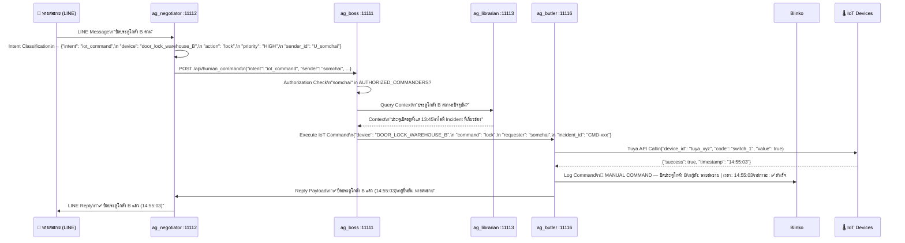

### 17.3 Intent Classification Map (ag_negotiator)

| คำสั่งตัวอย่าง (ภาษาไทย) | Intent | Target Agent | Priority |
|--------------------------|--------|-------------|----------|
| "รายงานประจำวันวันนี้" | `query_report` | ag_librarian | LOW |
| "กล้องโกดังเห็นอะไรบ้าง" | `vision_snapshot` | ag_watcher | MEDIUM |
| "ปิดประตูโกดัง B ด่วน" | `iot_command` | ag_butler | HIGH |
| "ยกเลิก False Alarm กล้อง 2" | `override_alert` | ag_boss | HIGH |
| "ประวัติเหตุการณ์เดือนนี้" | `query_history` | ag_librarian | LOW |
| "หยุดสายผลิต Line 1 ทันที" | `emergency_stop` | ag_boss | CRITICAL |
| "เปิดไฟโกดังทั้งหมด" | `iot_bulk_command` | ag_butler | MEDIUM |
| "ใครอยู่เวรตอนนี้" | `query_personnel` | ag_librarian | LOW |

---

## 18. ag_negotiator — Full Implementation

### 18.1 LINE Webhook Handler + Intent Classifier
```python
# tHe_DuDe_Service/agents/ag_negotiator/app/main.py

from fastapi import FastAPI, Request, HTTPException
from linebot.v3 import WebhookHandler
from linebot.v3.messaging import ApiClient, Configuration, MessagingApi, ReplyMessageRequest, TextMessage
from linebot.v3.webhooks import MessageEvent, TextMessageContent
import httpx
import os
import hmac
import hashlib
import base64

app = FastAPI(title="ag_negotiator", version="2.0")

LINE_CHANNEL_SECRET = os.getenv("LINE_CHANNEL_SECRET")
LINE_CHANNEL_TOKEN  = os.getenv("LINE_CHANNEL_ACCESS_TOKEN")
AG_BOSS_URL         = os.getenv("AG_BOSS_URL", "http://ag_boss:8000")

handler = WebhookHandler(LINE_CHANNEL_SECRET)

# ─── Webhook Security ───────────────────────────────────────────────────────
def verify_line_signature(body: bytes, signature: str) -> bool:
    """ยืนยัน LINE Webhook Signature"""
    expected = base64.b64encode(
        hmac.new(LINE_CHANNEL_SECRET.encode(), body, hashlib.sha256).digest()
    ).decode()
    return hmac.compare_digest(expected, signature)

# หมายเหตุ: hmac.new() ถูกต้องสำหรับ Python 3.x
# Python standard library: hmac.new(key, msg, digestmod) → HMAC object


@app.post("/webhook")
async def line_webhook(request: Request):
    """รับ LINE Webhook Events"""
    body      = await request.body()
    signature = request.headers.get("X-Line-Signature", "")

    if not verify_line_signature(body, signature):
        raise HTTPException(status_code=403, detail="Invalid signature")

    handler.handle(body.decode(), signature)
    return {"status": "ok"}


@app.post("/webhook/camera")
async def camera_webhook(request: Request, x_webhook_secret: str = None):
    """รับ Camera/IoT Webhook Events"""
    if x_webhook_secret != os.getenv("WEBHOOK_SECRET_KEY"):
        raise HTTPException(status_code=403, detail="Invalid webhook secret")

    event = await request.json()
    allowed_ips = os.getenv("ALLOWED_CAMERA_IPS", "").split(",")

    # Forward ไป ag_boss ทันที
    async with httpx.AsyncClient(timeout=5) as client:
        await client.post(f"{AG_BOSS_URL}/api/camera_event", json=event)

    return {"status": "accepted"}


# ─── LINE Message Handler ───────────────────────────────────────────────────
@handler.add(MessageEvent, message=TextMessageContent)
def handle_text_message(event: MessageEvent):
    """จัดการ LINE Text Message → Intent Classification → Boss"""
    text      = event.message.text.strip()
    sender_id = event.source.user_id

    # Classify Intent ด้วย LLM
    intent = classify_intent_sync(text, sender_id)

    # ส่ง Boss
    response_text = send_to_boss_sync(intent, text, sender_id, event.reply_token)

    # Reply กลับ LINE
    _reply_line(event.reply_token, response_text)


def classify_intent_sync(text: str, sender_id: str) -> dict:
    """เรียก LLM (Ollama) เพื่อ Classify Intent"""
    import httpx as _httpx

    OLLAMA_URL = os.getenv("OLLAMA_URL", "http://db_ollama:11434")

    prompt = f"""คุณคือระบบจัดการโรงงาน DuDe
วิเคราะห์คำสั่งต่อไปนี้และตอบเป็น JSON เท่านั้น (ไม่ต้องอธิบาย):

คำสั่ง: "{text}"

JSON Format:
{{
  "intent": "<query_report|query_history|vision_snapshot|iot_command|iot_bulk_command|override_alert|emergency_stop|unknown>",
  "priority": "<LOW|MEDIUM|HIGH|CRITICAL>",
  "device": "<ชื่ออุปกรณ์ หรือ null>",
  "action": "<lock|unlock|activate|deactivate|stop|start หรือ null>",
  "target": "<รายละเอียดเพิ่มเติม หรือ null>",
  "requires_confirmation": <true|false>
}}"""

    with _httpx.Client(timeout=10) as client:
        resp = client.post(f"{OLLAMA_URL}/api/generate", json={
            "model": os.getenv("CLASSIFIER_MODEL", "qwen3:0.6b"),
            "prompt": prompt,
            "stream": False,
            "format": "json"
        })
        data = resp.json()

    try:
        import json
        return json.loads(data.get("response", "{}"))
    except Exception:
        return {"intent": "unknown", "priority": "LOW"}


def send_to_boss_sync(intent: dict, original_text: str, sender_id: str, reply_token: str) -> str:
    """ส่ง Intent ไป ag_boss และรอ Response"""
    import httpx as _httpx

    payload = {
        "intent": intent,
        "original_text": original_text,
        "sender_id": sender_id,
        "reply_token": reply_token,
        "source": "line"
    }

    try:
        with _httpx.Client(timeout=30) as client:
            resp = client.post(f"{AG_BOSS_URL}/api/human_command", json=payload)
            result = resp.json()
            return result.get("reply_message", "✅ รับคำสั่งแล้ว")
    except Exception as e:
        return f"⚠️ ระบบชั่วคราวไม่ตอบสนอง: {str(e)[:50]}"


def _reply_line(reply_token: str, text: str):
    """ส่ง Reply กลับ LINE"""
    config = Configuration(access_token=LINE_CHANNEL_TOKEN)
    with ApiClient(config) as api_client:
        api = MessagingApi(api_client)
        api.reply_message(ReplyMessageRequest(
            reply_token=reply_token,
            messages=[TextMessage(type="text", text=text[:2000])]  # LINE limit
        ))
```

### 18.2 Authorization Service (ใน ag_boss)
```python
# tHe_DuDe_Service/agents/ag_boss/app/services/auth_service.py

from enum import Enum
import os
import json

class CommandPermission(str, Enum):
    VIEW_REPORT    = "view_report"
    VIEW_CAMERA    = "view_camera"
    CONTROL_IOT    = "control_iot"
    OVERRIDE_ALERT = "override_alert"
    EMERGENCY_STOP = "emergency_stop"
    ADMIN          = "admin"

# Permission Matrix — กำหนดในตัวแปรแวดล้อม
PERMISSION_MATRIX = {
    "supervisor": [
        CommandPermission.VIEW_REPORT,
        CommandPermission.VIEW_CAMERA,
        CommandPermission.CONTROL_IOT,
        CommandPermission.OVERRIDE_ALERT,
    ],
    "manager": [
        CommandPermission.VIEW_REPORT,
        CommandPermission.VIEW_CAMERA,
        CommandPermission.CONTROL_IOT,
        CommandPermission.OVERRIDE_ALERT,
        CommandPermission.EMERGENCY_STOP,
    ],
    "admin": list(CommandPermission),
    "viewer": [
        CommandPermission.VIEW_REPORT,
        CommandPermission.VIEW_CAMERA,
    ]
}

INTENT_PERMISSION_MAP = {
    "query_report":     CommandPermission.VIEW_REPORT,
    "query_history":    CommandPermission.VIEW_REPORT,
    "vision_snapshot":  CommandPermission.VIEW_CAMERA,
    "iot_command":      CommandPermission.CONTROL_IOT,
    "iot_bulk_command": CommandPermission.CONTROL_IOT,
    "override_alert":   CommandPermission.OVERRIDE_ALERT,
    "emergency_stop":   CommandPermission.EMERGENCY_STOP,
}

class AuthService:
    def __init__(self):
        # LINE User ID → Role Mapping (เก็บใน .env เป็น JSON)
        self.user_roles: dict = json.loads(os.getenv("LINE_USER_ROLES", "{}"))
        # ตัวอย่าง: {"Uxxxxxxxx": "manager", "Uyyyyyyyy": "supervisor"}

    def get_user_role(self, line_user_id: str) -> str:
        return self.user_roles.get(line_user_id, "viewer")

    def can_execute(self, line_user_id: str, intent: str) -> bool:
        """ตรวจสอบว่า User มีสิทธิ์ทำ Intent นี้หรือไม่"""
        role = self.get_user_role(line_user_id)
        required_perm = INTENT_PERMISSION_MAP.get(intent)

        if not required_perm:
            return False  # Unknown intent → ปฏิเสธ

        allowed_perms = PERMISSION_MATRIX.get(role, [])
        return required_perm in allowed_perms

    def get_deny_message(self, intent: str) -> str:
        return f"⛔ ไม่มีสิทธิ์ดำเนินการ: {intent}\nกรุณาติดต่อผู้ดูแลระบบ"
```

### 18.3 Human Command Handler (ใน ag_boss)
```python
# tHe_DuDe_Service/agents/ag_boss/app/api/human_command.py

from fastapi import APIRouter
from app.services.auth_service import AuthService
from app.core.mem0_client import MemoryService
from app.services.blinko_reader import BlinkoReader
from datetime import datetime
import httpx
import os

router  = APIRouter()
auth    = AuthService()
memory  = MemoryService()
blinko  = BlinkoReader()

REQUIRES_CONFIRMATION = {"emergency_stop", "iot_bulk_command"}

@router.post("/api/human_command")
async def handle_human_command(payload: dict):
    sender_id    = payload["sender_id"]
    intent_data  = payload["intent"]
    intent_name  = intent_data.get("intent", "unknown")
    original_text = payload.get("original_text", "")

    # 1. Authorization
    if not auth.can_execute(sender_id, intent_name):
        return {"reply_message": auth.get_deny_message(intent_name)}

    # 2. Confirmation Required?
    if intent_name in REQUIRES_CONFIRMATION and not payload.get("confirmed"):
        return {
            "reply_message": (
                f"⚠️ ยืนยันคำสั่ง: {original_text}\n"
                f"พิมพ์ 'ยืนยัน' เพื่อดำเนินการ หรือ 'ยกเลิก'"
            ),
            "awaiting_confirmation": True
        }

    # 3. Route ไปยัง Handler ที่ถูกต้อง
    handler_map = {
        "query_report":    _handle_query_report,
        "query_history":   _handle_query_history,
        "vision_snapshot": _handle_vision_snapshot,
        "iot_command":     _handle_iot_command,
        "override_alert":  _handle_override_alert,
        "emergency_stop":  _handle_emergency_stop,
    }

    handler = handler_map.get(intent_name)
    if not handler:
        return {"reply_message": "❓ ไม่เข้าใจคำสั่ง กรุณาลองใหม่"}

    result = await handler(intent_data, sender_id)

    # 4. Log ทุก Human Command ลง Blinko
    await _log_human_command(sender_id, original_text, intent_name, result)

    return result


async def _handle_query_report(intent: dict, sender_id: str) -> dict:
    """ดึงรายงานล่าสุดจาก Blinko"""
    report = await blinko.get_latest_daily_report()
    if not report:
        return {"reply_message": "📊 ยังไม่มีรายงานประจำวันสำหรับวันนี้"}

    summary = report.get("content", "")[:1000]  # ตัดให้พอดี LINE
    return {"reply_message": f"📊 รายงานล่าสุด:\n\n{summary}\n\nดูเพิ่มเติม: {report.get('url', '')}"}


async def _handle_query_history(intent: dict, sender_id: str) -> dict:
    """ค้นหาประวัติ Incident"""
    target = intent.get("target", "เหตุการณ์ทั้งหมด")
    incidents = await blinko.search_incidents(query=target, days_back=30, limit=5)

    if not incidents:
        return {"reply_message": f"📋 ไม่พบประวัติสำหรับ: {target}"}

    lines = [f"📋 ประวัติ ({len(incidents)} รายการ):"]
    for inc in incidents:
        lines.append(f"• {inc['timestamp'][:10]} — {inc.get('level','?')} | {inc.get('title','?')[:40]}")

    return {"reply_message": "\n".join(lines)}


async def _handle_vision_snapshot(intent: dict, sender_id: str) -> dict:
    """ขอ Snapshot จากกล้อง"""
    return {"reply_message": "📷 กำลังดึงภาพจากกล้อง... (ฟีเจอร์นี้ต้องการ LINE Image Reply)"}


async def _handle_iot_command(intent: dict, sender_id: str) -> dict:
    """สั่งควบคุม IoT Device"""
    device = intent.get("device")
    action = intent.get("action")

    if not device or not action:
        return {"reply_message": "❓ ระบุอุปกรณ์และคำสั่งให้ชัดเจนกว่านี้"}

    # ส่ง butler ผ่าน internal call
    async with httpx.AsyncClient(timeout=10) as client:
        resp = await client.post(f"{os.getenv('AG_BUTLER_URL', 'http://ag_butler:8000')}/api/iot", json={
            "device": device,
            "action": action,
            "requester": sender_id
        })
        result = resp.json()

    if result.get("success"):
        return {"reply_message": f"✅ {device}: {action} สำเร็จ ({datetime.now().strftime('%H:%M:%S')})"}
    else:
        return {"reply_message": f"❌ ไม่สามารถสั่ง {device}: {result.get('error', 'Unknown error')}"}


async def _handle_override_alert(intent: dict, sender_id: str) -> dict:
    """Override / ยกเลิก Alert"""
    camera = intent.get("target") or intent.get("device")
    await memory.remember_incident(
        entity_id=f"camera/{camera}",
        incident_text=f"Human override by {sender_id}: Alert cancelled — false alarm",
        metadata={"type": "override", "operator": sender_id, "timestamp": datetime.now().isoformat()}
    )
    return {"reply_message": f"✅ ยกเลิก Alert สำหรับกล้อง {camera} แล้ว\nบันทึก False Alarm เข้า Memory เรียบร้อย"}


async def _handle_emergency_stop(intent: dict, sender_id: str) -> dict:
    """หยุดสายการผลิตฉุกเฉิน"""
    target = intent.get("target", "ทุกสาย")
    # TODO: implement actual production line stop via IoT
    return {"reply_message": f"🛑 ส่งคำสั่งหยุดสาย: {target}\nกรุณายืนยันสถานะที่หน้างาน"}


async def _log_human_command(sender_id: str, text: str, intent: str, result: dict):
    """บันทึก Human Command ลง Blinko"""
    import httpx
    async with httpx.AsyncClient(timeout=5) as client:
        await client.post(
            f"{os.getenv('AG_BUTLER_URL', 'http://ag_butler:8000')}/api/log",
            json={
                "type": "HUMAN_COMMAND",
                "title": f"📝 COMMAND — {text[:50]}",
                "content": f"**ผู้สั่ง:** {sender_id}\n**คำสั่ง:** {text}\n**Intent:** {intent}\n**ผล:** {result.get('reply_message', '')[:200]}",
                "tags": ["#human_command", f"#intent_{intent}"],
                "incident_id": f"CMD-{datetime.now().strftime('%Y%m%d%H%M%S')}"
            }
        )
```

---

### 18.4 ag_boss — Main FastAPI Application
```python
# tHe_DuDe_Service/agents/ag_boss/app/main.py

from fastapi import FastAPI, HTTPException
from contextlib import asynccontextmanager
from datetime import datetime
import uvicorn
import os

from app.core.pipeline import DuDeOrchestrator
from app.api.human_command import router as human_command_router

# ── Singleton orchestrator (โหลดครั้งเดียวตอน startup) ──────────────────────
_orchestrator: DuDeOrchestrator | None = None


@asynccontextmanager
async def lifespan(app: FastAPI):
    global _orchestrator
    _orchestrator = DuDeOrchestrator()
    print("[ag_boss] Orchestrator initialized ✅")
    yield
    print("[ag_boss] Shutting down")


app = FastAPI(title="ag_boss", version="2.0", lifespan=lifespan)

# ── Mount Routers ────────────────────────────────────────────────────────────
app.include_router(human_command_router)


# ── Health ───────────────────────────────────────────────────────────────────
@app.get("/health")
async def health():
    return {"status": "ok", "service": "ag_boss", "version": "2.0"}


# ── Camera Event (จาก ag_negotiator) ────────────────────────────────────────
@app.post("/api/camera_event")
async def camera_event(event: dict):
    """
    รับ Camera/IoT Webhook Event จาก ag_negotiator
    ส่งต่อไปยัง handle_security_event pipeline
    """
    if not _orchestrator:
        raise HTTPException(status_code=503, detail="Orchestrator not ready")

    event_type = event.get("event", "")

    # Emergency events → Security pipeline
    SECURITY_EVENTS = {"smoke_detected", "fire_detected", "intrusion_detected",
                       "motion_detected", "glass_break", "sos_triggered"}

    if event_type in SECURITY_EVENTS:
        result = await _orchestrator.handle_security_event(event)
    else:
        # Unknown event → log only
        result = {
            "incident_id": f"UNK-{datetime.now().strftime('%Y%m%d%H%M%S')}",
            "severity": "LOW",
            "detections": [],
            "actions_executed": [],
            "sop_applied": "none",
            "note": f"Unhandled event type: {event_type}"
        }

    return result


# ── Daily Operations (จาก cron_jobs.sh) ─────────────────────────────────────
@app.post("/api/daily_operations")
async def daily_operations():
    """
    รัน Daily Quality & Inventory Check
    เรียกโดย dude_scheduler ทุก 08:00
    """
    if not _orchestrator:
        raise HTTPException(status_code=503, detail="Orchestrator not ready")

    result = await _orchestrator.handle_daily_operations()
    return result


# ── Weekly Pattern Analysis (จาก cron_jobs.sh ทุกวันจันทร์) ─────────────────
@app.post("/api/weekly_pattern_analysis")
async def weekly_pattern_analysis():
    """
    วิเคราะห์ Trend จาก Mem0 Entity Memories ย้อนหลัง 90 วัน
    เรียกโดย dude_scheduler ทุกวันจันทร์
    """
    if not _orchestrator:
        raise HTTPException(status_code=503, detail="Orchestrator not ready")

    from app.services.trend_analyzer import TrendAnalyzer
    from app.core.mem0_client import MemoryService

    memory   = MemoryService()
    analyzer = TrendAnalyzer()
    results  = []

    production_lines = os.getenv(
        "PRODUCTION_LINES",
        '[{"id":"prod_line_1"}]'
    )
    import json
    lines = json.loads(production_lines)

    for line in lines:
        entity_id = f"equipment/{line['id']}"
        memories  = await memory.get_entity_history(entity_id)
        trend     = analyzer.analyze_defect_trend(memories)
        trend.entity_id = entity_id

        results.append({
            "entity_id":       entity_id,
            "trend":           trend.trend,
            "slope":           trend.slope,
            "alert_level":     trend.alert_level,
            "prediction_days": trend.prediction_days,
            "recommendation":  trend.recommendation,
        })

    return {"analysis_date": datetime.now().isoformat(), "results": results}


if __name__ == "__main__":
    uvicorn.run("app.main:app", host="0.0.0.0", port=8000, reload=False)
```

---

### 18.5 ag_butler — Main FastAPI Application
```python
# tHe_DuDe_Service/agents/ag_butler/app/main.py

from fastapi import FastAPI, HTTPException
from contextlib import asynccontextmanager
from datetime import datetime
import httpx
import os
import uvicorn

from app.services.blinko_writer import BlinkoWriter, AlertLevel

_blinko = BlinkoWriter()


@asynccontextmanager
async def lifespan(app: FastAPI):
    print("[ag_butler] Ready ✅")
    yield


app = FastAPI(title="ag_butler", version="2.0", lifespan=lifespan)


# ── Health ───────────────────────────────────────────────────────────────────
@app.get("/health")
async def health():
    return {"status": "ok", "service": "ag_butler"}


# ── Execute Action (จาก ButlerClient.execute_actions) ────────────────────────
@app.post("/api/execute")
async def execute_action(payload: dict):
    """
    รับ Action จาก ag_boss และดำเนินการ:
    - iot       → ส่งคำสั่งไปยัง IoT device
    - line_push → ส่ง LINE Alert
    - log       → เขียน Blinko Log
    """
    action      = payload.get("action", {})
    incident_id = payload.get("incident_id", "")
    vision_res  = payload.get("vision_result", {})
    camera_id   = payload.get("camera_id", "unknown")
    action_type = action.get("type", "")

    if action_type == "iot":
        result = await _execute_iot(action, incident_id)

    elif action_type == "line_push":
        result = await _execute_line_push(action, incident_id)

    elif action_type == "log":
        level_str = action.get("level", "INFO")
        level_map = {
            "CRITICAL": AlertLevel.CRITICAL,
            "WARNING":  AlertLevel.WARNING,
            "INFO":     AlertLevel.INFO,
        }
        level = level_map.get(level_str, AlertLevel.INFO)
        note  = await _blinko.write_incident_log(
            level=level,
            title=f"Event from {camera_id}",
            camera_id=camera_id,
            vision_result=vision_res,
            actions_taken=[f"Action: {action_type}"],
            incident_id=incident_id,
        )
        result = {"success": True, "note_id": note.get("id", "")}

    else:
        result = {"success": False, "error": f"Unknown action type: {action_type}"}

    return result


# ── IoT Direct (จาก human_command._handle_iot_command) ───────────────────────
@app.post("/api/iot")
async def iot_command(payload: dict):
    """
    สั่ง IoT Device โดยตรง (จาก Human Command)
    ปัจจุบันรองรับ Tuya Smart devices ผ่าน tuyapy
    """
    device  = payload.get("device", "")
    action  = payload.get("action", "")
    result  = await _execute_iot({"device": device, "command": action}, "")
    return result


# ── Log Writer (จาก human_command._log_human_command) ────────────────────────
@app.post("/api/log")
async def write_log(payload: dict):
    """
    เขียน structured log ลง Blinko
    รับ payload จาก ag_boss / human_command
    """
    log_type    = payload.get("type", "INFO")
    title       = payload.get("title", "Log Entry")
    content     = payload.get("content", "")
    tags        = payload.get("tags", [])
    incident_id = payload.get("incident_id", f"LOG-{datetime.now().strftime('%Y%m%d%H%M%S')}")

    level_map = {
        "CRITICAL_ALERT": AlertLevel.CRITICAL,
        "WARNING":        AlertLevel.WARNING,
        "DAILY":          AlertLevel.DAILY,
        "HUMAN_COMMAND":  AlertLevel.INFO,
        "INFO":           AlertLevel.INFO,
    }
    level = level_map.get(log_type, AlertLevel.INFO)

    # เขียน raw content ลง Blinko โดยตรง (ไม่ผ่าน template)
    async with httpx.AsyncClient(timeout=10) as client:
        resp = await client.post(
            f"{os.getenv('BLINKO_BRIDGE_URL', 'http://blinko_bridge:8080')}/api/v1/notes",
            json={
                "content":  f"## {level.value} — {title}\n\n{content}",
                "tags":     tags + [f"#{level.name.lower()}"],
                "metadata": {"incident_id": incident_id, "type": log_type},
            },
            headers={"X-API-Key": os.getenv("BLINKO_API_KEY", "")},
        )
    return resp.json() if resp.status_code == 200 else {"success": False, "status": resp.status_code}


# ── Daily Report Writer (จาก ButlerClient.write_daily_report) ────────────────
@app.post("/api/daily_report")
async def write_daily_report(payload: dict):
    """รับ production/waste/inventory data และเขียน Daily Report ลง Blinko"""
    result = await _blinko.write_daily_report(
        date=payload.get("date", datetime.now().strftime("%Y-%m-%d")),
        production_data=payload.get("production", []),
        waste_data=payload.get("waste", []),
        inventory_data=payload.get("inventory", []),
    )
    return result


# ── Internal Helpers ─────────────────────────────────────────────────────────
async def _execute_iot(action: dict, incident_id: str) -> dict:
    """
    สั่ง IoT Device ผ่าน Tuya Cloud API
    device mapping โหลดจาก .env (FIRE_SUPPRESSION_ZONE_B, DOOR_LOCK_WAREHOUSE ฯลฯ)
    """
    device_key = action.get("device", "").upper().replace(" ", "_")
    device_id  = os.getenv(device_key, "")
    command    = action.get("command", action.get("action", ""))

    if not device_id:
        return {"success": False, "error": f"Device not found in .env: {device_key}"}

    # Tuya command mapping
    COMMAND_MAP = {
        "activate":   {"code": "switch_1", "value": True},
        "deactivate": {"code": "switch_1", "value": False},
        "lock":       {"code": "switch_1", "value": True},
        "unlock":     {"code": "switch_1", "value": False},
        "on":         {"code": "switch_1", "value": True},
        "off":        {"code": "switch_1", "value": False},
        "trigger_alarm":            {"code": "alarm_switch", "value": True},
        "activate_fire_suppression": {"code": "switch_1",   "value": True},
    }

    tuya_cmd = COMMAND_MAP.get(command)
    if not tuya_cmd:
        return {"success": False, "error": f"Unknown command: {command}"}

    try:
        TUYA_API_URL    = os.getenv("TUYA_API_URL", "https://openapi.tuyaeu.com")
        TUYA_CLIENT_ID  = os.getenv("TUYA_CLIENT_ID", "")
        TUYA_SECRET     = os.getenv("TUYA_CLIENT_SECRET", "")

        # หมายเหตุ: production ควรใช้ tuyapy library แทน raw HTTP
        # pip install tuyapy
        async with httpx.AsyncClient(timeout=10) as client:
            resp = await client.post(
                f"{TUYA_API_URL}/v1.0/devices/{device_id}/commands",
                json={"commands": [tuya_cmd]},
                headers={
                    "client_id": TUYA_CLIENT_ID,
                    "secret":    TUYA_SECRET,
                    "sign_method": "HMAC-SHA256",
                },
            )
        return {"success": resp.status_code == 200, "device": device_key, "command": command}

    except Exception as e:
        return {"success": False, "error": str(e)[:100]}


async def _execute_line_push(action: dict, incident_id: str) -> dict:
    """ส่ง LINE Push Message ผ่าน LINE Messaging API"""
    level      = action.get("level", 1)
    message    = action.get("message", "")
    contact_key = f"EMERGENCY_CONTACT_L{level}"
    to_user    = os.getenv(contact_key, "")

    if not to_user:
        return {"success": False, "error": f"No contact defined for {contact_key}"}

    try:
        async with httpx.AsyncClient(timeout=10) as client:
            resp = await client.post(
                "https://api.line.me/v2/bot/message/push",
                json={"to": to_user, "messages": [{"type": "text", "text": message}]},
                headers={"Authorization": f"Bearer {os.getenv('LINE_CHANNEL_ACCESS_TOKEN', '')}"},
            )
        return {"success": resp.status_code == 200, "to": to_user, "level": level}

    except Exception as e:
        return {"success": False, "error": str(e)[:100]}


if __name__ == "__main__":
    uvicorn.run("app.main:app", host="0.0.0.0", port=8000, reload=False)
```

---

### 18.6 ag_watcher — Main FastAPI Application
```python
# tHe_DuDe_Service/agents/ag_watcher/app/main.py

from fastapi import FastAPI, HTTPException
from contextlib import asynccontextmanager
from datetime import datetime
import httpx
import base64
import os
import uvicorn

OLLAMA_URL    = os.getenv("OLLAMA_URL",   "http://db_ollama:11434")
VISION_MODEL  = os.getenv("VISION_MODEL", "qwen2.5-vl:3b")   # qwen3-vl:2b บน 3060
OCR_LANG      = os.getenv("OCR_LANGUAGE", "th")
MAX_IMG_SIZE  = os.getenv("MAX_IMAGE_SIZE", "640x480")
CONCURRENT    = int(os.getenv("CONCURRENT_ANALYSIS", "2"))
VISION_MODE   = os.getenv("VISION_MODE", "webhook_only")      # webhook_only | full_rtsp


@asynccontextmanager
async def lifespan(app: FastAPI):
    print(f"[ag_watcher] Mode={VISION_MODE} Model={VISION_MODEL} ✅")
    yield


app = FastAPI(title="ag_watcher", version="2.0", lifespan=lifespan)


# ── Health ───────────────────────────────────────────────────────────────────
@app.get("/health")
async def health():
    return {"status": "ok", "service": "ag_watcher",
            "vision_mode": VISION_MODE, "model": VISION_MODEL}


# ── Vision Analyze (เรียกจาก VisionClient.analyze) ───────────────────────────
@app.post("/api/analyze")
async def analyze(payload: dict):
    """
    รับ snapshot URL หรือ base64 image → วิเคราะห์ด้วย Vision LLM → คืน detections

    Input:
        snapshot_url   : URL ของภาพ (หรือส่ง snapshot_b64 แทน)
        snapshot_b64   : base64-encoded image (ใช้เมื่อ URL ไม่ accessible)
        detect_classes : ["fire","smoke","person","defect","waste",...]
        camera_id      : ชื่อกล้อง
        incident_id    : reference ID (optional)

    Output:
        {status, camera_id, detections, summary, severity, processing_time_ms}
    """
    import time
    start = time.time()

    camera_id      = payload.get("camera_id", "unknown")
    detect_classes = payload.get("detect_classes", [])
    incident_id    = payload.get("incident_id", "")

    # โหลด image
    image_b64 = payload.get("snapshot_b64")
    if not image_b64:
        url = payload.get("snapshot_url", "")
        if not url:
            raise HTTPException(status_code=400, detail="snapshot_url or snapshot_b64 required")
        image_b64 = await _fetch_image_b64(url)

    # สร้าง prompt
    classes_str = ", ".join(detect_classes) if detect_classes else "any anomaly"
    prompt = (
        f"Analyze this factory/site image. "
        f"Detect and report: {classes_str}. "
        f"For each detected object provide: class name, confidence (0-1), approximate location. "
        f"Also give overall severity: LOW/MEDIUM/HIGH/NONE. "
        f"Reply in JSON only:\n"
        f'{{"detections":[{{"class":"","confidence":0.0,"location":""}}],'
        f'"summary":"","severity":"LOW/MEDIUM/HIGH/NONE"}}'
    )

    raw = await _ollama_vision(image_b64, prompt)

    # Parse JSON response
    import json, re
    try:
        # ล้าง markdown fences ถ้ามี
        clean = re.sub(r"```json|```", "", raw).strip()
        data  = json.loads(clean)
    except Exception:
        # fallback: ไม่สามารถ parse ได้ → ส่ง empty result
        data = {"detections": [], "summary": raw[:200], "severity": "UNKNOWN"}

    elapsed_ms = int((time.time() - start) * 1000)

    return {
        "status":             "ok",
        "camera_id":          camera_id,
        "incident_id":        incident_id,
        "detections":         data.get("detections", []),
        "summary":            data.get("summary", ""),
        "severity":           data.get("severity", "UNKNOWN"),
        "processing_time_ms": elapsed_ms,
        "model":              VISION_MODEL,
    }


# ── OCR (เรียกจาก VisionClient.ocr) ─────────────────────────────────────────
@app.post("/api/ocr")
async def ocr(payload: dict):
    """
    อ่านข้อความจากภาพ — ใบสั่งงาน, ป้าย, Label สินค้า
    ใช้ Vision LLM แทน PaddleOCR บน CPU-only hardware
    """
    import time
    start = time.time()

    camera_id = payload.get("camera_id", "unknown")
    language  = payload.get("language", OCR_LANG)

    image_b64 = payload.get("snapshot_b64")
    if not image_b64:
        url = payload.get("snapshot_url", "")
        if not url:
            raise HTTPException(status_code=400, detail="snapshot_url or snapshot_b64 required")
        image_b64 = await _fetch_image_b64(url)

    lang_hint = "Thai and English" if language == "th" else "English"
    prompt    = (
        f"Read all text visible in this image ({lang_hint}). "
        f"Return only the extracted text, preserving line breaks. "
        f"If no text is visible, return empty string."
    )

    text      = await _ollama_vision(image_b64, prompt)
    elapsed_ms = int((time.time() - start) * 1000)

    return {
        "status":             "ok",
        "camera_id":          camera_id,
        "text":               text.strip(),
        "confidence":         0.85,   # Vision LLM ไม่ให้ confidence โดยตรง
        "processing_time_ms": elapsed_ms,
    }


# ── Internal Helpers ─────────────────────────────────────────────────────────
async def _fetch_image_b64(url: str) -> str:
    """ดาวน์โหลด image จาก URL และแปลงเป็น base64"""
    try:
        async with httpx.AsyncClient(timeout=10) as client:
            resp = await client.get(url)
            resp.raise_for_status()
            return base64.b64encode(resp.content).decode()
    except Exception as e:
        raise HTTPException(status_code=502, detail=f"Cannot fetch image: {e}")


async def _ollama_vision(image_b64: str, prompt: str) -> str:
    """ส่ง image + prompt ไปยัง Ollama Vision model"""
    payload = {
        "model":  VISION_MODEL,
        "prompt": prompt,
        "images": [image_b64],
        "stream": False,
        "options": {
            "temperature": 0.1,
            "num_predict": 1024,
        }
    }
    try:
        async with httpx.AsyncClient(timeout=60) as client:
            resp = await client.post(f"{OLLAMA_URL}/api/generate", json=payload)
            resp.raise_for_status()
            return resp.json().get("response", "")
    except Exception as e:
        raise HTTPException(status_code=503, detail=f"Ollama vision error: {e}")


if __name__ == "__main__":
    uvicorn.run("app.main:app", host="0.0.0.0", port=8000, reload=False)
```

---

### 18.7 ag_librarian — Main FastAPI Application
```python
# tHe_DuDe_Service/agents/ag_librarian/app/main.py

from fastapi import FastAPI
from contextlib import asynccontextmanager
import asyncio
import uvicorn

from app.services.blinko_syncer import BlinkoSyncer

_syncer: BlinkoSyncer | None = None
_sync_task = None


@asynccontextmanager
async def lifespan(app: FastAPI):
    """เริ่ม BlinkoSyncer background loop ตอน startup"""
    global _syncer, _sync_task
    _syncer    = BlinkoSyncer()
    _sync_task = asyncio.create_task(_syncer.sync_loop())
    print("[ag_librarian] BlinkoSyncer started ✅")
    yield
    _sync_task.cancel()
    print("[ag_librarian] Shutting down")


app = FastAPI(title="ag_librarian", version="2.0", lifespan=lifespan)


# ── Health ───────────────────────────────────────────────────────────────────
@app.get("/health")
async def health():
    return {
        "status":    "ok",
        "service":   "ag_librarian",
        "last_sync": _syncer.last_sync.isoformat() if _syncer else None,
    }


# ── Manual Sync Trigger (สำหรับ debug / force sync) ─────────────────────────
@app.post("/api/sync")
async def trigger_sync():
    """Force sync Blinko → Qdrant ทันที (ไม่ต้องรอ 15 นาที)"""
    if not _syncer:
        return {"success": False, "error": "Syncer not ready"}
    count = await _syncer.sync_new_notes()
    return {"success": True, "synced": count}


# ── Search Incidents (เรียกจาก BlinkoReader fallback หรือ direct) ─────────────
@app.get("/api/search")
async def search_incidents(q: str, camera_id: str = None, limit: int = 5):
    """ค้นหา Incident จาก Qdrant (vector search)"""
    if not _syncer:
        return {"notes": []}
    results = await _syncer.search_incidents(
        query=q, camera_id=camera_id, limit=limit
    )
    return {"notes": results}


if __name__ == "__main__":
    uvicorn.run("app.main:app", host="0.0.0.0", port=8000, reload=False)
```

---

## 19. Security Architecture

### 19.1 Security Layers ทั้งระบบ

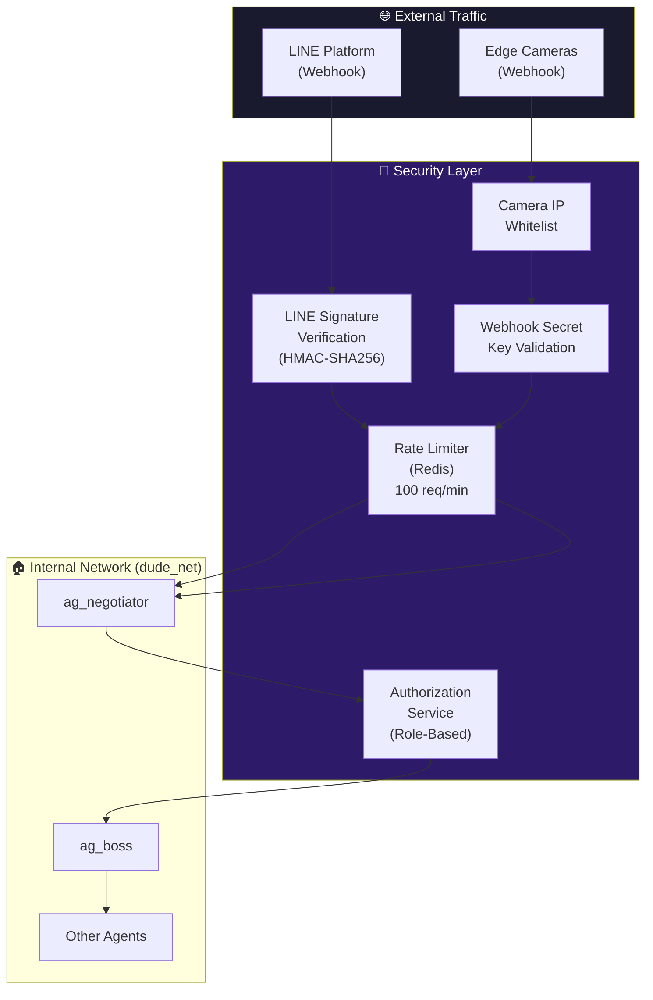

### 19.2 Webhook Security Implementation
```python
# tHe_DuDe_Service/agents/ag_negotiator/app/middleware/security.py

from fastapi import Request, HTTPException
from starlette.middleware.base import BaseHTTPMiddleware
import redis
import time
import os

redis_client = redis.Redis(
    host=os.getenv("REDIS_HOST", "db_redis"),
    port=int(os.getenv("REDIS_PORT", 13331)),
    decode_responses=True
)

class RateLimiterMiddleware(BaseHTTPMiddleware):
    """
    Rate Limiting ต่อ IP: 100 requests/minute
    ป้องกัน Webhook Flood Attack
    """

    async def dispatch(self, request: Request, call_next):
        client_ip = request.client.host
        key = f"rate_limit:{client_ip}"
        pipe = redis_client.pipeline()
        now  = time.time()

        pipe.zadd(key, {str(now): now})
        pipe.zremrangebyscore(key, 0, now - 60)  # ลบ entries เก่ากว่า 1 นาที
        pipe.zcard(key)
        pipe.expire(key, 120)
        results = pipe.execute()

        request_count = results[2]
        if request_count > 100:
            raise HTTPException(status_code=429, detail="Rate limit exceeded")

        response = await call_next(request)
        return response


class CameraIPWhitelistMiddleware(BaseHTTPMiddleware):
    """ตรวจสอบ IP ของกล้องก่อนรับ Webhook"""

    def __init__(self, app):
        super().__init__(app)
        self.allowed_ips = set(os.getenv("ALLOWED_CAMERA_IPS", "").split(","))

    async def dispatch(self, request: Request, call_next):
        if request.url.path.startswith("/webhook/camera"):
            client_ip = request.client.host
            if client_ip not in self.allowed_ips:
                raise HTTPException(status_code=403, detail=f"IP not whitelisted: {client_ip}")
        return await call_next(request)
```

### 19.3 Secret Management
```bash
# tHe_DuDe_Compose/scripts/rotate_secrets.sh
# รันทุก 90 วันเพื่อ Rotate API Keys

#!/bin/bash
set -e
echo "🔐 DuDe Secret Rotation — $(date)"

# Generate new webhook secret
NEW_WEBHOOK_SECRET=$(openssl rand -hex 32)
NEW_BLINKO_KEY=$(openssl rand -hex 32)

# Update .env
sed -i "s/WEBHOOK_SECRET_KEY=.*/WEBHOOK_SECRET_KEY=${NEW_WEBHOOK_SECRET}/" .env
sed -i "s/BLINKO_API_KEY=.*/BLINKO_API_KEY=${NEW_BLINKO_KEY}/" .env

# Restart affected services
docker compose restart ag_negotiator ag_butler blinko_bridge

echo "✅ Secrets rotated. Update camera firmware with new webhook secret."
echo "   New key prefix: ${NEW_WEBHOOK_SECRET:0:8}..."
```

### 19.4 Network Isolation Strategy
```yaml
# tHe_DuDe_Compose/docker-compose.yml — Network Definition

networks:
  dude_net:
    driver: bridge
    internal: true          # ❌ ไม่มี Internet Access โดยตรง
    ipam:
      config:
        - subnet: 172.20.0.0/16

  dude_dmz:
    driver: bridge           # ✅ มี Internet Access (สำหรับ ag_negotiator เท่านั้น)
    ipam:
      config:
        - subnet: 172.21.0.0/16

# ag_negotiator อยู่ทั้ง 2 networks — เป็น Gateway เดียว
ag_negotiator:
  networks:
    - dude_net
    - dude_dmz

# Services อื่นทั้งหมดอยู่แค่ dude_net
ag_boss:
  networks:
    - dude_net

ag_adventure:
  networks:
    - dude_net
    - dude_dmz    # ต้องการ Internet สำหรับ External Search เท่านั้น
```

### 19.5 Secrets ที่ต้องปกป้องและ Rotation Schedule

| Secret | ใช้ที่ไหน | Rotation | เก็บที่ไหน |
|--------|---------|----------|----------|
| `LINE_CHANNEL_SECRET` | ag_negotiator | ตาม LINE Policy | .env (encrypted) |
| `LINE_CHANNEL_ACCESS_TOKEN` | ag_negotiator | ทุก 30 วัน | .env (encrypted) |
| `BLINKO_API_KEY` | ag_butler, ag_librarian | ทุก 90 วัน | .env |
| `WEBHOOK_SECRET_KEY` | กล้องทุกตัว | ทุก 90 วัน | .env + กล้อง Firmware |
| `POSTGRES_PASSWORD` | db_postgres | ทุก 180 วัน | .env |
| `LINE_USER_ROLES` | ag_boss auth | เมื่อ Staff เปลี่ยน | .env (JSON) |

---

## 20. Testing Strategy

### 20.1 Test Pyramid สำหรับ DuDe Hawaiian

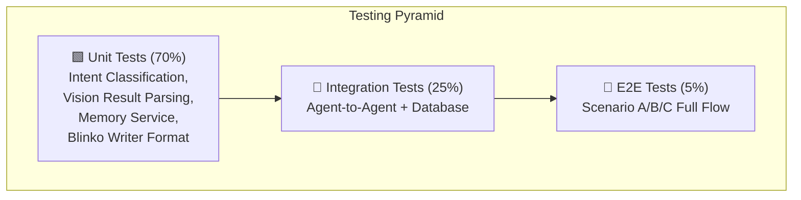

### 20.2 Unit Tests — Intent Classifier
```python
# tHe_DuDe_Service/tests/unit/test_intent_classifier.py

import pytest
from unittest.mock import patch, MagicMock
from agents.ag_negotiator.app.main import classify_intent_sync

class TestIntentClassifier:

    @pytest.mark.parametrize("text,expected_intent,expected_priority", [
        ("รายงานประจำวันวันนี้",      "query_report",   "LOW"),
        ("ปิดประตูโกดัง B ด่วน",     "iot_command",    "HIGH"),
        ("หยุดสายผลิต Line 1 ทันที", "emergency_stop", "CRITICAL"),
        ("กล้องโกดังเห็นอะไรบ้าง",   "vision_snapshot","MEDIUM"),
        ("ยกเลิก False Alarm กล้อง 2","override_alert", "HIGH"),
    ])
    def test_intent_classification(self, text, expected_intent, expected_priority):
        """ทดสอบว่า Classifier จำแนก Intent ได้ถูกต้อง"""
        with patch("httpx.Client") as mock_client:
            mock_response = MagicMock()
            mock_response.json.return_value = {
                "response": f'{{"intent": "{expected_intent}", "priority": "{expected_priority}", "device": null, "action": null, "target": null, "requires_confirmation": false}}'
            }
            mock_client.return_value.__enter__.return_value.post.return_value = mock_response

            result = classify_intent_sync(text, "U_test_user")

            assert result["intent"] == expected_intent
            assert result["priority"] == expected_priority

    def test_unknown_command_returns_unknown_intent(self):
        """คำสั่งที่ไม่รู้จักต้องคืน unknown"""
        with patch("httpx.Client") as mock_client:
            mock_response = MagicMock()
            mock_response.json.return_value = {"response": '{"intent": "unknown", "priority": "LOW"}'}
            mock_client.return_value.__enter__.return_value.post.return_value = mock_response

            result = classify_intent_sync("สวัสดีครับ", "U_test")
            assert result["intent"] == "unknown"
```

### 20.3 Unit Tests — Memory Service
```python
# tHe_DuDe_Service/tests/unit/test_memory_service.py

import pytest
from unittest.mock import AsyncMock, patch, MagicMock

class TestMemoryService:

    @pytest.fixture
    def memory_svc(self):
        with patch("agents.ag_boss.app.core.mem0_client.get_mem0") as mock_mem0:
            mock_mem0.return_value = MagicMock()
            from agents.ag_boss.app.core.mem0_client import MemoryService
            return MemoryService()

    @pytest.mark.asyncio
    async def test_remember_incident_stores_correctly(self, memory_svc):
        """ตรวจสอบว่า remember_incident เรียก mem0.add ด้วย param ที่ถูกต้อง"""
        memory_svc.mem.add = MagicMock(return_value={"id": "mem_123"})

        result = await memory_svc.remember_incident(
            entity_id="camera/warehouse_cam2",
            incident_text="ตรวจพบควันไฟ Section B",
            metadata={"incident_id": "INC-001", "severity": "HIGH"}
        )

        assert result == "mem_123"
        memory_svc.mem.add.assert_called_once()
        call_kwargs = memory_svc.mem.add.call_args[1]
        assert call_kwargs["user_id"] == "camera/warehouse_cam2"

    @pytest.mark.asyncio
    async def test_recall_context_returns_sorted_results(self, memory_svc):
        """ตรวจสอบว่า recall_context คืนผลลัพธ์ที่ถูกต้อง"""
        mock_results = {
            "results": [
                {"memory": "เหตุการณ์ล่าสุด", "score": 0.95},
                {"memory": "เหตุการณ์เก่า", "score": 0.72},
            ]
        }
        memory_svc.mem.search = MagicMock(return_value=mock_results)

        results = await memory_svc.recall_context(
            entity_id="camera/warehouse_cam2",
            query="smoke fire incident",
            limit=5
        )

        assert len(results) == 2
        assert results[0]["score"] == 0.95

    def test_calc_false_alarm_rate(self):
        """ตรวจสอบการคำนวณ False Alarm Rate"""
        from agents.ag_boss.app.core.pipeline import DuDeOrchestrator
        orch = DuDeOrchestrator.__new__(DuDeOrchestrator)

        memories = [
            {"memory": "false alarm ตรวจพบผิดพลาด"},
            {"memory": "confirmed fire incident"},
            {"memory": "false alarm again"},
            {"memory": "confirmed smoke"},
        ]

        rate = orch._calc_false_alarm_rate(memories)
        assert rate == pytest.approx(0.5)  # 2/4

        assert orch._calc_false_alarm_rate([]) == 0.0
```

### 20.4 Integration Tests — Fire Emergency Flow
```python
# tHe_DuDe_Service/tests/integration/test_fire_emergency_flow.py

import pytest
import httpx
import asyncio
import os

BASE_NEGOTIATOR = os.getenv("TEST_NEGOTIATOR_URL", "http://localhost:11112")
BASE_BOSS       = os.getenv("TEST_BOSS_URL", "http://localhost:11111")
BASE_BLINKO     = os.getenv("TEST_BLINKO_URL", "http://localhost:15555")

MOCK_FIRE_EVENT = {
    "event": "smoke_detected",
    "camera_id": "warehouse_cam2",
    "confidence": 0.94,
    "snapshot_url": "http://test-snapshot/smoke.jpg",
    "timestamp": "2026-04-07T14:32:01Z"
}

@pytest.mark.asyncio
@pytest.mark.integration
class TestFireEmergencyFlow:

    async def test_camera_webhook_reaches_boss(self):
        """กล้องส่ง Webhook → ag_negotiator → ag_boss"""
        async with httpx.AsyncClient(timeout=10) as client:
            resp = await client.post(
                f"{BASE_NEGOTIATOR}/webhook/camera",
                json=MOCK_FIRE_EVENT,
                headers={"X-Webhook-Secret": os.getenv("WEBHOOK_SECRET_KEY", "test_secret")}
            )
        assert resp.status_code == 200
        assert resp.json()["status"] == "accepted"

    async def test_boss_creates_incident_record(self):
        """ag_boss สร้าง Incident ID และส่ง ag_watcher"""
        async with httpx.AsyncClient(timeout=30) as client:
            resp = await client.post(
                f"{BASE_BOSS}/api/camera_event",
                json=MOCK_FIRE_EVENT
            )
        data = resp.json()
        assert "incident_id" in data
        assert data["incident_id"].startswith("INC-")
        assert data["severity"] in ["HIGH", "MEDIUM", "LOW"]

    async def test_blinko_receives_critical_log(self):
        """Blinko ต้องมี Critical Log ภายใน 10 วินาที"""
        # ส่ง Event ก่อน
        async with httpx.AsyncClient(timeout=30) as client:
            await client.post(f"{BASE_BOSS}/api/camera_event", json=MOCK_FIRE_EVENT)

        # รอให้ระบบประมวลผล
        await asyncio.sleep(5)

        # ตรวจสอบ Blinko
        async with httpx.AsyncClient(timeout=10) as client:
            resp = await client.get(
                f"{BASE_BLINKO}/api/v1/notes",
                params={"tags": "#critical", "limit": 5}
            )

        notes = resp.json().get("notes", [])
        assert len(notes) > 0
        assert any("warehouse_cam2" in n.get("content", "") for n in notes)

    async def test_response_time_under_30s(self):
        """E2E Response Time ต้องน้อยกว่า 30 วินาที"""
        import time
        start = time.time()

        async with httpx.AsyncClient(timeout=60) as client:
            await client.post(
                f"{BASE_NEGOTIATOR}/webhook/camera",
                json=MOCK_FIRE_EVENT,
                headers={"X-Webhook-Secret": os.getenv("WEBHOOK_SECRET_KEY", "test_secret")}
            )

        # รอ Processing
        await asyncio.sleep(2)

        async with httpx.AsyncClient(timeout=10) as client:
            resp = await client.get(f"{BASE_BLINKO}/api/v1/notes", params={"tags": "#critical", "limit": 1})

        elapsed = time.time() - start
        assert elapsed < 30, f"Response time {elapsed:.1f}s > 30s SLA"
```

### 20.5 วิธีรัน Tests
```bash
# Unit Tests (ไม่ต้องเปิด Docker)
cd tHe_DuDe_Service
pip install pytest pytest-asyncio pytest-cov --break-system-packages
pytest tests/unit/ -v --cov=agents --cov-report=html

# Integration Tests (ต้องเปิด Stack ก่อน)
docker compose --profile agents up -d
pytest tests/integration/ -v -m integration --timeout=60

# ดู Coverage Report
open htmlcov/index.html
```

---

## 21. Deployment Runbook

### 21.1 Boot Order (สำคัญมาก — ต้องทำตามลำดับ)

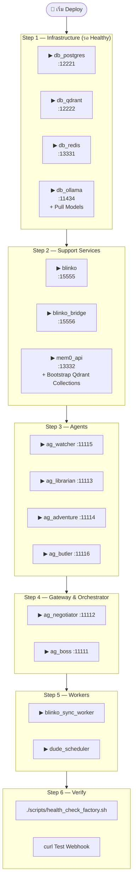

### 21.2 Bootstrap Script — First-Time Setup
```bash
#!/bin/bash
# tHe_DuDe_Compose/scripts/bootstrap.sh
# รันครั้งแรกหลัง clone project

set -e
echo "🏝️ DuDe Hawaiian v2.0 — First-Time Bootstrap"
echo "=============================================="

# ─── 1. ตรวจสอบ .env ───────────────────────────────────────────────────────
if [ ! -f .env ]; then
    echo "📋 สร้าง .env จาก template..."
    cp .env.example .env
    echo "⚠️  กรุณาแก้ไข .env ก่อนดำเนินการต่อ"
    echo "   - LINE_CHANNEL_SECRET"
    echo "   - LINE_CHANNEL_ACCESS_TOKEN"
    echo "   - LINE_USER_ROLES"
    echo "   - EMERGENCY_CONTACT_L1/L2/FIRE"
    echo "   - ALLOWED_CAMERA_IPS"
    exit 1
fi

# ─── 2. เริ่ม Infrastructure ────────────────────────────────────────────────
echo "🗄️ Step 1: Starting Infrastructure..."
docker compose up -d db_postgres db_qdrant db_redis db_ollama

echo "⏳ Waiting for databases to be healthy..."
until docker compose exec db_postgres pg_isready -U dude 2>/dev/null; do sleep 2; done
until curl -sf http://localhost:12222/healthz > /dev/null; do sleep 2; done
echo "✅ Databases ready"

# ─── 3. Pull Ollama Models ─────────────────────────────────────────────────
echo "🦙 Step 2: Pulling Ollama models..."
docker compose exec db_ollama ollama pull qwen2.5:3b
docker compose exec db_ollama ollama pull qwen3:0.6b
docker compose exec db_ollama ollama pull bge-m3:latest
docker compose exec db_ollama ollama pull qwen2.5-vl:3b
echo "✅ Models ready"

# ─── 4. Bootstrap Qdrant Collections ──────────────────────────────────────
echo "🗄️ Step 3: Bootstrapping Qdrant collections..."
docker compose run --rm mem0_api python /app/scripts/qdrant_bootstrap_v2.py
echo "✅ Qdrant collections created"

# ─── 5. Bootstrap PostgreSQL Schema ───────────────────────────────────────
echo "🐘 Step 4: Creating PostgreSQL schema..."
docker compose exec db_postgres psql -U dude -d dude_db -f /docker-entrypoint-initdb.d/schema.sql
echo "✅ PostgreSQL schema ready"

# ─── 6. เริ่ม Support Services ─────────────────────────────────────────────
echo "🔧 Step 5: Starting support services..."
docker compose up -d blinko blinko_bridge mem0_api
sleep 10
echo "✅ Support services started"

# ─── 7. Seed SOP Documents ────────────────────────────────────────────────
echo "📚 Step 6: Seeding SOP documents to Blinko..."
python scripts/seed_sop_documents.py
echo "✅ SOP documents seeded"

# ─── 8. เริ่ม Agents ──────────────────────────────────────────────────────
echo "🤖 Step 7: Starting agents..."
docker compose --profile agents up -d
sleep 15

# ─── 9. Health Check ──────────────────────────────────────────────────────
echo "🏥 Step 8: Running health check..."
bash scripts/health_check_factory.sh

echo ""
echo "✅✅✅ DuDe Hawaiian v2.0 is LIVE! ✅✅✅"
echo "   Blinko Dashboard: http://localhost:15555"
echo "   System Control:   http://localhost:11118"
echo ""
echo "📱 ทดสอบส่ง LINE Message เพื่อยืนยันระบบพร้อมใช้งาน"
```

### 21.3 Cron Jobs Script
```bash
#!/bin/sh
# tHe_DuDe_Compose/scripts/cron_jobs.sh
# Mount ไว้ที่ /etc/periodic/daily/dude_daily ใน dude_scheduler container
# Alpine crond รัน scripts ใน /etc/periodic/daily ทุกวันอัตโนมัติ
# สามารถเพิ่ม custom schedule ผ่าน /etc/crontabs/root ได้

AG_BOSS_URL="${AG_BOSS_URL:-http://ag_boss:8000}"
DAILY_CHECK_HOUR="${DAILY_CHECK_HOUR:-8}"
LOG_PREFIX="[DuDe Scheduler $(date '+%Y-%m-%d %H:%M:%S')]"

# ── ตรวจสอบว่าถึงเวลา Daily Check หรือยัง ──────────────────────────────────
CURRENT_HOUR=$(date +%H | sed 's/^0//')  # ลบ leading zero
if [ "$CURRENT_HOUR" != "$DAILY_CHECK_HOUR" ]; then
    # alpine crond runs /etc/periodic/daily once per day at midnight by default
    # เพื่อ control เวลา ให้ใส่ crontab แบบกำหนดเอง (ดู setup ด้านล่าง)
    echo "$LOG_PREFIX Skipping — not daily check hour ($DAILY_CHECK_HOUR:00)"
    exit 0
fi

echo "$LOG_PREFIX Starting daily operations check..."

# ── Daily Quality & Inventory Check ─────────────────────────────────────────
RESP=$(wget -qO- --post-data='{}' \
    --header='Content-Type: application/json' \
    "${AG_BOSS_URL}/api/daily_operations" 2>&1)

if echo "$RESP" | grep -q '"date"'; then
    echo "$LOG_PREFIX ✅ Daily operations check completed"
else
    echo "$LOG_PREFIX ❌ Daily operations check failed: $RESP"
    exit 1
fi

# ── Weekly Pattern Analysis (ทุกวันจันทร์) ──────────────────────────────────
DAY_OF_WEEK=$(date +%u)  # 1=Mon ... 7=Sun
if [ "$DAY_OF_WEEK" = "1" ]; then
    echo "$LOG_PREFIX Running weekly pattern analysis..."
    wget -qO- --post-data='{}' \
        --header='Content-Type: application/json' \
        "${AG_BOSS_URL}/api/weekly_pattern_analysis" > /dev/null 2>&1
    echo "$LOG_PREFIX ✅ Weekly analysis triggered"
fi

echo "$LOG_PREFIX Done"
exit 0
```

```
# tHe_DuDe_Compose/scripts/setup_crontab.sh
# รันครั้งเดียวเพื่อกำหนด schedule ที่ต้องการ (แทนค่า default midnight)
# ใช้หลัง bootstrap เสร็จ

#!/bin/bash
docker compose exec dude_scheduler sh -c "
echo '0 8 * * * /etc/periodic/daily/dude_daily >> /var/log/dude_daily.log 2>&1' \
    >> /etc/crontabs/root
echo 'Crontab updated: daily check at 08:00'
cat /etc/crontabs/root
"
```

---

### 21.4 Rolling Update (Zero-Downtime Agent Update)
```bash
#!/bin/bash
# tHe_DuDe_Compose/scripts/update_agent.sh <agent_name>
# ตัวอย่าง: ./update_agent.sh ag_boss

AGENT=$1
if [ -z "$AGENT" ]; then
    echo "Usage: ./update_agent.sh <agent_name>"
    exit 1
fi

echo "🔄 Updating $AGENT..."

# 1. Build Image ใหม่
docker compose build "$AGENT"

# 2. ตรวจสอบว่า Build สำเร็จ
if [ $? -ne 0 ]; then
    echo "❌ Build failed. Aborting update."
    exit 1
fi

# 3. Restart Agent (Docker Compose จะ Start ใหม่ด้วย Image ล่าสุด)
docker compose up -d --no-deps "$AGENT"

# 4. Health Check หลัง Restart
sleep 5
PORT_MAP=("ag_boss:11111" "ag_negotiator:11112" "ag_librarian:11113" "ag_adventure:11114" "ag_watcher:11115" "ag_butler:11116")
for entry in "${PORT_MAP[@]}"; do
    if [[ "$entry" == "$AGENT:"* ]]; then
        PORT="${entry#*:}"
        if curl -sf "http://localhost:${PORT}/health" > /dev/null; then
            echo "✅ $AGENT is healthy on :$PORT"
        else
            echo "❌ $AGENT health check failed — rolling back..."
            docker compose rollback "$AGENT"
            exit 1
        fi
    fi
done

echo "✅ $AGENT updated successfully"
```

### 21.5 Troubleshooting Guide

| อาการ | สาเหตุที่พบบ่อย | วิธีแก้ |
|-------|--------------|--------|
| ag_boss ไม่ตอบสนอง | Mem0 timeout ขณะ Query | ตรวจ Qdrant: `curl http://localhost:12222/healthz` |
| LINE Alert ไม่ส่ง | Token หมดอายุ / Rate limit | ตรวจ LINE Console, รัน `docker logs ag_negotiator` |
| Vision ช้า > 15s | Ollama Queue เต็ม (Concurrent) | ตรวจ `docker stats db_ollama`, ลด Parallel Job |
| Blinko Sync หยุด | blinko_sync_worker Crash | `docker compose restart blinko_sync_worker` |
| Memory ไม่บันทึก | Qdrant Collection Missing | รัน `python qdrant_bootstrap_v2.py` ใหม่ |
| False Alarm Rate สูง | Model Confidence ต่ำ | ปรับ `CONFIDENCE_THRESHOLD` ใน .env |
| Redis Connection Refused | Redis ยังไม่พร้อม | `docker compose restart db_redis && sleep 5` |
| Human Command ไม่ตอบ | LINE Token หมดอายุ | Refresh Token จาก LINE Developers Console |
| cron ไม่ทำงาน | schedule ยังเป็น midnight default | รัน `scripts/setup_crontab.sh` เพื่อตั้ง 08:00 |

### 21.6 Backup & Recovery
```bash
#!/bin/bash
# tHe_DuDe_Compose/scripts/backup.sh
# ควรรันทุกคืน 02:00 ผ่าน cron

BACKUP_DIR="/home/amnexus/backups/dude/$(date +%Y%m%d)"
mkdir -p "$BACKUP_DIR"

echo "💾 DuDe Backup — $(date)"

# PostgreSQL
docker compose exec -T db_postgres pg_dump -U dude dude_db | gzip > "$BACKUP_DIR/postgres.sql.gz"
echo "✅ PostgreSQL backed up"

# Qdrant Collections (Snapshot)
curl -sf -X POST "http://localhost:12222/collections/dude_mem0/snapshots" > /dev/null
curl -sf -X POST "http://localhost:12222/collections/blinko_incident_logs/snapshots" > /dev/null
curl -sf -X POST "http://localhost:12222/collections/dude_sop_documents/snapshots" > /dev/null
echo "✅ Qdrant snapshots created"

# ลบ Backup เก่ากว่า 7 วัน
find /home/amnexus/backups/dude/ -type d -mtime +7 -exec rm -rf {} + 2>/dev/null

echo "✅ Backup complete: $BACKUP_DIR"

# เพิ่ม Cron: 0 2 * * * /path/to/backup.sh >> /var/log/dude_backup.log 2>&1
```

---

## 22. Scenario D: Predictive Maintenance Alert (อนาคต — Phase 2)

### 22.1 ภาพรวม
เมื่อ Mem0 สะสม Incident Memory มากพอ (3-6 เดือน) ระบบสามารถ **ทำนายความผิดปกติก่อนเกิดเหตุ** โดยวิเคราะห์ Pattern ของ Entity

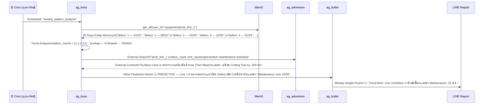

### 22.2 Trend Analysis Engine
```python
# tHe_DuDe_Service/agents/ag_boss/app/services/trend_analyzer.py

from dataclasses import dataclass
from typing import List, Tuple
import re

@dataclass
class TrendResult:
    entity_id: str
    metric: str
    values: List[float]
    slope: float                    # เพิ่ม/ลดต่อ Period
    trend: str                      # "rising", "stable", "falling"
    prediction_days: int            # คาดว่าจะ Exceed Threshold ในกี่วัน
    alert_level: str                # "NONE", "WATCH", "WARNING", "CRITICAL"
    recommendation: str

class TrendAnalyzer:
    """วิเคราะห์ Trend จาก Mem0 Entity Memories"""

    def analyze_defect_trend(
        self,
        memories: List[dict],
        threshold: float = 2.0
    ) -> TrendResult:
        """วิเคราะห์ Defect Rate Trend จาก Memory"""

        # Extract numeric values จาก memory strings
        values = []
        for mem in memories:
            text = mem.get("memory", "")
            match = re.search(r"(\d+)\s+defect", text.lower())
            if match:
                values.append(float(match.group(1)))

        if len(values) < 3:
            return TrendResult(
                entity_id="", metric="defects", values=values,
                slope=0, trend="insufficient_data",
                prediction_days=-1, alert_level="NONE",
                recommendation="ข้อมูลยังน้อยเกินไป ต้องรอ 3+ วัน"
            )

        # Linear Regression อย่างง่าย
        n = len(values)
        x = list(range(n))
        x_mean = sum(x) / n
        y_mean = sum(values) / n

        numerator   = sum((x[i] - x_mean) * (values[i] - y_mean) for i in range(n))
        denominator = sum((x[i] - x_mean) ** 2 for i in range(n))
        slope = numerator / denominator if denominator != 0 else 0

        # Predict วันที่จะ Exceed Threshold
        current_avg = values[-1]
        if slope > 0 and current_avg < threshold:
            days_to_threshold = int((threshold - current_avg) / slope)
        else:
            days_to_threshold = -1

        # Alert Level
        if slope > 1.0 or current_avg > threshold * 2:
            alert_level = "CRITICAL"
        elif slope > 0.5 or current_avg > threshold:
            alert_level = "WARNING"
        elif slope > 0.2:
            alert_level = "WATCH"
        else:
            alert_level = "NONE"

        trend = "rising" if slope > 0.1 else ("falling" if slope < -0.1 else "stable")

        recommendation = self._generate_recommendation(trend, slope, days_to_threshold, current_avg, threshold)

        return TrendResult(
            entity_id="", metric="defects", values=values,
            slope=round(slope, 3), trend=trend,
            prediction_days=days_to_threshold,
            alert_level=alert_level,
            recommendation=recommendation
        )

    def _generate_recommendation(self, trend, slope, days, current, threshold) -> str:
        if trend == "rising" and days > 0:
            return f"แนวโน้มเพิ่ม {slope:.1f}/วัน — คาดว่าเกิน Threshold ใน {days} วัน — แนะนำ Maintenance ก่อนกำหนด"
        elif trend == "rising":
            return "เกิน Threshold แล้ว — ต้องหยุดตรวจสอบทันที"
        elif trend == "stable":
            return "สถานะปกติ — ติดตามต่อเนื่อง"
        else:
            return "Defect ลดลง — ระบบทำงานดี"
```

---

## 23. ภาคผนวก — SOP Seed Documents (ตัวอย่าง)

### 23.1 SOP Templates ที่ต้อง Seed ลง Blinko วันแรก

```markdown
<!-- seed/sop_fire_emergency.md -->
## SOP: ไฟไหม้ / ควันไฟ
**Tags:** #sop #emergency #fire
**Version:** 1.0 | **Updated:** 2026-04-07

### เงื่อนไข Trigger
- ตรวจพบ smoke/fire จาก Vision AI Confidence > 0.85
- ยืนยันจาก 2 เซ็นเซอร์พร้อมกัน

### ขั้นตอน (ระบบทำอัตโนมัติ)
1. เปิดระบบดับเพลิงอัตโนมัติ (Zone ที่พบ)
2. ส่ง LINE Alert Level 1 ถึงหัวหน้าเวร
3. บันทึก Incident Log ใน Blinko
4. รอการยืนยันจาก Human ภายใน 3 นาที

### ขั้นตอน (หากไม่มีการยืนยัน 3 นาที)
1. Escalate ถึง Level 2 (ผู้จัดการโรงงาน)
2. โทร 199 อัตโนมัติ (ผ่าน LINE OA)

### Contact List
- หัวหน้าเวร: LINE ID ตาม EMERGENCY_CONTACT_L1
- ผู้จัดการ: LINE ID ตาม EMERGENCY_CONTACT_L2
- ดับเพลิง: LINE ID ตาม EMERGENCY_CONTACT_FIRE
```

```markdown
<!-- seed/sop_defect_threshold.md -->
## SOP: ของเสียเกิน Threshold
**Tags:** #sop #quality #defect
**Version:** 1.0 | **Updated:** 2026-04-07

### เงื่อนไข Trigger
- พบ surface_crack > 2 ชิ้น/ชั่วโมง (Production Line ใดก็ได้)
- Vision AI Confidence > 0.80

### ขั้นตอน
1. ส่ง WARNING Alert ถึง QC Team (LINE)
2. บันทึก Defect Log พร้อม ภาพ Snapshot
3. อัปเดต Entity Memory ของ Production Line นั้น

### เงื่อนไข Stop Line (Escalate)
- พบ > 5 ชิ้น/ชั่วโมง ติดต่อกัน 2 ชั่วโมง
- ให้ ag_boss ส่งคำสั่ง emergency_stop ผ่าน ag_butler
```

### 23.2 Script สำหรับ Seed SOP Documents
```python
# tHe_DuDe_Compose/scripts/seed_sop_documents.py

import httpx
import os
from pathlib import Path

BLINKO_URL = os.getenv("BLINKO_BRIDGE_URL", "http://localhost:15556")
BLINKO_KEY = os.getenv("BLINKO_API_KEY", "")
SOP_DIR    = Path("./seed")

def seed_sop_documents():
    sop_files = list(SOP_DIR.glob("sop_*.md"))
    print(f"📚 Seeding {len(sop_files)} SOP documents...")

    for sop_file in sop_files:
        content = sop_file.read_text(encoding="utf-8")
        tags = ["#sop"]

        # Extract tags จาก Frontmatter
        for line in content.split("\n"):
            if line.startswith("**Tags:**"):
                extracted = [t.strip() for t in line.replace("**Tags:**", "").split(",")]
                tags.extend(extracted)
                break

        resp = httpx.post(
            f"{BLINKO_URL}/api/v1/notes",
            json={"content": content, "tags": list(set(tags)), "metadata": {"type": "sop", "source": sop_file.name}},
            headers={"X-API-Key": BLINKO_KEY},
            timeout=10
        )

        if resp.status_code == 200:
            print(f"  ✅ {sop_file.name}")
        else:
            print(f"  ❌ {sop_file.name}: {resp.status_code}")

if __name__ == "__main__":
    seed_sop_documents()
```

---

## 24. PostgreSQL Schema

```sql
-- tHe_DuDe_Compose/db/init/schema.sql
-- รันอัตโนมัติตอน bootstrap ผ่าน:
--   docker compose exec db_postgres psql -U dude -d dude_db -f /docker-entrypoint-initdb.d/schema.sql
-- หรือ mount ที่ /docker-entrypoint-initdb.d/ ให้รันตอน container สร้างใหม่

-- ── Extensions ──────────────────────────────────────────────────────────────
CREATE EXTENSION IF NOT EXISTS "uuid-ossp";
CREATE EXTENSION IF NOT EXISTS "pg_trgm";   -- สำหรับ fuzzy text search

-- ── Incidents ────────────────────────────────────────────────────────────────
CREATE TABLE IF NOT EXISTS incidents (
    id              UUID        PRIMARY KEY DEFAULT uuid_generate_v4(),
    incident_id     VARCHAR(40) UNIQUE NOT NULL,   -- "INC-20260407-ABC123"
    camera_id       VARCHAR(100) NOT NULL,
    event_type      VARCHAR(50)  NOT NULL,          -- "smoke_detected", "intrusion_detected"
    severity        VARCHAR(20)  NOT NULL DEFAULT 'LOW', -- LOW / MEDIUM / HIGH / CRITICAL
    confidence      FLOAT,
    snapshot_url    TEXT,
    detections      JSONB,                          -- raw vision result
    actions_taken   JSONB,                          -- list of actions executed
    status          VARCHAR(30)  NOT NULL DEFAULT 'OPEN',
                                                    -- OPEN / CONFIRMED / FALSE_ALARM / RESOLVED
    confirmed_by    VARCHAR(100),                   -- LINE user_id ของผู้ยืนยัน
    blinko_note_id  VARCHAR(100),
    mem0_memory_id  VARCHAR(100),
    sop_applied     VARCHAR(100),
    response_time_s INTEGER,                        -- วินาทีจาก event ถึง LINE alert
    created_at      TIMESTAMPTZ  NOT NULL DEFAULT NOW(),
    updated_at      TIMESTAMPTZ  NOT NULL DEFAULT NOW(),
    resolved_at     TIMESTAMPTZ
);

CREATE INDEX IF NOT EXISTS idx_incidents_camera_id  ON incidents (camera_id);
CREATE INDEX IF NOT EXISTS idx_incidents_severity   ON incidents (severity);
CREATE INDEX IF NOT EXISTS idx_incidents_status     ON incidents (status);
CREATE INDEX IF NOT EXISTS idx_incidents_created_at ON incidents (created_at DESC);
CREATE INDEX IF NOT EXISTS idx_incidents_event_type ON incidents (event_type);

-- ── Daily Reports ────────────────────────────────────────────────────────────
CREATE TABLE IF NOT EXISTS daily_reports (
    id              UUID        PRIMARY KEY DEFAULT uuid_generate_v4(),
    report_date     DATE        UNIQUE NOT NULL,
    production_data JSONB,      -- [{line, defect_count, defect_type, threshold, trend, alert}]
    waste_data      JSONB,      -- [{location, fill_level, type}]
    inventory_data  JSONB,
    summary_text    TEXT,
    blinko_note_id  VARCHAR(100),
    created_at      TIMESTAMPTZ NOT NULL DEFAULT NOW()
);

CREATE INDEX IF NOT EXISTS idx_daily_reports_date ON daily_reports (report_date DESC);

-- ── Equipment State ──────────────────────────────────────────────────────────
CREATE TABLE IF NOT EXISTS equipment_state (
    id              UUID        PRIMARY KEY DEFAULT uuid_generate_v4(),
    equipment_id    VARCHAR(100) UNIQUE NOT NULL,   -- "prod_line_1", "warehouse_cam2"
    equipment_type  VARCHAR(50)  NOT NULL,           -- "production_line","camera","iot_device"
    status          VARCHAR(30)  NOT NULL DEFAULT 'NORMAL',
                                                    -- NORMAL / WARNING / CRITICAL / OFFLINE
    last_defect_count INTEGER    DEFAULT 0,
    last_checked_at TIMESTAMPTZ,
    last_incident_id VARCHAR(40),
    metadata        JSONB,
    updated_at      TIMESTAMPTZ NOT NULL DEFAULT NOW()
);

CREATE INDEX IF NOT EXISTS idx_equipment_state_type   ON equipment_state (equipment_type);
CREATE INDEX IF NOT EXISTS idx_equipment_state_status ON equipment_state (status);

-- ── Human Commands Log ───────────────────────────────────────────────────────
CREATE TABLE IF NOT EXISTS human_commands (
    id              UUID        PRIMARY KEY DEFAULT uuid_generate_v4(),
    command_id      VARCHAR(40) UNIQUE NOT NULL,   -- "CMD-20260407143201"
    sender_line_id  VARCHAR(100) NOT NULL,
    sender_role     VARCHAR(30),                    -- supervisor / manager / admin / viewer
    original_text   TEXT        NOT NULL,
    intent          VARCHAR(50),                    -- iot_command / query_report / ...
    target_device   VARCHAR(100),
    action          VARCHAR(50),
    result_success  BOOLEAN,
    result_message  TEXT,
    blinko_note_id  VARCHAR(100),
    created_at      TIMESTAMPTZ NOT NULL DEFAULT NOW()
);

CREATE INDEX IF NOT EXISTS idx_human_commands_sender    ON human_commands (sender_line_id);
CREATE INDEX IF NOT EXISTS idx_human_commands_intent    ON human_commands (intent);
CREATE INDEX IF NOT EXISTS idx_human_commands_created   ON human_commands (created_at DESC);

-- ── Agent Metadata ───────────────────────────────────────────────────────────
CREATE TABLE IF NOT EXISTS agent_metadata (
    agent_name      VARCHAR(50) PRIMARY KEY,        -- "ag_boss", "ag_watcher", ...
    last_heartbeat  TIMESTAMPTZ,
    version         VARCHAR(20),
    config          JSONB,
    updated_at      TIMESTAMPTZ NOT NULL DEFAULT NOW()
);

INSERT INTO agent_metadata (agent_name, version) VALUES
    ('ag_boss',       '2.0'),
    ('ag_negotiator', '2.0'),
    ('ag_librarian',  '2.0'),
    ('ag_adventure',  '2.0'),
    ('ag_watcher',    '2.0'),
    ('ag_butler',     '2.0')
ON CONFLICT (agent_name) DO NOTHING;

-- ── Auto-update updated_at trigger ──────────────────────────────────────────
CREATE OR REPLACE FUNCTION update_updated_at()
RETURNS TRIGGER AS $$
BEGIN
    NEW.updated_at = NOW();
    RETURN NEW;
END;
$$ LANGUAGE plpgsql;

CREATE TRIGGER trg_incidents_updated_at
    BEFORE UPDATE ON incidents
    FOR EACH ROW EXECUTE FUNCTION update_updated_at();

CREATE TRIGGER trg_equipment_state_updated_at
    BEFORE UPDATE ON equipment_state
    FOR EACH ROW EXECUTE FUNCTION update_updated_at();
```

---

## 25. Environment Template — .env.example

```bash
# tHe_DuDe_Compose/.env.example
# คัดลอกไฟล์นี้เป็น .env แล้วแก้ค่าที่มี <CHANGE_ME> ก่อน bootstrap
# cp .env.example .env

# ══════════════════════════════════════════════════════════════
# LINE MESSAGING API  (จาก https://developers.line.biz/console)
# ══════════════════════════════════════════════════════════════
LINE_CHANNEL_SECRET=<CHANGE_ME>
LINE_CHANNEL_ACCESS_TOKEN=<CHANGE_ME>

# LINE User ID → Role mapping (JSON)
# หา User ID ได้จาก LINE Developers > Webhook event log
# roles: admin | manager | supervisor | viewer
LINE_USER_ROLES={"U000000000000000000":"manager"}

# ══════════════════════════════════════════════════════════════
# EMERGENCY CONTACTS  (LINE User ID)
# ══════════════════════════════════════════════════════════════
EMERGENCY_CONTACT_L1=<CHANGE_ME>    # หัวหน้าเวร (Level 1)
EMERGENCY_CONTACT_L2=<CHANGE_ME>    # ผู้จัดการโรงงาน (Level 2)
EMERGENCY_CONTACT_FIRE=<CHANGE_ME>  # ทีมดับเพลิง

# ══════════════════════════════════════════════════════════════
# WEBHOOK SECURITY
# ══════════════════════════════════════════════════════════════
WEBHOOK_SECRET_KEY=<CHANGE_ME>          # สร้างด้วย: openssl rand -hex 32
ALLOWED_CAMERA_IPS=192.168.1.121,192.168.1.122,192.168.1.123

# ══════════════════════════════════════════════════════════════
# DATABASE — ไม่ต้องแก้ถ้าใช้ Docker Compose ทั้งหมด
# ══════════════════════════════════════════════════════════════
POSTGRES_USER=dude
POSTGRES_PASSWORD=dude_secure_password_change_me
POSTGRES_DB=dude_db
POSTGRES_URL=postgresql://dude:dude_secure_password_change_me@db_postgres:5432/dude_db

QDRANT_URL=http://db_qdrant:6333
REDIS_HOST=db_redis
REDIS_PORT=6379
OLLAMA_URL=http://db_ollama:11434

# ══════════════════════════════════════════════════════════════
# BLINKO
# ══════════════════════════════════════════════════════════════
BLINKO_API_KEY=<CHANGE_ME>              # ตั้งใน Blinko Settings หลัง start
BLINKO_BRIDGE_URL=http://blinko_bridge:8080
BLINKO_PUBLIC_URL=http://localhost:15555  # URL สำหรับ link ใน LINE (ใส่ IP จริงถ้า expose)
BLINKO_SYNC_INTERVAL=900
BLINKO_SYNC_TAGS=#critical,#warning,#daily_report,#sop
BLINKO_SEARCH_COLLECTION=blinko_incident_logs

# ══════════════════════════════════════════════════════════════
# MEM0
# ══════════════════════════════════════════════════════════════
MEM0_COLLECTION=dude_mem0
MEM0_EMBEDDING_MODEL=bge-m3:latest
MEM0_CACHE_SIZE=1000
MEM0_HISTORY_DB=/app/data/mem0_history.db

# ══════════════════════════════════════════════════════════════
# LLM MODELS  (ปรับตาม hardware)
# ══════════════════════════════════════════════════════════════
# Dell OptiPlex 3060 (CPU-only):
PRIMARY_MODEL=qwen2.5:3b
CLASSIFIER_MODEL=qwen3:0.6b
VISION_MODEL=qwen2.5-vl:3b
VISION_MODE=webhook_only
MAX_IMAGE_SIZE=640x480
CONCURRENT_ANALYSIS=2

# GPU Server (uncomment เมื่อย้าย):
# PRIMARY_MODEL=qwen2.5:7b
# VISION_MODEL=qwen2.5-vl:7b
# VISION_MODE=full_rtsp
# MAX_IMAGE_SIZE=1920x1080
# CONCURRENT_ANALYSIS=8

# ══════════════════════════════════════════════════════════════
# SITE / FACTORY CONFIGURATION
# ══════════════════════════════════════════════════════════════
SITE_NAME=DuDe Factory Site A
SITE_TIMEZONE=Asia/Bangkok
DAILY_CHECK_HOUR=8
CONFIDENCE_THRESHOLD=0.80

# Production Lines (JSON Array)
PRODUCTION_LINES='[
  {"id":"prod_line_1","camera_id":"cam_line1","snapshot_url":"http://192.168.1.121/snapshot.jpg","defect_threshold":2},
  {"id":"prod_line_2","camera_id":"cam_line2","snapshot_url":"http://192.168.1.122/snapshot.jpg","defect_threshold":2}
]'

# ══════════════════════════════════════════════════════════════
# IoT DEVICE MAPPING  (Tuya Device IDs)
# ══════════════════════════════════════════════════════════════
TUYA_API_URL=https://openapi.tuyaeu.com
TUYA_CLIENT_ID=<CHANGE_ME>
TUYA_CLIENT_SECRET=<CHANGE_ME>

FIRE_SUPPRESSION_ZONE_B=<tuya_device_id>
ALARM_SPEAKER_MAIN=<tuya_device_id>
DOOR_LOCK_WAREHOUSE=<tuya_device_id>
DOOR_LOCK_WAREHOUSE_B=<tuya_device_id>

# ══════════════════════════════════════════════════════════════
# WEB CONTROL PANEL
# ══════════════════════════════════════════════════════════════
WEB_CONTROL_SECRET=<CHANGE_ME>          # password สำหรับ login Control Panel

# ══════════════════════════════════════════════════════════════
# AGENT INTERNAL URLs  (ไม่ต้องแก้ถ้าใช้ Docker network เดียวกัน)
# ══════════════════════════════════════════════════════════════
AG_BOSS_URL=http://ag_boss:8000
AG_NEGOTIATOR_URL=http://ag_negotiator:8000
AG_WATCHER_URL=http://ag_watcher:8000
AG_BUTLER_URL=http://ag_butler:8000
AG_LIBRARIAN_URL=http://ag_librarian:8000
AG_ADVENTURE_URL=http://ag_adventure:8000
MEM0_SVC_URL=http://mem0_api:8080
```

---

## 26. Requirements.txt — แต่ละ Agent

### 26.1 ag_boss
```text
# tHe_DuDe_Service/agents/ag_boss/requirements.txt
fastapi==0.115.0
uvicorn[standard]==0.30.0
httpx==0.27.0
mem0ai==0.1.29
qdrant-client==1.9.1
pydantic==2.7.0
python-dotenv==1.0.1
asyncio-throttle==1.0.2
```

### 26.2 ag_negotiator
```text
# tHe_DuDe_Service/agents/ag_negotiator/requirements.txt
fastapi==0.115.0
uvicorn[standard]==0.30.0
httpx==0.27.0
line-bot-sdk==3.11.0        # linebot.v3
redis==5.0.4
pydantic==2.7.0
python-dotenv==1.0.1
```

### 26.3 ag_butler
```text
# tHe_DuDe_Service/agents/ag_butler/requirements.txt
fastapi==0.115.0
uvicorn[standard]==0.30.0
httpx==0.27.0
pydantic==2.7.0
python-dotenv==1.0.1
```

### 26.4 ag_watcher
```text
# tHe_DuDe_Service/agents/ag_watcher/requirements.txt
fastapi==0.115.0
uvicorn[standard]==0.30.0
httpx==0.27.0
Pillow==10.3.0              # resize / validate image ก่อนส่ง Ollama
python-dotenv==1.0.1
pydantic==2.7.0
```

### 26.5 ag_librarian
```text
# tHe_DuDe_Service/agents/ag_librarian/requirements.txt
fastapi==0.115.0
uvicorn[standard]==0.30.0
httpx==0.27.0
qdrant-client==1.9.1
pydantic==2.7.0
python-dotenv==1.0.1
```

### 26.6 ag_adventure
```text
# tHe_DuDe_Service/agents/ag_adventure/requirements.txt
fastapi==0.115.0
uvicorn[standard]==0.30.0
httpx==0.27.0
duckduckgo-search==6.1.7    # web search ไม่ต้อง API key
beautifulsoup4==4.12.3      # parse HTML ผลการค้นหา
lxml==5.2.1
pydantic==2.7.0
python-dotenv==1.0.1
```

### 26.7 Shared / Test Dependencies
```text
# tHe_DuDe_Service/requirements-dev.txt
pytest==8.2.0
pytest-asyncio==0.23.6
pytest-cov==5.0.0
httpx==0.27.0               # test client
respx==0.21.1               # mock httpx calls
```

---

## 27. ag_adventure — External Search Agent

### 27.1 ภาพรวม
ag_adventure ทำหน้าที่ค้นหาข้อมูลจากอินเทอร์เน็ตให้ ag_boss เมื่อต้องการ:
- Root cause analysis ของ defect pattern ที่ไม่เคยเจอมาก่อน
- Regulation / Safety Standard ที่เกี่ยวข้องกับ incident
- Product / Part information สำหรับการจัดซื้อ
- Predictive maintenance best practice

### 27.2 Main Application
```python
# tHe_DuDe_Service/agents/ag_adventure/app/main.py

from fastapi import FastAPI, HTTPException
from contextlib import asynccontextmanager
from datetime import datetime
import httpx
import os
import uvicorn

from app.services.searcher import WebSearcher

_searcher: WebSearcher | None = None


@asynccontextmanager
async def lifespan(app: FastAPI):
    global _searcher
    _searcher = WebSearcher()
    print("[ag_adventure] WebSearcher ready ✅")
    yield


app = FastAPI(title="ag_adventure", version="2.0", lifespan=lifespan)


# ── Health ───────────────────────────────────────────────────────────────────
@app.get("/health")
async def health():
    return {"status": "ok", "service": "ag_adventure"}


# ── Search (เรียกจาก ag_boss) ─────────────────────────────────────────────────
@app.post("/api/search")
async def search(payload: dict):
    """
    ค้นหาข้อมูลจาก Web และสรุปด้วย LLM

    Input:
        query      : คำค้นหา (ภาษาไทยหรืออังกฤษ)
        context    : บริบทเพิ่มเติม เช่น "factory defect root cause"
        max_results: จำนวน source สูงสุด (default 5)
        summarize  : true/false — ให้ LLM สรุปผลหรือคืน raw results

    Output:
        {query, sources, summary, search_time_ms}
    """
    if not _searcher:
        raise HTTPException(status_code=503, detail="Searcher not ready")

    query       = payload.get("query", "")
    context     = payload.get("context", "")
    max_results = int(payload.get("max_results", 5))
    summarize   = payload.get("summarize", True)

    if not query:
        raise HTTPException(status_code=400, detail="query is required")

    result = await _searcher.search_and_summarize(
        query=query,
        context=context,
        max_results=max_results,
        summarize=summarize,
    )
    return result
```

### 27.3 WebSearcher Service
```python
# tHe_DuDe_Service/agents/ag_adventure/app/services/searcher.py

import httpx
import os
import time
from duckduckgo_search import DDGS
from bs4 import BeautifulSoup

OLLAMA_URL     = os.getenv("OLLAMA_URL",     "http://db_ollama:11434")
PRIMARY_MODEL  = os.getenv("PRIMARY_MODEL",  "qwen2.5:3b")
MAX_BODY_CHARS = 2000   # จำกัดความยาว body ต่อ source


class WebSearcher:
    """ค้นหา Web ด้วย DuckDuckGo และสรุปด้วย Ollama LLM"""

    async def search_and_summarize(
        self,
        query: str,
        context: str = "",
        max_results: int = 5,
        summarize: bool = True,
    ) -> dict:
        start = time.time()

        # ── 1. DuckDuckGo Search ─────────────────────────────────────────────
        sources = await self._ddg_search(query, max_results)

        if not sources:
            return {
                "query":          query,
                "sources":        [],
                "summary":        "ไม่พบข้อมูลที่เกี่ยวข้อง",
                "search_time_ms": int((time.time() - start) * 1000),
            }

        # ── 2. Fetch & Extract body text ────────────────────────────────────
        for src in sources:
            src["body"] = await self._fetch_text(src["url"])

        # ── 3. Summarize ด้วย LLM ────────────────────────────────────────────
        summary = ""
        if summarize:
            summary = await self._llm_summarize(query, context, sources)

        elapsed_ms = int((time.time() - start) * 1000)

        return {
            "query":          query,
            "sources":        [
                {
                    "title": s["title"],
                    "url":   s["url"],
                    "body":  s["body"][:500],   # ตัดสำหรับ response
                }
                for s in sources
            ],
            "summary":        summary,
            "search_time_ms": elapsed_ms,
        }

    async def _ddg_search(self, query: str, max_results: int) -> list[dict]:
        """ค้นหาด้วย DuckDuckGo — ไม่ต้อง API key"""
        try:
            with DDGS() as ddgs:
                results = list(ddgs.text(query, max_results=max_results))
            return [
                {
                    "title": r.get("title", ""),
                    "url":   r.get("href", ""),
                    "body":  r.get("body", ""),
                }
                for r in results
            ]
        except Exception as e:
            print(f"[ag_adventure] DDG search error: {e}")
            return []

    async def _fetch_text(self, url: str) -> str:
        """ดึง HTML และ extract ข้อความจาก <p> tags"""
        if not url:
            return ""
        try:
            async with httpx.AsyncClient(timeout=8, follow_redirects=True) as client:
                resp = await client.get(
                    url,
                    headers={"User-Agent": "Mozilla/5.0 (DuDe Factory Agent)"},
                )
                if resp.status_code != 200:
                    return ""
                soup = BeautifulSoup(resp.text, "lxml")
                # เอาแค่ paragraph text
                paragraphs = soup.find_all("p")
                text = " ".join(p.get_text(strip=True) for p in paragraphs)
                return text[:MAX_BODY_CHARS]
        except Exception:
            return ""

    async def _llm_summarize(
        self,
        query: str,
        context: str,
        sources: list[dict],
    ) -> str:
        """สรุปผลการค้นหาด้วย Ollama LLM เป็นภาษาไทย"""
        combined = "\n\n".join([
            f"Source: {s['title']}\nURL: {s['url']}\nContent: {s['body'][:800]}"
            for s in sources
            if s.get("body")
        ])

        prompt = f"""คุณคือผู้เชี่ยวชาญด้านการจัดการโรงงานและวิศวกรรม
ค้นหา: "{query}"
{f'บริบท: {context}' if context else ''}

ข้อมูลจากอินเทอร์เน็ต:
{combined}

สรุปข้อมูลที่เกี่ยวข้องเป็นภาษาไทย ไม่เกิน 5 ประโยค
เน้น: สาเหตุ, วิธีแก้ไข, คำแนะนำในการป้องกัน"""

        try:
            async with httpx.AsyncClient(timeout=30) as client:
                resp = await client.post(
                    f"{OLLAMA_URL}/api/generate",
                    json={
                        "model":  PRIMARY_MODEL,
                        "prompt": prompt,
                        "stream": False,
                        "options": {"temperature": 0.2, "num_predict": 512},
                    },
                )
                return resp.json().get("response", "").strip()
        except Exception as e:
            return f"สรุปไม่ได้: {e}"
```

---

## 28. dude_web_control — System Control Panel

### 28.1 ภาพรวม
Web UI สำหรับทีม Ops เข้าดูสถานะระบบ, trigger manual actions, และ monitor agents
เข้าถึงที่ `http://localhost:11118` — รองรับ Basic Auth ด้วย `WEB_CONTROL_SECRET`

### 28.2 Main Application
```python
# tHe_DuDe_Service/app_mcp_svc/web_control/app/main.py

from fastapi import FastAPI, HTTPException, Depends, status
from fastapi.security import HTTPBasic, HTTPBasicCredentials
from fastapi.responses import HTMLResponse
from contextlib import asynccontextmanager
import httpx
import secrets
import os
import uvicorn

CONTROL_SECRET = os.getenv("WEB_CONTROL_SECRET", "change_me")
SITE_NAME      = os.getenv("SITE_NAME", "DuDe Factory")

AGENT_URLS = {
    "ag_boss":       os.getenv("AG_BOSS_URL",       "http://ag_boss:8000"),
    "ag_negotiator": os.getenv("AG_NEGOTIATOR_URL", "http://ag_negotiator:8000"),
    "ag_watcher":    os.getenv("AG_WATCHER_URL",    "http://ag_watcher:8000"),
    "ag_butler":     os.getenv("AG_BUTLER_URL",     "http://ag_butler:8000"),
    "ag_librarian":  os.getenv("AG_LIBRARIAN_URL",  "http://ag_librarian:8000"),
    "ag_adventure":  os.getenv("AG_ADVENTURE_URL",  "http://ag_adventure:8000"),
}

INFRA_URLS = {
    "qdrant":       os.getenv("QDRANT_URL",        "http://db_qdrant:6333") + "/healthz",
    "ollama":       os.getenv("OLLAMA_URL",        "http://db_ollama:11434") + "/api/tags",
    "blinko":       os.getenv("BLINKO_URL",        "http://blinko:3000") + "/health",
    "blinko_bridge":os.getenv("BLINKO_BRIDGE_URL", "http://blinko_bridge:8080") + "/health",
    "mem0_api":     os.getenv("MEM0_SVC_URL",      "http://mem0_api:8080") + "/health",
}

security = HTTPBasic()


@asynccontextmanager
async def lifespan(app: FastAPI):
    print(f"[dude_web_control] Control panel ready for {SITE_NAME} ✅")
    yield


app = FastAPI(title="dude_web_control", version="2.0", lifespan=lifespan)


# ── Auth ─────────────────────────────────────────────────────────────────────
def verify_auth(creds: HTTPBasicCredentials = Depends(security)):
    ok = secrets.compare_digest(creds.password.encode(), CONTROL_SECRET.encode())
    if not ok:
        raise HTTPException(
            status_code=status.HTTP_401_UNAUTHORIZED,
            headers={"WWW-Authenticate": "Basic"},
        )
    return creds.username


# ── Health ───────────────────────────────────────────────────────────────────
@app.get("/health")
async def health():
    return {"status": "ok", "service": "dude_web_control"}


# ── System Status API ─────────────────────────────────────────────────────────
@app.get("/api/status")
async def system_status(user: str = Depends(verify_auth)):
    """ตรวจสอบสถานะ agents และ infrastructure ทั้งหมดพร้อมกัน"""
    import asyncio

    async def check(name: str, url: str) -> dict:
        try:
            async with httpx.AsyncClient(timeout=3) as client:
                resp = await client.get(f"{url}/health")
                return {"name": name, "status": "ok", "code": resp.status_code}
        except Exception as e:
            return {"name": name, "status": "error", "error": str(e)[:60]}

    async def check_infra(name: str, url: str) -> dict:
        try:
            async with httpx.AsyncClient(timeout=3) as client:
                resp = await client.get(url)
                return {"name": name, "status": "ok", "code": resp.status_code}
        except Exception as e:
            return {"name": name, "status": "error", "error": str(e)[:60]}

    agent_checks = [check(n, u) for n, u in AGENT_URLS.items()]
    infra_checks  = [check_infra(n, u) for n, u in INFRA_URLS.items()]

    agents, infra = await asyncio.gather(
        asyncio.gather(*agent_checks),
        asyncio.gather(*infra_checks),
    )

    all_ok = all(r["status"] == "ok" for r in list(agents) + list(infra))

    return {
        "site":      SITE_NAME,
        "overall":   "healthy" if all_ok else "degraded",
        "agents":    agents,
        "infra":     infra,
    }


# ── Manual Triggers ──────────────────────────────────────────────────────────
@app.post("/api/trigger/daily_operations")
async def trigger_daily(user: str = Depends(verify_auth)):
    """Trigger daily operations check ด้วยตนเอง"""
    async with httpx.AsyncClient(timeout=60) as client:
        resp = await client.post(f"{AGENT_URLS['ag_boss']}/api/daily_operations", json={})
    return resp.json()


@app.post("/api/trigger/sync")
async def trigger_sync(user: str = Depends(verify_auth)):
    """Force Blinko → Qdrant sync ทันที"""
    async with httpx.AsyncClient(timeout=30) as client:
        resp = await client.post(f"{AGENT_URLS['ag_librarian']}/api/sync", json={})
    return resp.json()


@app.post("/api/trigger/weekly_analysis")
async def trigger_weekly(user: str = Depends(verify_auth)):
    """Trigger weekly pattern analysis ด้วยตนเอง"""
    async with httpx.AsyncClient(timeout=120) as client:
        resp = await client.post(
            f"{AGENT_URLS['ag_boss']}/api/weekly_pattern_analysis", json={}
        )
    return resp.json()


# ── Dashboard HTML ────────────────────────────────────────────────────────────
@app.get("/", response_class=HTMLResponse)
async def dashboard(user: str = Depends(verify_auth)):
    """Simple HTML dashboard — auto-refresh ทุก 30 วินาที"""
    return HTMLResponse(content=f"""<!DOCTYPE html>
<html lang="th">
<head>
  <meta charset="UTF-8">
  <meta http-equiv="refresh" content="30">
  <title>{SITE_NAME} — Control Panel</title>
  <style>
    body {{ font-family: monospace; background: #0d1117; color: #c9d1d9; padding: 2rem; }}
    h1   {{ color: #58a6ff; }}
    .ok  {{ color: #3fb950; }} .err {{ color: #f85149; }}
    button {{ background: #21262d; color: #c9d1d9; border: 1px solid #30363d;
              padding: 0.5rem 1rem; cursor: pointer; border-radius: 4px; margin: 0.25rem; }}
    button:hover {{ background: #30363d; }}
    pre  {{ background: #161b22; padding: 1rem; border-radius: 6px; overflow-x: auto; }}
  </style>
</head>
<body>
  <h1>🏭 {SITE_NAME} — DuDe Control Panel</h1>
  <p>Auto-refresh ทุก 30 วินาที | ผู้ใช้: <b>{user}</b></p>

  <h2>System Status</h2>
  <pre id="status">กำลังโหลด...</pre>

  <h2>Manual Triggers</h2>
  <button onclick="trigger('/api/trigger/daily_operations')">▶ Daily Operations</button>
  <button onclick="trigger('/api/trigger/sync')">🔄 Force Blinko Sync</button>
  <button onclick="trigger('/api/trigger/weekly_analysis')">📈 Weekly Analysis</button>
  <pre id="result"></pre>

  <script>
    async function loadStatus() {{
      const r = await fetch('/api/status');
      const d = await r.json();
      document.getElementById('status').textContent = JSON.stringify(d, null, 2);
    }}
    async function trigger(url) {{
      document.getElementById('result').textContent = 'กำลังดำเนินการ...';
      const r = await fetch(url, {{method:'POST'}});
      const d = await r.json();
      document.getElementById('result').textContent = JSON.stringify(d, null, 2);
    }}
    loadStatus();
  </script>
</body>
</html>""")


if __name__ == "__main__":
    uvicorn.run("app.main:app", host="0.0.0.0", port=8080, reload=False)
```

### 28.3 Dockerfile
```dockerfile
# tHe_DuDe_Service/app_mcp_svc/web_control/Dockerfile
FROM python:3.11-slim

WORKDIR /app
COPY app_mcp_svc/web_control/requirements.txt .
RUN pip install --no-cache-dir -r requirements.txt

COPY app_mcp_svc/web_control/app ./app

EXPOSE 8080
CMD ["python", "-m", "app.main"]
```

```text
# tHe_DuDe_Service/app_mcp_svc/web_control/requirements.txt
fastapi==0.115.0
uvicorn[standard]==0.30.0
httpx==0.27.0
python-dotenv==1.0.1
```

---

## 29. mem0_svc — Memory Service API

### 29.1 ภาพรวม
Standalone FastAPI wrapper รอบ Mem0 library
ทำให้ agent อื่นๆ เรียกใช้ Memory ผ่าน HTTP แทนการ import library โดยตรง
รองรับ multi-agent scenario ที่ต้องการ share memory pool

### 29.2 Main Application
```python
# tHe_DuDe_Service/app_mcp_svc/mem0_svc/app/main.py

from fastapi import FastAPI, HTTPException
from contextlib import asynccontextmanager
from pydantic import BaseModel
import uvicorn

from app.core.mem0_client import get_mem0

_mem0 = None


@asynccontextmanager
async def lifespan(app: FastAPI):
    global _mem0
    _mem0 = get_mem0()
    print("[mem0_svc] Memory service ready ✅")
    yield


app = FastAPI(title="mem0_svc", version="2.0", lifespan=lifespan)


# ── Models ────────────────────────────────────────────────────────────────────
class AddMemoryRequest(BaseModel):
    entity_id:    str
    content:      str
    metadata:     dict = {}

class SearchMemoryRequest(BaseModel):
    entity_id:    str
    query:        str
    limit:        int = 5

class UpdateMemoryRequest(BaseModel):
    memory_id:    str
    new_content:  str


# ── Health ───────────────────────────────────────────────────────────────────
@app.get("/health")
async def health():
    return {"status": "ok", "service": "mem0_svc"}


# ── Add Memory ────────────────────────────────────────────────────────────────
@app.post("/api/memory/add")
async def add_memory(req: AddMemoryRequest):
    """บันทึก memory ใหม่สำหรับ entity"""
    if not _mem0:
        raise HTTPException(status_code=503, detail="Memory not ready")
    result = _mem0.add(
        messages=[{"role": "system", "content": req.content}],
        user_id=req.entity_id,
        metadata=req.metadata,
    )
    return {"memory_id": result.get("id", ""), "entity_id": req.entity_id}


# ── Search Memory ─────────────────────────────────────────────────────────────
@app.post("/api/memory/search")
async def search_memory(req: SearchMemoryRequest):
    """ค้นหา memory ที่เกี่ยวข้องกับ entity"""
    if not _mem0:
        raise HTTPException(status_code=503, detail="Memory not ready")
    results = _mem0.search(
        query=req.query,
        user_id=req.entity_id,
        limit=req.limit,
    )
    return {"results": results.get("results", []), "entity_id": req.entity_id}


# ── Get All Memory ────────────────────────────────────────────────────────────
@app.get("/api/memory/{entity_id}")
async def get_all_memory(entity_id: str):
    """ดึง memory ทั้งหมดของ entity"""
    if not _mem0:
        raise HTTPException(status_code=503, detail="Memory not ready")
    results = _mem0.get_all(user_id=entity_id)
    return {"results": results.get("results", []), "entity_id": entity_id}


# ── Update Memory ─────────────────────────────────────────────────────────────
@app.put("/api/memory/{memory_id}")
async def update_memory(memory_id: str, req: UpdateMemoryRequest):
    """อัปเดต memory หลัง incident แก้ไขแล้ว"""
    if not _mem0:
        raise HTTPException(status_code=503, detail="Memory not ready")
    _mem0.update(memory_id=memory_id, data=req.new_content)
    return {"success": True, "memory_id": memory_id}


# ── Delete Memory ─────────────────────────────────────────────────────────────
@app.delete("/api/memory/{memory_id}")
async def delete_memory(memory_id: str):
    """ลบ memory (ใช้เมื่อ False Alarm confirmed)"""
    if not _mem0:
        raise HTTPException(status_code=503, detail="Memory not ready")
    _mem0.delete(memory_id=memory_id)
    return {"success": True, "memory_id": memory_id}


if __name__ == "__main__":
    uvicorn.run("app.main:app", host="0.0.0.0", port=8080, reload=False)
```

### 29.3 Dockerfile
```dockerfile
# tHe_DuDe_Service/app_mcp_svc/mem0_svc/Dockerfile
FROM python:3.11-slim

WORKDIR /app
COPY app_mcp_svc/mem0_svc/requirements.txt .
RUN pip install --no-cache-dir -r requirements.txt

COPY app_mcp_svc/mem0_svc/app ./app
COPY scripts/qdrant_bootstrap_v2.py ./scripts/

EXPOSE 8080
CMD ["python", "-m", "app.main"]
```

```text
# tHe_DuDe_Service/app_mcp_svc/mem0_svc/requirements.txt
fastapi==0.115.0
uvicorn[standard]==0.30.0
mem0ai==0.1.29
qdrant-client==1.9.1
pydantic==2.7.0
python-dotenv==1.0.1
```

### 29.4 Project Structure สมบูรณ์
```
tHe_DuDe_Service/
├── agents/
│   ├── ag_boss/
│   │   ├── Dockerfile
│   │   ├── requirements.txt          ← Sec 26.1
│   │   └── app/
│   │       ├── main.py               ← Sec 18.4
│   │       ├── core/
│   │       │   ├── mem0_client.py    ← Sec 11.1
│   │       │   └── pipeline.py       ← Sec 11.4
│   │       ├── api/
│   │       │   └── human_command.py  ← Sec 18.3
│   │       └── services/
│   │           ├── vision_client.py  ← Sec 11.5
│   │           ├── blinko_reader.py  ← Sec 11.6
│   │           ├── auth_service.py   ← Sec 18.2
│   │           └── trend_analyzer.py ← Sec 22.2
│   ├── ag_negotiator/
│   │   ├── Dockerfile
│   │   ├── requirements.txt          ← Sec 26.2
│   │   └── app/
│   │       ├── main.py               ← Sec 18.1
│   │       └── middleware/
│   │           └── security.py       ← Sec 19.2
│   ├── ag_butler/
│   │   ├── Dockerfile
│   │   ├── requirements.txt          ← Sec 26.3
│   │   └── app/
│   │       ├── main.py               ← Sec 18.5
│   │       └── services/
│   │           └── blinko_writer.py  ← Sec 11.2
│   ├── ag_watcher/
│   │   ├── Dockerfile
│   │   ├── requirements.txt          ← Sec 26.4
│   │   └── app/
│   │       └── main.py               ← Sec 18.6
│   ├── ag_librarian/
│   │   ├── Dockerfile
│   │   ├── requirements.txt          ← Sec 26.5
│   │   └── app/
│   │       ├── main.py               ← Sec 18.7
│   │       └── services/
│   │           └── blinko_syncer.py  ← Sec 11.3
│   └── ag_adventure/
│       ├── Dockerfile
│       ├── requirements.txt          ← Sec 26.6
│       └── app/
│           ├── main.py               ← Sec 27.2
│           └── services/
│               └── searcher.py       ← Sec 27.3
├── app_mcp_svc/
│   ├── web_control/
│   │   ├── Dockerfile                ← Sec 28.3
│   │   ├── requirements.txt          ← Sec 28.3
│   │   └── app/
│   │       └── main.py               ← Sec 28.2
│   └── mem0_svc/
│       ├── Dockerfile                ← Sec 29.3
│       ├── requirements.txt          ← Sec 29.3
│       └── app/
│           └── main.py               ← Sec 29.2
├── scripts/
│   ├── qdrant_bootstrap_v2.py        ← Sec 14
│   └── seed_sop_documents.py         ← Sec 23.2
├── tests/
│   ├── unit/
│   │   ├── test_intent_classifier.py ← Sec 20.2
│   │   └── test_memory_service.py    ← Sec 20.3
│   └── integration/
│       └── test_fire_emergency_flow.py ← Sec 20.4
└── requirements-dev.txt              ← Sec 26.7

tHe_DuDe_Compose/
├── docker-compose.yml                ← Sec 12
├── .env                              ← (สร้างจาก .env.example)
├── .env.example                      ← Sec 25
├── db/
│   └── init/
│       └── schema.sql                ← Sec 24
├── seed/
│   ├── sop_fire_emergency.md         ← Sec 23.1
│   └── sop_defect_threshold.md       ← Sec 23.1
└── scripts/
    ├── bootstrap.sh                  ← Sec 21.2
    ├── health_check_factory.sh       ← Sec 15.1
    ├── cron_jobs.sh                  ← Sec 21.3
    ├── setup_crontab.sh              ← Sec 21.3
    ├── update_agent.sh               ← Sec 21.4
    ├── backup.sh                     ← Sec 21.6
    └── rotate_secrets.sh             ← Sec 19.3
```

---


---

---

# DuDe Hawaiian v2.1 — Self-Improving Factory AI

**เวอร์ชัน:** 2.1 | **วันที่:** เมษายน 2026 | **สถานะ:** Extension to v2.0

## สิ่งที่เพิ่มจาก v2.0
1. **Skill System** — ag_boss โหลด skills runtime ไม่ต้อง redeploy
2. **Self-Improvement Engine** — สังเกต pattern → สร้าง Proposal → Human approve → Apply
3. **Approval Flow** — LINE Quick Reply สำหรับ approve/reject proposal

---

## 30. Skill System

### 30.1 ภาพรวม

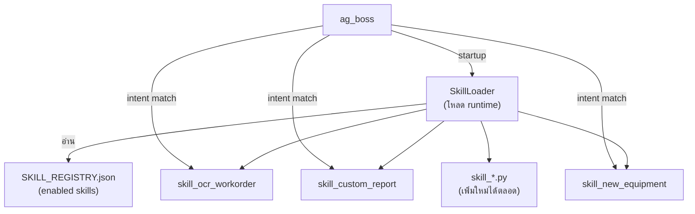

### 30.2 Skill Registry
```json
// tHe_DuDe_Service/skills/SKILL_REGISTRY.json
{
  "version": "2.1",
  "skills": [
    {
      "id":          "skill_ocr_workorder",
      "name":        "OCR ใบสั่งงาน",
      "description": "อ่านและ parse ใบสั่งงานจากภาพ",
      "enabled":     true,
      "intents":     ["ocr_workorder", "read_document"],
      "module":      "skills.skill_ocr_workorder",
      "class":       "OcrWorkorderSkill",
      "version":     "1.0",
      "added_by":    "admin",
      "added_at":    "2026-04-07"
    },
    {
      "id":          "skill_custom_report",
      "name":        "รายงาน Custom Format",
      "description": "สร้างรายงานตาม format ที่ลูกค้ากำหนด",
      "enabled":     true,
      "intents":     ["custom_report", "export_report"],
      "module":      "skills.skill_custom_report",
      "class":       "CustomReportSkill",
      "version":     "1.0",
      "added_by":    "admin",
      "added_at":    "2026-04-07"
    },
    {
      "id":          "skill_new_equipment",
      "name":        "เพิ่มอุปกรณ์ใหม่",
      "description": "ลงทะเบียนกล้อง/เครื่องจักร/IoT ใหม่โดยไม่ redeploy",
      "enabled":     true,
      "intents":     ["register_equipment", "add_camera", "add_iot"],
      "module":      "skills.skill_new_equipment",
      "class":       "NewEquipmentSkill",
      "version":     "1.0",
      "added_by":    "admin",
      "added_at":    "2026-04-07"
    }
  ]
}
```

### 30.3 Skill Base Class
```python
# tHe_DuDe_Service/skills/base_skill.py

from abc import ABC, abstractmethod
from dataclasses import dataclass


@dataclass
class SkillResult:
    success:     bool
    message:     str              # ตอบกลับ LINE
    data:        dict = None      # structured data สำหรับ ag_boss
    blinko_log:  bool = True      # เขียน log ลง Blinko ด้วยมั้ย


class BaseSkill(ABC):
    """Base class ที่ทุก skill ต้อง inherit"""

    skill_id:    str = ""
    skill_name:  str = ""
    version:     str = "1.0"

    @abstractmethod
    async def execute(self, intent: dict, context: dict) -> SkillResult:
        """
        ดำเนินการตาม intent

        Args:
            intent:  parsed intent จาก ag_negotiator
            context: {sender_id, camera_id, snapshot_url, memories, ...}

        Returns:
            SkillResult
        """
        ...

    async def validate(self, intent: dict) -> bool:
        """ตรวจสอบว่า intent มีข้อมูลครบก่อน execute — override ได้"""
        return True
```

### 30.4 Skill Loader (ใน ag_boss)
```python
# tHe_DuDe_Service/agents/ag_boss/app/core/skill_loader.py

import json
import importlib
import os
from pathlib import Path
from app.skills.base_skill import BaseSkill

SKILL_REGISTRY_PATH = os.getenv(
    "SKILL_REGISTRY_PATH",
    "/app/skills/SKILL_REGISTRY.json"
)


class SkillLoader:
    """โหลด skills จาก registry ตอน startup และ route intent → skill"""

    def __init__(self):
        self._skills:  dict[str, BaseSkill] = {}   # intent → skill instance
        self._registry: list[dict] = []

    def load_all(self):
        """โหลดทุก enabled skill จาก SKILL_REGISTRY.json"""
        path = Path(SKILL_REGISTRY_PATH)
        if not path.exists():
            print("[SkillLoader] Registry not found — no skills loaded")
            return

        registry = json.loads(path.read_text())
        self._registry = registry.get("skills", [])

        loaded = 0
        for entry in self._registry:
            if not entry.get("enabled", False):
                continue
            try:
                module  = importlib.import_module(entry["module"])
                cls     = getattr(module, entry["class"])
                instance: BaseSkill = cls()

                # map ทุก intent ของ skill นี้ → instance เดียวกัน
                for intent in entry.get("intents", []):
                    self._skills[intent] = instance

                loaded += 1
                print(f"[SkillLoader] ✅ Loaded: {entry['id']} v{entry['version']}")
            except Exception as e:
                print(f"[SkillLoader] ❌ Failed: {entry['id']} — {e}")

        print(f"[SkillLoader] {loaded}/{len(self._registry)} skills loaded")

    def get_skill(self, intent: str) -> BaseSkill | None:
        """คืน skill instance สำหรับ intent นี้ หรือ None ถ้าไม่มี"""
        return self._skills.get(intent)

    def list_skills(self) -> list[dict]:
        """คืน registry สำหรับแสดงใน control panel"""
        return self._registry

    def reload(self):
        """Hot-reload skills โดยไม่ restart container"""
        self._skills.clear()
        self.load_all()
```

### 30.5 ตัวอย่าง Skill — OCR ใบสั่งงาน
```python
# tHe_DuDe_Service/skills/skill_ocr_workorder.py

from app.skills.base_skill import BaseSkill, SkillResult
from app.services.vision_client import VisionClient


class OcrWorkorderSkill(BaseSkill):
    skill_id   = "skill_ocr_workorder"
    skill_name = "OCR ใบสั่งงาน"
    version    = "1.0"

    def __init__(self):
        self.vision = VisionClient()

    async def execute(self, intent: dict, context: dict) -> SkillResult:
        snapshot_url = context.get("snapshot_url", "")
        camera_id    = context.get("camera_id", "manual")

        if not snapshot_url:
            return SkillResult(
                success=False,
                message="❌ กรุณาส่งรูปใบสั่งงานมาด้วยครับ",
            )

        result = await self.vision.ocr(
            snapshot_url=snapshot_url,
            camera_id=camera_id,
            language="th",
        )

        text = result.get("text", "").strip()
        if not text:
            return SkillResult(
                success=False,
                message="❌ อ่านข้อความไม่ได้ กรุณาถ่ายภาพใหม่ในที่แสงดี",
            )

        return SkillResult(
            success=True,
            message=f"📋 ข้อความในใบสั่งงาน:\n\n{text[:1000]}",
            data={"text": text, "camera_id": camera_id},
            blinko_log=True,
        )
```

### 30.6 ตัวอย่าง Skill — เพิ่มอุปกรณ์ใหม่
```python
# tHe_DuDe_Service/skills/skill_new_equipment.py

import os
import json
from app.skills.base_skill import BaseSkill, SkillResult
from app.core.mem0_client import MemoryService


class NewEquipmentSkill(BaseSkill):
    skill_id   = "skill_new_equipment"
    skill_name = "เพิ่มอุปกรณ์ใหม่"
    version    = "1.0"

    def __init__(self):
        self.memory = MemoryService()

    async def execute(self, intent: dict, context: dict) -> SkillResult:
        """
        รับข้อมูลอุปกรณ์ใหม่และลงทะเบียนใน Mem0 + .env runtime
        intent.target = "camera|iot|production_line"
        intent.device = ชื่ออุปกรณ์
        """
        eq_type = intent.get("target", "")
        eq_name = intent.get("device", "")
        eq_id   = intent.get("action", "")   # device ID / IP

        if not eq_type or not eq_name:
            return SkillResult(
                success=False,
                message="❌ ระบุ ประเภทและชื่ออุปกรณ์ให้ครบครับ\nเช่น: เพิ่มกล้อง warehouse_cam3 IP 192.168.1.125",
            )

        entity_id = f"{eq_type}/{eq_name}"

        # บันทึกลง Mem0
        await self.memory.remember_incident(
            entity_id=entity_id,
            incident_text=f"ลงทะเบียนอุปกรณ์ใหม่: {eq_name} ประเภท {eq_type} ID: {eq_id}",
            metadata={
                "type":       "equipment_registration",
                "eq_type":    eq_type,
                "eq_name":    eq_name,
                "eq_id":      eq_id,
                "registered_by": context.get("sender_id", "unknown"),
            }
        )

        return SkillResult(
            success=True,
            message=(
                f"✅ ลงทะเบียน {eq_type} ใหม่แล้ว\n"
                f"ชื่อ: {eq_name}\n"
                f"ID: {eq_id}\n"
                f"ระบบจะจำอุปกรณ์นี้ในการ Query ครั้งต่อไป"
            ),
            data={"entity_id": entity_id, "eq_id": eq_id},
            blinko_log=True,
        )
```

### 30.7 เชื่อม Skill Loader เข้า ag_boss pipeline
```python
# เพิ่มใน tHe_DuDe_Service/agents/ag_boss/app/main.py

from app.core.skill_loader import SkillLoader

_skill_loader: SkillLoader | None = None

@asynccontextmanager
async def lifespan(app: FastAPI):
    global _orchestrator, _skill_loader
    _orchestrator = DuDeOrchestrator()
    _skill_loader = SkillLoader()
    _skill_loader.load_all()
    print("[ag_boss] Ready ✅")
    yield


# เพิ่ม endpoint สำหรับ skill management
@app.get("/api/skills")
async def list_skills():
    """แสดง skills ทั้งหมดที่ loaded"""
    if not _skill_loader:
        return {"skills": []}
    return {"skills": _skill_loader.list_skills()}


@app.post("/api/skills/reload")
async def reload_skills():
    """Hot-reload skills โดยไม่ restart container"""
    if not _skill_loader:
        return {"success": False}
    _skill_loader.reload()
    return {"success": True, "message": "Skills reloaded"}


# เพิ่มใน handle_human_command — ลอง skill ก่อน default handlers
@app.post("/api/human_command")
async def handle_human_command_v21(payload: dict):
    intent_name = payload.get("intent", {}).get("intent", "unknown")

    # ลอง Skill ก่อน
    if _skill_loader:
        skill = _skill_loader.get_skill(intent_name)
        if skill:
            result = await skill.execute(
                intent=payload["intent"],
                context={
                    "sender_id":    payload.get("sender_id"),
                    "snapshot_url": payload.get("snapshot_url", ""),
                    "camera_id":    payload.get("camera_id", ""),
                }
            )
            return {"reply_message": result.message, "data": result.data}

    # fallback → default handler เดิม (Sec 18.3)
    return await handle_human_command(payload)
```

---

## 31. Self-Improvement Engine

### 31.1 ภาพรวม Flow

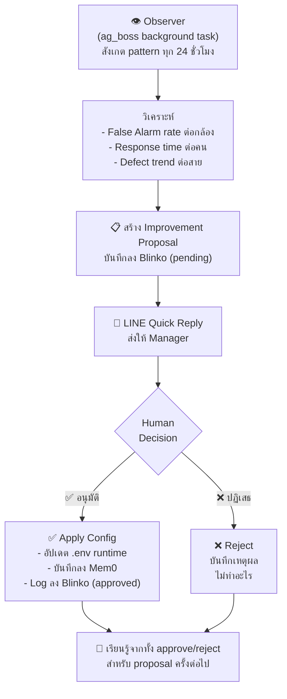

### 31.2 Proposal Generator
```python
# tHe_DuDe_Service/agents/ag_boss/app/services/improvement_engine.py

import os
import uuid
from dataclasses import dataclass, field
from datetime import datetime
from app.core.mem0_client import MemoryService
from app.services.blinko_reader import BlinkoReader

PROPOSAL_APPROVAL_ROLE = os.getenv("PROPOSAL_APPROVAL_ROLE", "manager")


@dataclass
class ImprovementProposal:
    proposal_id:  str
    title:        str
    description:  str
    evidence:     list[str]        # หลักฐาน / ข้อมูลที่ใช้ตัดสินใจ
    change_type:  str              # "threshold" | "escalation" | "contact" | "schedule"
    target:       str              # entity ที่จะเปลี่ยน เช่น "camera/warehouse_cam2"
    current_val:  str              # ค่าปัจจุบัน
    proposed_val: str              # ค่าที่เสนอ
    impact:       str              # ผลที่คาดว่าจะเกิด
    risk:         str              # ความเสี่ยง
    status:       str = "pending"  # pending | approved | rejected
    created_at:   str = field(default_factory=lambda: datetime.now().isoformat())
    decided_by:   str = ""
    decided_at:   str = ""
    reject_reason: str = ""


class ImprovementEngine:
    """วิเคราะห์ pattern และสร้าง Improvement Proposals"""

    def __init__(self):
        self.memory = MemoryService()
        self.blinko = BlinkoReader()

    async def run_daily_analysis(self) -> list[ImprovementProposal]:
        """รันทุกคืน 23:00 — วิเคราะห์และสร้าง proposals"""
        proposals = []

        proposals += await self._analyze_false_alarm_patterns()
        proposals += await self._analyze_response_time_patterns()
        proposals += await self._analyze_threshold_patterns()

        return proposals

    # ── False Alarm Pattern ───────────────────────────────────────────────────
    async def _analyze_false_alarm_patterns(self) -> list[ImprovementProposal]:
        """ถ้ากล้องไหน FA rate > 30% ใน 14 วัน → เสนอปรับ threshold"""
        proposals = []
        import json, os

        cameras = json.loads(os.getenv("PRODUCTION_LINES", "[]"))
        # เพิ่ม cameras จาก .env
        camera_ids = [c["camera_id"] for c in cameras]

        for cam_id in camera_ids:
            memories = await self.memory.get_entity_history(f"camera/{cam_id}")
            if len(memories) < 7:
                continue

            recent = memories[:14]
            fa_count = sum(
                1 for m in recent
                if "false alarm" in m.get("memory", "").lower()
            )
            fa_rate = fa_count / len(recent)

            if fa_rate > 0.30:
                # ดึง pattern ว่า FA เกิดช่วงเวลาไหน
                fa_times = self._extract_fa_times(recent)
                time_hint = f"ช่วง {fa_times}" if fa_times else ""

                proposals.append(ImprovementProposal(
                    proposal_id  = f"P-{uuid.uuid4().hex[:8].upper()}",
                    title        = f"ปรับ Threshold กล้อง {cam_id}",
                    description  = (
                        f"กล้อง {cam_id} มี False Alarm {fa_count}/{len(recent)} ครั้ง "
                        f"({fa_rate:.0%}) ใน 14 วันที่ผ่านมา {time_hint}"
                    ),
                    evidence     = [m.get("memory", "") for m in recent[:5]],
                    change_type  = "threshold",
                    target       = f"camera/{cam_id}",
                    current_val  = os.getenv("CONFIDENCE_THRESHOLD", "0.80"),
                    proposed_val = str(min(0.95, float(os.getenv("CONFIDENCE_THRESHOLD", "0.80")) + 0.10)),
                    impact       = f"คาดว่า FA จะลดลง ~{fa_rate:.0%} ต่อ 14 วัน",
                    risk         = "อาจพลาด event จริงที่ confidence ต่ำ — แนะนำ monitor 7 วันหลัง apply",
                ))

        return proposals

    # ── Response Time Pattern ─────────────────────────────────────────────────
    async def _analyze_response_time_patterns(self) -> list[ImprovementProposal]:
        """ถ้า L1 contact ตอบช้า avg > 5 นาที → เสนอลด escalation time"""
        proposals = []
        import re

        l1_id = os.getenv("EMERGENCY_CONTACT_L1", "")
        if not l1_id:
            return proposals

        memories = await self.memory.get_entity_history(f"person/{l1_id}")
        response_times = []
        for m in memories:
            match = re.search(r"response.?time[:\s]+(\d+\.?\d*)\s*min", m.get("memory", ""), re.IGNORECASE)
            if match:
                response_times.append(float(match.group(1)))

        if len(response_times) < 5:
            return proposals

        avg_response = sum(response_times) / len(response_times)
        current_escalation = int(os.getenv("ESCALATION_MINUTES", "3"))

        if avg_response > current_escalation * 1.5:
            proposals.append(ImprovementProposal(
                proposal_id  = f"P-{uuid.uuid4().hex[:8].upper()}",
                title        = "ปรับเวลา Escalation อัตโนมัติ",
                description  = (
                    f"L1 Contact มี avg response time {avg_response:.1f} นาที "
                    f"(เกิน {current_escalation} นาทีที่ตั้งไว้)"
                ),
                evidence     = [f"Response times: {response_times[-5:]}"],
                change_type  = "escalation",
                target       = "system/escalation_time",
                current_val  = f"{current_escalation} นาที",
                proposed_val = f"{max(1, current_escalation - 1)} นาที",
                impact       = "Escalate ถึง L2 เร็วขึ้น ลดเวลาตอบสนอง emergency",
                risk         = "อาจ escalate เร็วเกินไปถ้า L1 ไม่ได้เห็น LINE",
            ))

        return proposals

    # ── Threshold Pattern ─────────────────────────────────────────────────────
    async def _analyze_threshold_patterns(self) -> list[ImprovementProposal]:
        """ถ้า production line defect threshold ต่ำเกินจริง → เสนอปรับ"""
        return []   # placeholder — implement ตาม data จริง

    @staticmethod
    def _extract_fa_times(memories: list[dict]) -> str:
        """extract ช่วงเวลาที่ FA เกิดบ่อย"""
        import re
        hours = []
        for m in memories:
            if "false alarm" not in m.get("memory", "").lower():
                continue
            match = re.search(r"(\d{2}):\d{2}", m.get("memory", ""))
            if match:
                hours.append(int(match.group(1)))
        if not hours:
            return ""
        most_common = max(set(hours), key=hours.count)
        return f"{most_common:02d}:00-{most_common+1:02d}:00"
```

### 31.3 Proposal Writer (เขียนลง Blinko + ส่ง LINE)
```python
# tHe_DuDe_Service/agents/ag_boss/app/services/proposal_writer.py

import httpx
import os
from app.services.improvement_engine import ImprovementProposal

BLINKO_BRIDGE_URL   = os.getenv("BLINKO_BRIDGE_URL",        "http://blinko_bridge:8080")
BLINKO_API_KEY      = os.getenv("BLINKO_API_KEY",            "")
LINE_TOKEN          = os.getenv("LINE_CHANNEL_ACCESS_TOKEN", "")
APPROVAL_CONTACT    = os.getenv("EMERGENCY_CONTACT_L2",      "")  # Manager approve


class ProposalWriter:
    """บันทึก Proposal ลง Blinko และส่ง LINE Quick Reply"""

    async def publish(self, proposal: ImprovementProposal):
        """บันทึกลง Blinko และ push LINE ให้ manager"""
        blinko_result = await self._write_blinko(proposal)
        note_id       = blinko_result.get("id", "")
        await self._push_line(proposal, note_id)

    async def _write_blinko(self, p: ImprovementProposal) -> dict:
        evidence_md = "\n".join([f"- {e[:100]}" for e in p.evidence[:5]])
        content = f"""## 📋 PROPOSAL — {p.title}
**Proposal ID:** `{p.proposal_id}`
**วันที่:** {p.created_at[:10]}
**Status:** ⏳ PENDING APPROVAL

### สิ่งที่เสนอเปลี่ยน
| | ค่า |
|---|---|
| **Target** | {p.target} |
| **ปัจจุบัน** | {p.current_val} |
| **เสนอเป็น** | {p.proposed_val} |

### เหตุผล
{p.description}

### หลักฐาน
{evidence_md}

### ผลที่คาดหวัง
{p.impact}

### ความเสี่ยง
⚠️ {p.risk}

---
*สร้างโดย Self-Improvement Engine | DuDe Hawaiian v2.1*"""

        async with httpx.AsyncClient(timeout=10) as client:
            resp = await client.post(
                f"{BLINKO_BRIDGE_URL}/api/v1/notes",
                json={
                    "content":  content,
                    "tags":     ["#proposal", "#pending_approval", f"#type_{p.change_type}"],
                    "metadata": {
                        "proposal_id": p.proposal_id,
                        "status":      "pending",
                        "change_type": p.change_type,
                        "target":      p.target,
                        "current_val": p.current_val,
                        "proposed_val":p.proposed_val,
                    }
                },
                headers={"X-API-Key": BLINKO_API_KEY},
            )
        return resp.json() if resp.status_code == 200 else {}

    async def _push_line(self, p: ImprovementProposal, note_id: str):
        """ส่ง LINE Flex Message พร้อม Quick Reply ให้ Manager"""
        blinko_url = os.getenv("BLINKO_PUBLIC_URL", "http://localhost:15555")

        message = {
            "type": "flex",
            "altText": f"📋 ข้อเสนอ: {p.title}",
            "contents": {
                "type": "bubble",
                "header": {
                    "type": "box",
                    "layout": "vertical",
                    "backgroundColor": "#1a1a2e",
                    "contents": [{
                        "type": "text",
                        "text": "📋 ข้อเสนอปรับปรุงระบบ",
                        "color": "#58a6ff",
                        "weight": "bold",
                        "size": "md"
                    }]
                },
                "body": {
                    "type": "box",
                    "layout": "vertical",
                    "spacing": "sm",
                    "contents": [
                        {"type": "text", "text": p.title, "weight": "bold", "wrap": True},
                        {"type": "text", "text": p.description[:120], "wrap": True,
                         "size": "sm", "color": "#666666"},
                        {"type": "separator"},
                        {"type": "box", "layout": "horizontal", "contents": [
                            {"type": "text", "text": "ปัจจุบัน:", "size": "sm", "flex": 2},
                            {"type": "text", "text": p.current_val, "size": "sm",
                             "flex": 3, "color": "#f85149"},
                        ]},
                        {"type": "box", "layout": "horizontal", "contents": [
                            {"type": "text", "text": "เสนอเป็น:", "size": "sm", "flex": 2},
                            {"type": "text", "text": p.proposed_val, "size": "sm",
                             "flex": 3, "color": "#3fb950"},
                        ]},
                        {"type": "text", "text": f"⚠️ {p.risk}", "size": "xs",
                         "color": "#d29922", "wrap": True},
                    ]
                },
                "footer": {
                    "type": "box",
                    "layout": "horizontal",
                    "spacing": "sm",
                    "contents": [
                        {
                            "type": "button",
                            "style": "primary",
                            "color": "#3fb950",
                            "action": {
                                "type": "message",
                                "label": "✅ อนุมัติ",
                                "text":  f"approve {p.proposal_id}"
                            }
                        },
                        {
                            "type": "button",
                            "style": "secondary",
                            "action": {
                                "type": "message",
                                "label": "❌ ปฏิเสธ",
                                "text":  f"reject {p.proposal_id}"
                            }
                        },
                        {
                            "type": "button",
                            "style": "link",
                            "action": {
                                "type": "uri",
                                "label": "📊 หลักฐาน",
                                "uri":   f"{blinko_url}/notes/{note_id}"
                            }
                        }
                    ]
                }
            }
        }

        if not APPROVAL_CONTACT:
            return

        async with httpx.AsyncClient(timeout=10) as client:
            await client.post(
                "https://api.line.me/v2/bot/message/push",
                json={"to": APPROVAL_CONTACT, "messages": [message]},
                headers={"Authorization": f"Bearer {LINE_TOKEN}"},
            )
```

### 31.4 Approval Handler (ใน ag_negotiator)
```python
# เพิ่มใน tHe_DuDe_Service/agents/ag_negotiator/app/main.py
# ใน classify_intent_sync() — เพิ่ม pattern สำหรับ approve/reject

import re as _re

def classify_intent_sync(text: str, sender_id: str) -> dict:
    """เพิ่ม shortcut สำหรับ approve/reject proposal"""

    # ตรวจ pattern: "approve P-XXXXXXXX" หรือ "reject P-XXXXXXXX เหตุผล..."
    approve_match = _re.match(r"approve\s+(P-[A-F0-9]{8})", text.strip(), _re.IGNORECASE)
    reject_match  = _re.match(r"reject\s+(P-[A-F0-9]{8})(.*)", text.strip(), _re.IGNORECASE)

    if approve_match:
        return {
            "intent":      "approve_proposal",
            "priority":    "HIGH",
            "target":      approve_match.group(1),
            "action":      "approve",
            "requires_confirmation": False,
        }

    if reject_match:
        reason = reject_match.group(2).strip() or "ไม่ระบุเหตุผล"
        return {
            "intent":      "approve_proposal",
            "priority":    "HIGH",
            "target":      reject_match.group(1),
            "action":      "reject",
            "reason":      reason,
            "requires_confirmation": False,
        }

    # fallback → LLM classify เดิม (Sec 18.1)
    return _classify_via_llm(text, sender_id)
```

### 31.5 Proposal Executor (apply config จริง)
```python
# tHe_DuDe_Service/agents/ag_boss/app/services/proposal_executor.py

import httpx
import os
from datetime import datetime
from app.core.mem0_client import MemoryService

BLINKO_BRIDGE_URL = os.getenv("BLINKO_BRIDGE_URL", "http://blinko_bridge:8080")
BLINKO_API_KEY    = os.getenv("BLINKO_API_KEY", "")

# Runtime config store — โหลดจาก Mem0 ตอน startup
# (แทน .env ที่แก้ไม่ได้ตอน runtime)
_runtime_config: dict = {}


class ProposalExecutor:
    """Apply หรือ Reject Improvement Proposal"""

    def __init__(self):
        self.memory = MemoryService()

    async def approve(
        self,
        proposal_id: str,
        decided_by: str,
        proposal_data: dict,
    ) -> str:
        """Apply config change และบันทึกผล"""

        change_type  = proposal_data.get("change_type", "")
        target       = proposal_data.get("target", "")
        proposed_val = proposal_data.get("proposed_val", "")

        # ── Apply change ตาม type ──────────────────────────────────────────
        if change_type == "threshold":
            _runtime_config[f"threshold:{target}"] = float(proposed_val)
            apply_msg = f"Confidence threshold สำหรับ {target} → {proposed_val}"

        elif change_type == "escalation":
            _runtime_config["escalation_minutes"] = int(proposed_val.replace(" นาที", ""))
            apply_msg = f"Escalation time → {proposed_val}"

        elif change_type == "contact":
            _runtime_config[f"contact:{target}"] = proposed_val
            apply_msg = f"Contact สำหรับ {target} → {proposed_val}"

        else:
            apply_msg = f"Applied: {change_type} = {proposed_val}"

        # ── บันทึกลง Mem0 ──────────────────────────────────────────────────
        await self.memory.remember_incident(
            entity_id=f"system/improvement",
            incident_text=(
                f"Proposal {proposal_id} approved by {decided_by}: {apply_msg}"
            ),
            metadata={
                "proposal_id":  proposal_id,
                "change_type":  change_type,
                "target":       target,
                "new_value":    proposed_val,
                "decided_by":   decided_by,
                "decided_at":   datetime.now().isoformat(),
            }
        )

        # ── อัปเดต Blinko status ────────────────────────────────────────────
        await self._update_blinko_status(proposal_id, "approved", decided_by)

        return f"✅ อนุมัติแล้ว\n{apply_msg}\nมีผลทันที"

    async def reject(
        self,
        proposal_id: str,
        decided_by: str,
        reason: str,
        proposal_data: dict,
    ) -> str:
        """บันทึกการ reject และเหตุผล"""

        await self.memory.remember_incident(
            entity_id="system/improvement",
            incident_text=(
                f"Proposal {proposal_id} rejected by {decided_by}. "
                f"Reason: {reason}"
            ),
            metadata={
                "proposal_id": proposal_id,
                "status":      "rejected",
                "reason":      reason,
                "decided_by":  decided_by,
                "decided_at":  datetime.now().isoformat(),
            }
        )

        await self._update_blinko_status(proposal_id, "rejected", decided_by, reason)

        return f"❌ ปฏิเสธ Proposal {proposal_id}\nเหตุผล: {reason}\nระบบจะไม่เปลี่ยนแปลงค่าใดๆ"

    def get_runtime_value(self, key: str, default=None):
        """อ่านค่า runtime config — ใช้แทน os.getenv สำหรับ dynamic values"""
        return _runtime_config.get(key, default)

    async def _update_blinko_status(
        self,
        proposal_id: str,
        status: str,
        decided_by: str,
        reason: str = "",
    ):
        """อัปเดต status ของ Proposal note ใน Blinko"""
        status_emoji = "✅" if status == "approved" else "❌"
        status_text  = "APPROVED" if status == "approved" else "REJECTED"

        async with httpx.AsyncClient(timeout=10) as client:
            await client.post(
                f"{BLINKO_BRIDGE_URL}/api/v1/notes/update_tag",
                json={
                    "search_tag":   f"proposal_id:{proposal_id}",
                    "remove_tags":  ["#pending_approval"],
                    "add_tags":     [f"#{status}"],
                    "append_content": (
                        f"\n\n---\n**{status_emoji} {status_text}**\n"
                        f"โดย: {decided_by} | {datetime.now().strftime('%Y-%m-%d %H:%M')}"
                        + (f"\nเหตุผล: {reason}" if reason else "")
                    ),
                },
                headers={"X-API-Key": BLINKO_API_KEY},
            )
```

### 31.6 เชื่อม Approval Handler เข้า ag_boss
```python
# เพิ่มใน tHe_DuDe_Service/agents/ag_boss/app/api/human_command.py

from app.services.proposal_executor import ProposalExecutor

_executor = ProposalExecutor()

# เพิ่มใน handler_map (Sec 18.3)
handler_map["approve_proposal"] = _handle_approve_proposal


async def _handle_approve_proposal(intent: dict, sender_id: str) -> dict:
    """จัดการ approve หรือ reject proposal จาก LINE"""
    proposal_id = intent.get("target", "")
    action      = intent.get("action", "")  # "approve" | "reject"
    reason      = intent.get("reason", "ไม่ระบุเหตุผล")

    if not proposal_id:
        return {"reply_message": "❓ ไม่พบ Proposal ID"}

    # ดึง proposal data จาก Blinko
    from app.services.blinko_reader import BlinkoReader
    reader   = BlinkoReader()
    notes    = await reader._search_notes(
        query=proposal_id, tags=["#proposal"], limit=1
    )

    if not notes:
        return {"reply_message": f"❓ ไม่พบ Proposal {proposal_id}"}

    proposal_data = notes[0].get("metadata", {})

    if action == "approve":
        reply = await _executor.approve(proposal_id, sender_id, proposal_data)
    else:
        reply = await _executor.reject(proposal_id, sender_id, reason, proposal_data)

    return {"reply_message": reply}
```

---

## 32. Cron Schedule เพิ่มเติมสำหรับ v2.1

```bash
# เพิ่มใน tHe_DuDe_Compose/scripts/cron_jobs.sh

# ── Daily Improvement Analysis (23:00 ทุกคืน) ────────────────────────────────
CURRENT_HOUR=$(date +%H | sed 's/^0//')
if [ "$CURRENT_HOUR" = "23" ]; then
    echo "$LOG_PREFIX Running improvement analysis..."
    wget -qO- --post-data='{}' \
        --header='Content-Type: application/json' \
        "${AG_BOSS_URL}/api/improvement/analyze" > /dev/null 2>&1
    echo "$LOG_PREFIX ✅ Improvement analysis triggered"
fi
```

```python
# เพิ่มใน tHe_DuDe_Service/agents/ag_boss/app/main.py

from app.services.improvement_engine import ImprovementEngine
from app.services.proposal_writer    import ProposalWriter

@app.post("/api/improvement/analyze")
async def run_improvement_analysis():
    """รัน Self-Improvement Analysis และสร้าง Proposals"""
    engine   = ImprovementEngine()
    writer   = ProposalWriter()

    proposals = await engine.run_daily_analysis()

    published = 0
    for p in proposals:
        await writer.publish(p)
        published += 1

    return {
        "analyzed_at": datetime.now().isoformat(),
        "proposals_created": published,
        "proposal_ids": [p.proposal_id for p in proposals],
    }
```

---

## 33. .env เพิ่มเติมสำหรับ v2.1

```bash
# เพิ่มใน tHe_DuDe_Compose/.env.example

# ══════════════════════════════════════════════════════════════
# SELF-IMPROVEMENT ENGINE (v2.1)
# ══════════════════════════════════════════════════════════════
PROPOSAL_APPROVAL_ROLE=manager     # role ที่มีสิทธิ์ approve
ESCALATION_MINUTES=3               # นาทีก่อน escalate (ปรับได้ผ่าน proposal)
FA_RATE_THRESHOLD=0.30             # False Alarm rate ที่ trigger proposal
IMPROVEMENT_ANALYSIS_HOUR=23       # ชั่วโมงที่รัน analysis (0-23)

# ══════════════════════════════════════════════════════════════
# SKILL SYSTEM (v2.1)
# ══════════════════════════════════════════════════════════════
SKILL_REGISTRY_PATH=/app/skills/SKILL_REGISTRY.json
```

---

## 34. Project Structure v2.1 (เพิ่มเติม)

```
tHe_DuDe_Service/
├── skills/                             ← ใหม่ใน v2.1
│   ├── SKILL_REGISTRY.json             ← Sec 30.2
│   ├── base_skill.py                   ← Sec 30.3
│   ├── skill_ocr_workorder.py          ← Sec 30.5
│   ├── skill_new_equipment.py          ← Sec 30.6
│   └── skill_custom_report.py          ← (implement ตาม format ลูกค้า)
│
└── agents/ag_boss/app/
    ├── core/
    │   └── skill_loader.py             ← Sec 30.4
    └── services/
        ├── improvement_engine.py       ← Sec 31.2
        ├── proposal_writer.py          ← Sec 31.3
        └── proposal_executor.py        ← Sec 31.5
```

---

*DuDe Hawaiian v2.1 — Self-Improving Factory AI*
*เขียนโดย: Ake | เวอร์ชัน: 2.1 | อัปเดตล่าสุด: เมษายน 2026*
